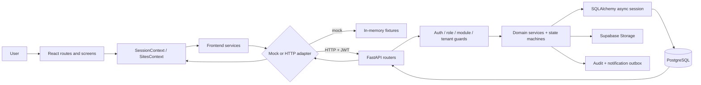

# Project overview

Matrix is a multi-tenant retail-expansion workflow. A site starts in Business Development (BD), progresses through commercial and legal review, then moves through Design, Project, NSO, Launch, and Financial Closure. The `sites` row is the shared record; module tables store detailed workflow state and mirror summary statuses back onto `sites`.

## People and scope

| Role | Scope | Typical responsibility |
| --- | --- | --- |
| `business_admin` | Tenant-wide admin portal | Approve supervisors, review admin gates, launch and closure decisions |
| `supervisor` | Tenant plus assigned module | Review, approve, reject, allocate, and manage module teams |
| `executive` | Owned, assigned, or delegated records | Capture site data and execute module work |

Module membership is separate from role. A user can be a `supervisor` or `executive` and carry a module claim such as `bd`, `legal`, `design`, `project`, `nso`, or `project_excellence`.

> **Source of Truth**
> - `backend/app/rbac/roles.py:1-16` — canonical three-role model.
> - `backend/app/rbac/guards.py:8-57` — role and module guards.
> - `backend/database/verified.sql:331-342` — persisted module memberships.

## Main modules

| Module | Primary data |
| --- | --- |
| BD / Sites | `sites`, `site_details`, `approvals`, LOI files |
| Legal | DD checklist, agreement, licensing, change requests |
| Design | Review folder and deliverables |
| Project | Allocation, milestones, quality audit, NSO handoff |
| Project Excellence | Shared GFC budget and quality-audit completion |
| NSO | Opening-readiness stages |
| Launch | Multi-party validation and final launch |
| Financial Closure | Post-launch actual budget against the GFC baseline |

> **Source of Truth**
> - `frontend/src/router/routes.js:2-61` — route vocabulary.
> - `frontend/src/router/AppRouter.jsx:128-534` — screens and module guards.
> - `backend/app/main.py:297-298` — registered backend routers.

## Technology stack

| Layer | Technology | How this repository uses it |
| --- | --- | --- |
| Frontend | React 18, React Router, Vite | Hash-routed SPA with route-level role/module guards |
| UI state | React Context plus local component state | `SessionContext` and `SitesContext` are global; forms and overlays remain local |
| API client | Axios | Bearer-token injection, refresh/retry, snake/camel adaptation, typed errors |
| Backend | Python 3.11+, FastAPI, Pydantic | Routers validate HTTP input and delegate to services |
| Persistence | PostgreSQL on Supabase | Tenant-scoped relational storage |
| ORM | SQLAlchemy 2 async + asyncpg | Async sessions, row locks, transaction helpers, ORM models |
| Files | Supabase Storage REST API | Backend-only service-role uploads and short-lived signed URLs |
| Auth | Backend-issued HS256 JWT | Email, workspace code, and password login; role/module/tenant claims |
| Notifications | Transactional outbox + Resend drain | In-app rows are read directly; email rows are drained in-process |
| Deployment | Vercel + Railway | Static frontend on Vercel; long-running FastAPI process on Railway |
| Design system | CSS tokens and shared primitives | Global tokens from `frontend/public/colors_and_type.css`, reusable UI in `modules/shared` |

> **Source of Truth**
> - `frontend/package.json:1-30` — frontend dependencies and scripts.
> - `backend/pyproject.toml:1-30` — backend runtime dependencies.
> - `backend/app/core/security.py:34-79` — JWT issuance.
> - `backend/app/services/storage_service.py:1-14,97-141` — file storage.
> - `frontend/vercel.json:1-21` and `backend/railway.json:1-13` — deployment runtimes.

## One-screen architecture

> **Source of Truth**
> - `frontend/src/main.jsx:13-22` — provider and router composition.
> - `frontend/src/services/api/adapters/index.js:1-14` — adapter switch.
> - `backend/app/routers/sites.py:1-54` — thin-router pattern.
> - `backend/app/services/bd_service.py:1-14` — service write contract.
> - `backend/app/db/session.py:69-115` — async session and transaction behavior.
