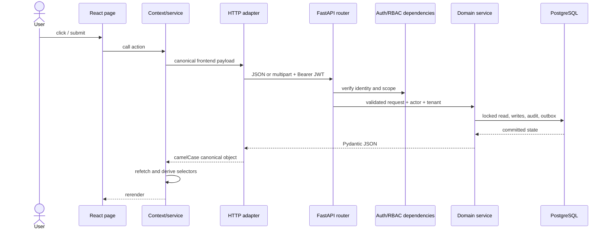

# System architecture

The codebase is split by responsibility: React pages collect intent, frontend services normalize data, FastAPI routers enforce HTTP-level access, domain services enforce business rules, and SQLAlchemy persists one transaction.

## Request lifecycle

> **Source of Truth**
> - `frontend/src/state/SitesContext.jsx:254-344` — UI actions call services then refresh.
> - `frontend/src/services/api/adapters/httpAdapter.js:94-159` — request/response interception.
> - `backend/app/routers/sites.py:143-250` — validation and service dispatch.
> - `backend/app/services/bd_service.py:89-173` — one complete write path.

## Frontend structure

| Path | Responsibility |
| --- | --- |
| `frontend/src/main.jsx` | App bootstrap and provider order |
| `frontend/src/router/` | Route constants, route tree, role/module guards |
| `frontend/src/modules/` | User-facing pages grouped by business module |
| `frontend/src/state/` | Global session and canonical site state |
| `frontend/src/services/api/` | Public services, adapters, auth token, refresh events |
| `frontend/src/lib/` | Shared pure logic, including the mirrored site state machine |
| `frontend/src/rbac/` | Client-side visibility and navigation rules |
| `frontend/src/modules/shared/` | Chrome, primitives, drawers, and shared forms |

`App.jsx` is the authenticated shell: top bar, sidebar, global site drawer, toasts, and an `<Outlet>` for pages. It should not absorb module-specific business logic.

> **Source of Truth**
> - `frontend/src/main.jsx:1-22` — bootstrap.
> - `frontend/src/App.jsx:18-24,133-228` — shell responsibility.
> - `frontend/src/router/AppRouter.jsx:128-534` — route tree.

## Backend structure

| Path | Responsibility |
| --- | --- |
| `backend/app/main.py` | FastAPI app, middleware, lifespan, router registration |
| `backend/app/routers/` | HTTP paths, request models, dependency guards |
| `backend/app/domain/schemas/` | Pydantic request/response contracts |
| `backend/app/domain/state_machine.py` | Canonical BD site lifecycle |
| `backend/app/services/` | Business rules, SQLAlchemy queries, audit/outbox writes |
| `backend/app/db/models.py` | Runtime ORM mappings |
| `backend/app/db/session.py` | Engine, request-scoped sessions, transactions |
| `backend/app/core/` | Configuration, JWT, password, upload, and rate-limit helpers |
| `backend/app/rbac/` | Role vocabulary, permissions, route dependencies |
| `backend/database/migrations/` | Ordered executable database changes |

Routers are intentionally thin. Some older or administrative routers still contain SQL, so “no SQL in routers” is a direction, not a universal invariant.

> **Source of Truth**
> - `backend/app/main.py:225-250,297-313` — app composition.
> - `backend/app/routers/sites.py:1-54` and `backend/app/routers/bd.py:1-53` — thin routers.
> - `backend/app/routers/auth.py:148-265` and `backend/app/routers/users.py:157-232` — notable router-owned SQL.

## Transaction boundary

`get_db()` owns request cleanup: successful requests commit any still-open transaction; failures roll back. Services use `transaction()` so a service can join an existing request transaction safely. Status-changing reads use `SELECT ... FOR UPDATE` to prevent concurrent transitions from both succeeding.

> **Source of Truth**
> - `backend/app/db/session.py:79-115` — request and service transaction boundaries.
> - `backend/app/services/_common.py:38-67` — tenant-scoped reads and row locks.
> - `backend/tests/test_write_persistence_regression.py:45-86` — commit/rollback regression coverage.

## Sources of truth by layer

| Concern | Canonical source |
| --- | --- |
| Browser route path | `frontend/src/router/routes.js` |
| API path and role dependency | `backend/app/routers/*.py` |
| Request/response shape | `backend/app/domain/schemas/*.py` |
| Business transition | `backend/app/services/*.py` |
| BD site status vocabulary | `backend/app/domain/state_machine.py` |
| Database change | Ordered migration in `backend/database/migrations/` |
| Runtime table mapping | `backend/app/db/models.py` |
| Global frontend session/sites | `frontend/src/state/` |
| Wire conversion | `frontend/src/services/api/adapters/httpAdapter.js` |
