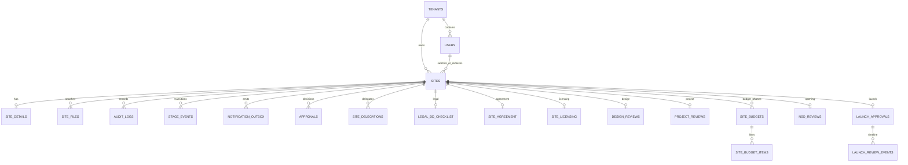

# Data model and storage

`sites` is the cross-module aggregate. Most domain workflows add a one-to-one review row or one-to-many child rows and write a small mirror status back to `sites` so lists do not fan out across every module table.

## Source hierarchy and known drift

1. **Migrations are executable truth.** Apply them in order.
2. **ORM models are runtime truth.** Services read and write these mappings.
3. **`schema.sql` is a readable snapshot only.** Its header says not to execute it directly.

The snapshot currently stops at migration `202606141`. Newer migrations add `site_budgets`, `site_budget_items`, `financial_closure_status`, and later workflow fields. The snapshot still lists legacy `project_budget_items`, while migration `202606145` marks its destructive removal as not yet applied. Check the target database before assuming either legacy or replacement objects exist.

> **Source of Truth**
> - `backend/database/schema.sql:1-9` — snapshot status and last sync.
> - `backend/database/migrations/202606144_shared_site_budgets.sql:1-81` — shared budget additions.
> - `backend/database/migrations/202606145_drop_legacy_project_budget.sql:1-21` — held destructive cleanup.
> - `backend/app/db/models.py:749-814` — runtime shared-budget mappings.

## Relationship map

> **Source of Truth**
> - `backend/database/schema.sql:12-743` — snapshot PK/FK definitions.
> - `backend/database/migrations/202606144_shared_site_budgets.sql:15-57` — newer budget PK/FKs.

## Table reference

| Table | Ownership and purpose | Important relationship |
| --- | --- | --- |
| `tenants` | Workspace identity, plan, seats, login code, branding | Parent of users and domain data |
| `users` | Identity, top-level role, active flag, city, password hash | Unique email per tenant |
| `sites` | Canonical site identity, lifecycle status, owners, summary mirrors | Central aggregate; references tenant and users |
| `site_details` | One site’s commercial/detail form | Unique `site_id` |
| `site_files` | LOIs, photos, quality-audit documents and storage paths | Many files per site |
| `audit_logs` | Human-readable activity and field diffs | Tenant/site scoped; site nullable for user/admin events |
| `stage_events` | Immutable transition ledger for analytics/SLA | Written with transition audit events |
| `notification_outbox` | Pending/sent/failed delivery rows | One row per recipient and channel |
| `approvals` | Site approval decision and LOI deadline | Many decisions per site; latest is used |
| `shortlist_delegations` | Legacy/BD shortlist authority | Active row has `revoked_at IS NULL` |
| `site_delegations` | Module-specific assignment | Keyed by site, module, delegate |
| `business_admins` | Tenant admin membership extension | One-to-one with user |
| `module_codes` | Department join codes | Unique tenant/module |
| `supervisor_invite_codes` | Supervisor-owned executive join codes | Unique supervisor/module |
| `user_module_memberships` | Module and module-level role | Unique user/module |
| `workspace_requests` | New workspace approval queue | Becomes tenant/admin provisioning |
| `password_reset_requests` | Approval-bound password reset lifecycle | Links tenant/user and one-time token hash |
| `legal_dd_checklist` | One site’s DD items and verdict | PK is `site_id` |
| `site_agreement` | One site’s agreement state | PK is `site_id` |
| `site_licensing` | One site’s license checklist | PK is `site_id` |
| `legal_change_requests` | BD requests to alter legal fields | Site, requester, review status |
| `design_reviews` | One design workflow folder per site | PK is `site_id` |
| `design_deliverables` | Recce/2D/3D/BOQ artifacts and reviews | Unique site/kind |
| `project_reviews` | Project allocation, milestones, quality audit, NSO handoff | PK is `site_id` |
| `project_budget_items` | Legacy budget rows in the schema snapshot | Superseded; removal is held |
| `site_budgets` | Shared `gfc` or `closure` budget header | Unique site/phase |
| `site_budget_items` | Eleven lines for a shared budget | Unique budget/index |
| `nso_reviews` | NSO stage data and final approval | PK is `site_id` |
| `launch_approvals` | Editable commercial snapshot and launch FSM | Unique `site_id` |
| `launch_review_events` | Append-only launch comments, edits, verdicts | Child of launch approval |

> **Source of Truth**
> - `backend/database/schema.sql:12-114` — tenant, user, site.
> - `backend/database/schema.sql:121-315` — details, files, audit, events, outbox, approvals, delegations.
> - `backend/database/schema.sql:318-499` — membership, onboarding, and legal.
> - `backend/database/schema.sql:503-743` — design, project, NSO, and launch snapshot.
> - `backend/database/migrations/202606144_shared_site_budgets.sql:15-61` — shared budgets.

## Stored versus derived

Stored fields come from SQL rows. The API additionally derives:

- `total_op_cost = (expected_rent + cam_charges) * 1.18` when both values exist.
- `days` from `visit_date`.
- legacy `stage` labels from canonical `sites.status`.
- latest approval metadata, NSO status, and launch status by joining related rows.
- frontend-only queue shapes such as `inReview`, `loiUploaded`, and `pushed`.

Do not persist a derived UI label merely to satisfy a component. Add it to response shaping or a selector.

> **Source of Truth**
> - `backend/app/services/_common.py:156-241` — API response derivation.
> - `frontend/src/services/api/adapters/httpAdapter.js:193-321` — wire-to-canonical conversion.
> - `frontend/src/state/SitesContext.jsx:45-144,220-252` — queue-specific selectors.

## Tenant isolation and deletion behavior

Every domain query must include `tenant_id`. Executive reads add object ownership (`submitted_by` or `assigned_to`) or module delegation. Sites are not hard-deleted through normal workflows: reject/archive changes status and keeps audit history. Many child tables use `ON DELETE CASCADE` as database cleanup protection if a site is ever physically deleted administratively.

> **Source of Truth**
> - `backend/app/services/_common.py:38-83,129-143` — tenant and executive scope.
> - `backend/app/services/bd_service.py:450-564` — reject, archive, revive.
> - `backend/database/schema.sql:289-314,437-495,517-550` — cascade examples.

## File storage

The database stores file metadata and an object path, not file bytes. The backend uploads bytes with a service-role key, saves a `site_files` row, and returns short-lived signed URLs. Slow storage calls occur outside database transactions so they do not hold a pooler connection.

> **Source of Truth**
> - `backend/app/services/storage_service.py:49-141` — storage client, upload, signing.
> - `backend/app/services/loi_service.py:35-99` — upload outside DB transaction, then metadata transaction.
> - `backend/app/services/site_documents_service.py:12-55` — document listing and concurrent URL signing.
