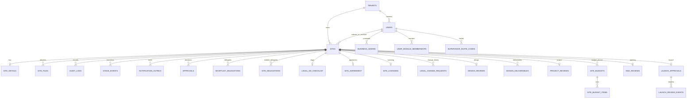

# Data model and storage

`sites` is the cross-module aggregate. Most domain workflows add a one-to-one review row or one-to-many child rows and write a small mirror status back to `sites` so lists do not fan out across every module table.

## Source hierarchy and known drift

1. **Verified live schema is structural truth.** `backend/database/verified.sql` is the schema dump taken from the running Supabase database. It is the canonical reference for table names, columns, types, constraints, and relationships.
2. **ORM models are runtime truth.** `backend/app/db/models.py` maps the tables the Python backend reads and writes. It should mirror `verified.sql`; when it drifts, the live schema wins and the model must be updated.
3. **Migrations are ordered history.** Files under `backend/database/migrations/` explain how the live schema was reached. They are not the source of truth, and `backend/database/schema.sql` is now a stale snapshot kept only for historical comparison.

This page uses `verified.sql` for table/column facts and `models.py` for the ORM view. Any mismatch should be resolved against the verified schema.

> **Source of Truth**
> - `backend/database/verified.sql:1-3` — context-only dump, not executable.
> - `backend/app/db/models.py:1-33` — ORM base and mapping conventions.
> - `backend/database/migrations/` — change history (reference, not truth).
> - `backend/database/schema.sql` — older snapshot; superseded by `verified.sql`.

## Relationship map

> **Source of Truth**
> - `backend/database/verified.sql:4-677` — all table definitions and FKs.
> - `backend/app/db/models.py:37-1037` — ORM class-to-table mapping.

## Table reference

| Table | Ownership and purpose | Important relationship |
| --- | --- | --- |
| `tenants` | Workspace identity, plan, seats, login code, branding | Parent of users and domain data |
| `users` | Identity, top-level role, active flag, city, password hash | FK to `tenants(id)` |
| `sites` | Canonical site identity, lifecycle status, owners, summary mirrors | Central aggregate; references tenant and users |
| `site_details` | One site’s commercial/detail form; `completion_pct` auto-computed | Unique `site_id` FK |
| `site_files` | LOIs, photos, quality-audit documents and storage paths | Many files per site |
| `audit_logs` | Human-readable activity and field diffs | Tenant/site scoped; site nullable for user/admin events |
| `stage_events` | Immutable transition ledger for analytics/SLA | Written with transition audit events |
| `notification_outbox` | Pending/sent/failed delivery rows | One row per recipient and channel |
| `approvals` | Site approval decision and LOI deadline | Many decisions per site; latest is used |
| `shortlist_delegations` | BD shortlist authority | Active row has `revoked_at IS NULL` |
| `site_delegations` | Module-specific assignment | Keyed by site, module, delegate |
| `business_admins` | Tenant admin membership extension | One-to-one with user |
| `module_codes` | Department join codes | Unique tenant/module |
| `supervisor_invite_codes` | Supervisor-owned executive join codes | Unique supervisor/module |
| `user_module_memberships` | Module and module-level role | Unique user/module |
| `workspace_requests` | New workspace approval queue | Uses `workspace_request_status` enum |
| `password_reset_requests` | Approval-bound password reset lifecycle | Links tenant/user and one-time token hash |
| `legal_dd_checklist` | One site’s DD items and verdict | PK is `site_id` |
| `site_agreement` | One site’s agreement state | PK is `site_id` |
| `site_licensing` | One site’s license checklist | PK is `site_id` |
| `legal_change_requests` | BD requests to alter legal fields | Site, requester, review status |
| `design_reviews` | One design workflow folder per site | PK is `site_id` |
| `design_deliverables` | Recce/2D/3D/BOQ artifacts and reviews | Unique site/kind |
| `project_reviews` | Project allocation, milestones, quality audit, NSO handoff | PK is `site_id` |
| `site_budgets` | Shared `gfc` or `closure` budget header | Unique site/phase |
| `site_budget_items` | Eleven lines for a shared budget | Unique budget/index |
| `nso_reviews` | NSO stage data and final approval | PK is `site_id` |
| `launch_approvals` | Editable commercial snapshot and launch FSM | Unique `site_id` |
| `launch_review_events` | Append-only launch comments, edits, verdicts | Child of launch approval |

> **Source of Truth**
> - `backend/database/verified.sql:4-28` — tenant and users.
> - `backend/database/verified.sql:30-90` — sites aggregate.
> - `backend/database/verified.sql:92-157` — site_details.
> - `backend/database/verified.sql:160-260` — approvals, files, stage_events, audit_logs, outbox.
> - `backend/database/verified.sql:262-342` — workspace_requests, delegations, admin/membership/codes.
> - `backend/database/verified.sql:344-410` — legal DD, agreement, licensing, change requests.
> - `backend/database/verified.sql:412-473` — delegations, design reviews and deliverables.
> - `backend/database/verified.sql:476-508` — project_reviews.
> - `backend/database/verified.sql:510-553` — password_reset_requests and nso_reviews.
> - `backend/database/verified.sql:555-635` — launch_approvals and launch_review_events.
> - `backend/database/verified.sql:637-677` — site_budgets and site_budget_items.

## SQLAlchemy ORM model reference

The backend uses SQLAlchemy 2 async mappings. Every model inherits from `app.db.base.Base` and uses `Mapped[T]` / `mapped_column()` declarations. Most primary keys use `server_default=func.uuid_generate_v4()` or `func.gen_random_uuid()`, and `updated_at` columns use `server_default=func.now(), onupdate=func.now()`.

The whole registry enables `eager_defaults = True` at the bottom of `models.py` so server-side defaults and `onupdate` values are fetched via `RETURNING` during flush. Without this, reading a freshly inserted/updated row can trigger a synchronous lazy refresh inside the async session, raising `MissingGreenlet` and surfacing to the client as a CORS-masked 500.

### Core models

| SQLAlchemy class | Table | Key columns / notes |
| --- | --- | --- |
| `Tenant` | `tenants` | `id`, `slug` (unique), `name`, `plan`, `seat_limit`, `workspace_code`, `logo_url` |
| `User` | `users` | `id`, `tenant_id`, `email`, `name`, `role`, `is_active`, `assigned_city`, `notes`, `password_hash`, `created_at`, `updated_at` |
| `Site` | `sites` | `id`, `tenant_id`, `submitted_by`, `assigned_to`, `supervisor_id`, `status`, `city`, `name`, commercial fields, module mirror columns (`legal_dd_status`, `agreement_status`, `licensing_status`, `design_status`, `project_status`, `finance_status`, `project_excellence_status`, `financial_closure_status`), `is_launched` |
| `SiteDetail` | `site_details` | `id`, `site_id` (unique FK), `tenant_id`, `carpet_area_sqft`, `estimated_monthly_sales`, `score`, rent/commercial fields, `completion_pct`, `escalation_date` |
| `AuditLog` | `audit_logs` | `id`, `tenant_id`, `site_id`, `actor_id`, `action`, `old_value`/`new_value` (JSONB), `from_status`/`to_status`, field-level diffs |
| `StageEvent` | `stage_events` | `id`, `site_id`, `tenant_id`, `event_type`, `from_status`/`to_status`, `actor_role`, `api_route`, `metadata_json` (mapped to column `metadata`) |
| `Approval` | `approvals` | `id`, `site_id`, `tenant_id`, `approver_id`, `status`, `expected_loi_days`, `loi_deadline` |
| `SiteFile` | `site_files` | `id`, `site_id`, `tenant_id`, `uploaded_by`, `file_type`, `file_name`, `storage_path`, `source`, `onedrive_item_id`, `is_primary` |
| `NotificationOutbox` | `notification_outbox` | `id`, `tenant_id`, `site_id`, `recipient_id`, `type`, `channel`, `status`, `payload` (JSONB), `attempts` |

### Delegation and membership models

| SQLAlchemy class | Table | Key columns / notes |
| --- | --- | --- |
| `ShortlistDelegation` | `shortlist_delegations` | `site_id`, `delegate_user_id`, `granted_by`, `granted_at`, `revoked_at` |
| `SiteDelegation` | `site_delegations` | `site_id`, `module`, `delegate_user_id`, `granted_by`, `revoked_at`; check constraint allows `bd`, `legal`, `design`, `project`, `nso`, `project_excellence`, `financial_closure` |

### Legal models

| SQLAlchemy class | Table | Key columns / notes |
| --- | --- | --- |
| `LegalDdChecklist` | `legal_dd_checklist` | `site_id` PK, nine yes/no/pending checks, `final_verdict`, `stage`, `other_1_label`/`other_2_label` |
| `SiteAgreement` | `site_agreement` | `site_id` PK, `signed`, `registered`, `document_url` |
| `SiteLicensing` | `site_licensing` | `site_id` PK, five yes/no/pending license checks, `stage` |
| `LegalChangeRequest` | `legal_change_requests` | `site_id`, `target_table`, `field_name`, `current_value`, `requested_value`, `requested_by`, `status` |

### Design, project, NSO, launch, budget models

| SQLAlchemy class | Table | Key columns / notes |
| --- | --- | --- |
| `DesignReview` | `design_reviews` | `site_id` PK, `current_stage`, `gfc_status`, `gfc_comments` |
| `DesignDeliverable` | `design_deliverables` | `site_id` + `kind` unique, `status`, `admin_status`, file/amount/comment fields |
| `ProjectReview` | `project_reviews` | `site_id` PK, `project_status`, `current_stage`, allocation + milestone statuses, `nso_status`, `pushed_to_nso_at`; declares `eager_defaults = True` explicitly |
| `NsoReview` | `nso_reviews` | `site_id` PK, `current_stage`, `nso_status`, readiness flags, `handover_pushed_at` |
| `LaunchApproval` | `launch_approvals` | `site_id` unique, editable commercial snapshot, validation-loop verdicts, legacy approval timestamps |
| `LaunchReviewEvent` | `launch_review_events` | `launch_approval_id`, `site_id`, `stage`, `action`, `comment`, `changes` (JSONB) |
| `SiteBudget` | `site_budgets` | `site_id` + `phase` unique, `status`, allocation/comments/area/covers; declares `eager_defaults = True` |
| `SiteBudgetItem` | `site_budget_items` | `budget_id`, `idx` (1–11), `phase`, `label`, `amount` |

### Tables in the verified schema not yet mapped in `models.py`

The following tables exist in `verified.sql` but currently have no SQLAlchemy class. They are queried with raw SQL or are managed in routers/services directly:

- `business_admins`
- `module_codes`
- `supervisor_invite_codes`
- `user_module_memberships`
- `workspace_requests`
- `password_reset_requests`

When adding a mapped class, also add the corresponding migration if the table is new.

> **Source of Truth**
> - `backend/app/db/models.py:37-1037` — full ORM mapping.
> - `backend/app/db/models.py:1052-1053` — `eager_defaults = True` applied to all mappers.
> - `backend/database/verified.sql:4-677` — live schema the models must track.

## Stored versus derived

Stored fields come from SQL rows. The API additionally derives:

- `total_op_cost = (expected_rent + cam_charges) * 1.18` when both values exist.
- `days` from `visit_date`.
- legacy `stage` labels from canonical `sites.status`.
- latest approval metadata, NSO status, and launch status by joining related rows.
- frontend-only queue shapes such as `inReview`, `loiUploaded`, and `pushed`.

Do not persist a derived UI label merely to satisfy a component. Add it to response shaping or a selector.

> **Source of Truth**
> - `backend/app/services/_common.py:156-241` — API response derivation.
> - `frontend/src/services/api/adapters/httpAdapter.js:193-321` — wire-to-canonical conversion.
> - `frontend/src/state/SitesContext.jsx:45-144,220-252` — queue-specific selectors.

## Tenant isolation and deletion behavior

Every domain query must include `tenant_id`. Executive reads add object ownership (`submitted_by` or `assigned_to`) or module delegation. Sites are not hard-deleted through normal workflows: reject/archive changes status and keeps audit history. Child tables reference `sites(id)` so a site row can be removed administratively while keeping related audit history if required.

> **Source of Truth**
> - `backend/app/services/_common.py:38-83,129-143` — tenant and executive scope.
> - `backend/app/services/bd_service.py:450-564` — reject, archive, revive.
> - `backend/database/verified.sql:92-157,344-388,412-428` — child tables with FKs to `sites(id)`.

## File storage

The database stores file metadata and an object path, not file bytes. The backend uploads bytes with a service-role key, saves a `site_files` row, and returns short-lived signed URLs. Slow storage calls occur outside database transactions so they do not hold a pooler connection.

> **Source of Truth**
> - `backend/app/services/storage_service.py:49-141` — storage client, upload, signing.
> - `backend/app/services/loi_service.py:35-99` — upload outside DB transaction, then metadata transaction.
> - `backend/app/services/site_documents_service.py:12-55` — document listing and concurrent URL signing.
