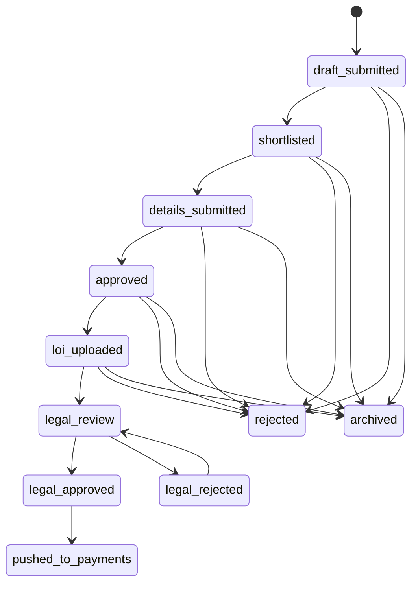
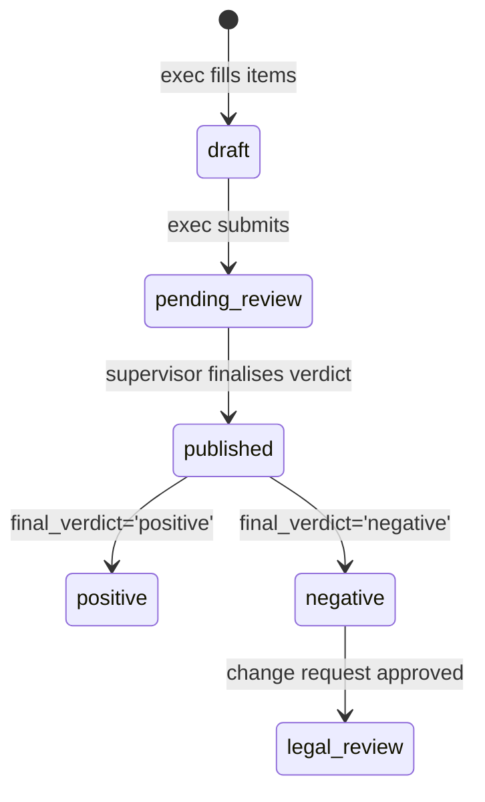
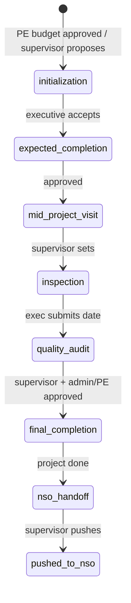
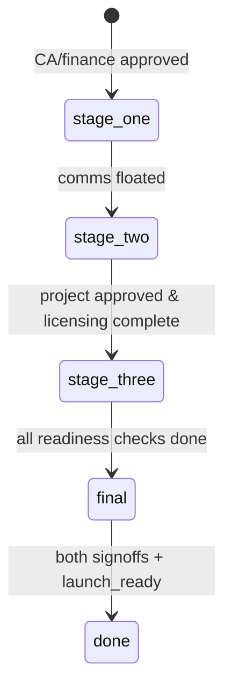
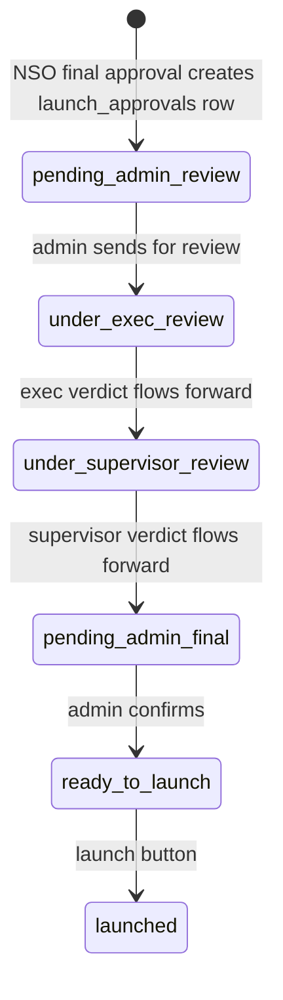
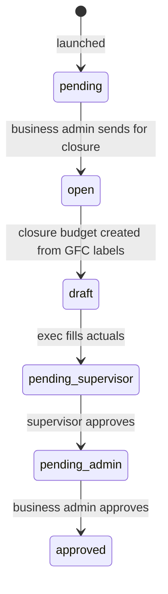

# Domain state machine

The BD site lifecycle is shared between backend and frontend. The backend is authoritative; the frontend mirror prevents impossible UI actions and preserves legacy page labels.

## Canonical states and transitions

| From | Allowed next states | Main actor |
| --- | --- | --- |
| `draft_submitted` | `shortlisted`, `rejected`, `archived` | Supervisor |
| `shortlisted` | `details_submitted`, `rejected`, `archived` | Executive submits; supervisor rejects/archives |
| `details_submitted` | `approved`, `rejected`, `archived` | Supervisor |
| `approved` | `loi_uploaded`, `rejected`, `archived` | Owning/assigned executive uploads LOI |
| `loi_uploaded` | `legal_review`, `rejected`, `archived` | Supervisor |
| `legal_review` | `legal_approved`, `legal_rejected` | Legal workflow |
| `legal_approved` | `pushed_to_payments` | Legal/payment handoff |
| `legal_rejected` | `legal_review` | Approved change-request recovery |
| `pushed_to_payments` | none | Terminal in this FSM |
| `rejected` | none | Terminal |
| `archived` | none in generic FSM | Supervisor-only revive uses saved prior status |

> **Source of Truth**
> - `backend/app/domain/state_machine.py:11-45` — canonical enum and graph.
> - `frontend/src/lib/stateMachine.js:5-34` — required mirror.
> - `backend/app/services/bd_service.py:520-564` — explicit archive revival outside the generic graph.



## Enforcement

Backend services lock the site row, convert the current string to `SiteStatus`, call `assert_transition`, then mutate. Invalid transitions return HTTP `422`. The universal status endpoint also blocks impossible updates before persisting.

Mock mode calls the frontend `assertTransition` and throws an `Error`. HTTP mode does not trust the frontend mirror; the backend revalidates.

> **Source of Truth**
> - `backend/app/domain/state_machine.py:48-58` — backend `422`.
> - `backend/app/routers/sites.py:167-250` — status dispatcher and role gates.
> - `backend/app/services/bd_service.py:178-210,274-333,338-391` — locked transition examples.
> - `frontend/src/lib/stateMachine.js:36-45` and `frontend/src/services/api/adapters/mockAdapter.js:87-128` — mock enforcement.

## Important exceptions

- A supervisor-created site starts directly as `shortlisted`; it does not approve its own draft.
- Archive revival restores `archived_from_status`; it is not a normal `archived -> X` graph edge.
- “Push to payments” is a compatibility name. The current BD action sends `loi_uploaded -> legal_review`.
- Module workflows such as Design, Project, NSO, Launch, finance, and shared budgets have their own status fields and service rules; they do not extend `SiteStatus`.

> **Source of Truth**
> - `backend/app/services/bd_service.py:107-173` — supervisor auto-shortlist.
> - `frontend/src/services/api/siteService.js:86-90` — compatibility wrapper.
> - `backend/app/services/bd_service.py:394-447` — actual legal handoff.
> - `backend/app/db/models.py:125-165,749-814,821-902,939-1002` — module status fields.

## Module-specific status tracks

The BD `sites.status` graph is the main lifecycle. Other modules run parallel tracks with their own tables and service rules; they do not extend `SiteStatus`.

### Legal track

The DD checklist has its own `stage` column; the site moves through the legal states on the main graph.



Once published positive, the supervisor saves agreement and licensing; all five licensing checks becoming `yes` transitions `sites.status` from `legal_review` to `legal_approved`.

### Design track

A parallel track gated on `legal_dd_status='positive'` and `finance_status='approved'`.

```mermaid
stateDiagram-v2
  [*] --> recce : supervisor allocates
  recce --> stage_2d : approved
  stage_2d --> stage_3d : supervisor + admin approved
  stage_3d --> gfc : 3D approved
  gfc --> boq : admin GFC approved
  boq --> done : supervisor + admin approved
  stage_2d --> recce : rejected / re-upload
  stage_3d --> stage_2d : rejected / re-upload
  boq --> gfc : rejected / re-upload

  state stage_2d as "2d"
  state stage_3d as "3d"
```

`design_status` mirror: `pending → allocated → in_progress → gfc_pending → approved`.

### Project Execution track

Unlocks when `design_status='approved'`.



`project_status` mirror: `pending → allocated → in_progress → done`.

### NSO track

Opens at `stage_three` when Project pushes a completed site into the NSO Handover tab.



### Launch track

Post-NSO validation loop with rent-term staging.



Edits before the final `Confirm` live only on `launch_approvals`; `Confirm` commits them to `site_details` and `sites`.

### Financial Closure track

Post-launch actuals vs the approved GFC budget.



> **Source of Truth**
> - `backend/app/services/legal_service.py:1-13,58-250` — legal four-step flow and stage gates.
> - `backend/app/services/design_service.py:1-25,72-83,617-689` — design stage order and gates.
> - `backend/app/services/project_service.py:586-631` — milestone gating.
> - `backend/app/services/nso_service.py:167-197,247-288` — NSO stage computation.
> - `backend/app/services/launch_service.py:1-23,533-740` — launch validation loop.
> - `backend/app/services/financial_closure_service.py:1-11,146-175` — closure open and workflow.
