# Database-to-application transaction flows

The stable write pattern is:

```text
UI intent → frontend service → HTTP adapter → guarded router
→ service transaction → tenant-scoped locked read → validation
→ domain rows + audit + outbox → commit → refetch → rerender
```

Audit and outbox rows normally share the business transaction, so a rolled-back action does not leave a success notification.

> **Source of Truth**
> - `backend/app/db/session.py:79-115` — transaction behavior.
> - `backend/app/services/audit_service.py:18-78` — audit and stage-event co-write.
> - `backend/app/services/notification_service.py:164-212` — outbox writer.

## Login

1. Branded login checks account state.
2. The browser posts email, workspace code, and password to `/api/auth/login`.
3. Backend resolves tenant and user, checks active/password state, loads deterministic module membership, and mints a JWT.
4. Browser stores the token in `sessionStorage`.
5. `SessionContext` calls `/auth/whoami`, hydrates role/tenant/module, and routes render.

> **Source of Truth**
> - `frontend/src/modules/landing/BrandedLoginPage.jsx:62-113` — login UI.
> - `frontend/src/services/api/supabaseAuth.js:46-76` — login request and token store.
> - `backend/app/routers/auth.py:138-265` — login query and token issuance.
> - `frontend/src/state/SessionContext.jsx:92-154` — hydration.

## Create site

1. `NewPipelineModal` calls `SitesContext.createDraft`.
2. `siteService.createSite` selects the active adapter.
3. HTTP adapter posts snake_case data to `POST /api/sites`.
4. Router injects actor and tenant.
5. Service creates `sites`; supervisor-created sites start shortlisted.
6. Service writes audit and, for executive submissions, supervisor outbox rows.
7. Context refetches `/sites` and broadcasts a site-change event.

> **Source of Truth**
> - `frontend/src/App.jsx:193-205` and `frontend/src/state/SitesContext.jsx:316-344`.
> - `frontend/src/services/api/adapters/httpAdapter.js:343-358`.
> - `backend/app/routers/sites.py:143-164`.
> - `backend/app/services/bd_service.py:89-173`.

## Change site status

1. UI calls a `siteService` convenience function.
2. HTTP adapter sends `PATCH /sites/{id}/status`.
3. Router blocks supervisor-only targets for executives and dispatches by target state.
4. Service locks the site row and calls the canonical state machine.
5. State timestamp/domain rows, audit, and notifications are written together.
6. The site list refetches.

> **Source of Truth**
> - `frontend/src/services/api/siteService.js:17-90`.
> - `backend/app/routers/sites.py:167-250`.
> - `backend/app/services/_common.py:52-67`.
> - `backend/app/services/bd_service.py:178-447`.

## Upload LOI

LOI is deliberately two-phase:

1. Validate tenant, owner, and transition in a read transaction.
2. Roll back the read transaction to release the DB connection.
3. Upload bytes to Supabase Storage.
4. Open a new locked write transaction and revalidate the transition.
5. Insert `site_files`, set `sites.status/loi_uploaded_at`, write audit/stage event, and enqueue notifications.
6. Commit and refresh the frontend.

Storage may succeed while the later DB transaction fails; retry uses the same object path and storage upload is configured as upsert.

> **Source of Truth**
> - `frontend/src/state/SitesContext.jsx:299-309`.
> - `backend/app/services/loi_service.py:23-109`.
> - `backend/app/services/storage_service.py:97-120`.

## Reject or archive

Both are supervisor-only. Reject stores a combined reason and moves to terminal `rejected`. Archive requires a non-empty note, snapshots the previous status, and moves to `archived`. Revive is a separate supervisor action that restores the snapshot and retains the historical note.

> **Source of Truth**
> - `frontend/src/state/SitesContext.jsx:261-282`.
> - `backend/app/routers/sites.py:271-321`.
> - `backend/app/services/bd_service.py:450-564`.

## Assign user or site

- **Site assignment:** supervisor validates an active executive in the same tenant, updates `sites.assigned_to`, audits the field change, and notifies the new owner.
- **Pending user activation:** supervisor locks a tenant user, activates it, creates module membership when encoded in signup notes, audits, and commits.
- **Module delegation:** module-specific `site_delegations` rows grant/revoke scoped work without changing the primary site owner.

> **Source of Truth**
> - `backend/app/services/bd_service.py:569-610` — site assignment.
> - `backend/app/routers/users.py:157-232` — user activation.
> - `backend/app/routers/delegations.py:37-113` — delegation HTTP contract.

## Audit list fetch

1. Page calls `audit.getSiteActivity`.
2. Adapter requests `/audit/site/{id}` with optional module.
3. Backend verifies tenant and BD executive ownership, filters audit actions when a module is supplied, orders newest first, and returns `{items,total}`.
4. Frontend derives display tag, label, and color from `action`; it does not rewrite stored audit data.

> **Source of Truth**
> - `frontend/src/services/api/audit.js:1-11,76-170`.
> - `frontend/src/services/api/adapters/httpAdapter.js:372-389`.
> - `backend/app/routers/audit.py:32-54`.
> - `backend/app/services/query_service.py:223-274`.

## Shared budget and Financial Closure

Project Excellence owns the `gfc` workflow but stores budget data in shared `site_budgets`. After launch, a business admin opens `closure`, which seeds the same eleven labels with blank actual amounts. Closure computes per-line variation against the approved GFC phase and follows executive/delegate → supervisor → business-admin review.

> **Source of Truth**
> - `backend/app/services/budget_service.py:1-165` — shared data operations.
> - `backend/app/services/financial_closure_service.py:1-174,348-469` — closure workflow.
> - `backend/database/verified.sql:637-677` — shared budget storage.

## Cross-module site journey

A site does not stay in one table. Each module creates or updates its own rows and stamps a mirror status back onto `sites` so downstream modules and dashboards can decide whether the site is ready.

```mermaid
flowchart LR
  BD["BD / Sites<br/>sites, site_details, approvals"]
  LOI["LOI upload<br/>site_files"]
  Legal["Legal<br/>legal_dd_checklist<br/>site_agreement<br/>site_licensing"]
  Finance["Finance / CA<br/>sites.finance_*"]
  Design["Design<br/>design_reviews<br/>design_deliverables"]
  PE["Project Excellence<br/>site_budgets phase=gfc"]
  Project["Project Execution<br/>project_reviews"]
  NSO["NSO<br/>nso_reviews"]
  Launch["Launch<br/>launch_approvals"]
  FC["Financial Closure<br/>site_budgets phase=closure"]

  BD -->|draft → approved| LOI
  LOI -->|status=legal_review| Legal
  Legal -->|legal_dd_status=positive<br/>agreement_status<br/>licensing_status| Finance
  Finance -->|finance_status=approved| Design
  Design -->|design_status=approved| PE
  PE -->|budget approved| Project
  Project -->|project_status=done<br/>pushed to NSO Handover| NSO
  NSO -->|nso_status=complete| Launch
  Launch -->|is_launched=true| FC
```



Each arrow is a gate: the downstream module refuses to open until the upstream mirror status is set. This is why `sites` carries so many module summary columns.

> **Source of Truth**
> - `backend/app/services/legal_service.py:1-13` — legal module unlock.
> - `backend/app/services/design_service.py:232-246` — design unlock gate.
> - `backend/app/services/project_service.py:49-55` — project unlock gate.
> - `backend/app/services/project_excellence_service.py:49-54` — PE unlock gate.
> - `backend/app/services/nso_service.py:167-197` — NSO handoff push.
> - `backend/app/services/launch_service.py:1-23` — launch trigger.
> - `backend/app/services/financial_closure_service.py:51-64` — closure unlock gate.
