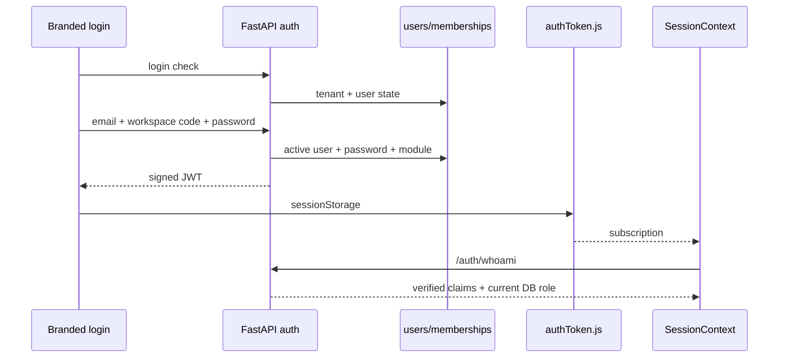
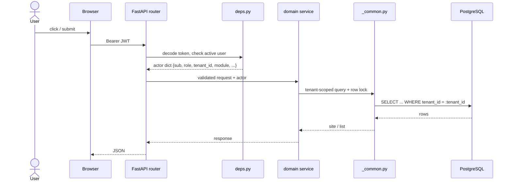

# Authentication and authorization

The backend issues its own 24-hour HS256 JWT. Supabase provides PostgreSQL and Storage, but Supabase Auth is not in the active login path; `supabaseAuth.js` is a historical filename.

## Login and token lifecycle

The HTTP adapter proactively refreshes near expiry and retries one token-carrying `401`. Refresh accepts a recently expired token only within a 48-hour grace window and rechecks that the user is active.

> **Source of Truth**
> - `frontend/src/services/api/supabaseAuth.js:1-14,46-80` — active login path.
> - `backend/app/core/security.py:34-79,145-193` — token TTL and refresh grace.
> - `frontend/src/services/api/adapters/httpAdapter.js:54-98,130-157` — refresh and retry.

## Backend enforcement layers

| Layer | Check |
| --- | --- |
| Token | Signature, audience, expiry, required claims |
| Current account | `users.is_active` and current DB role on every request |
| Tenant | Every persisted lookup filters `tenant_id` |
| Role | FastAPI `require_role(...)` dependency |
| Module | FastAPI `require_module(...)` dependency |
| Object | Executive must own, be assigned, or be delegated to the site |
| Domain | Service-specific rules such as self-approval and state transitions |

Frontend route guards improve navigation but are not security controls.

> **Source of Truth**
> - `backend/app/core/security.py:87-142` — JWT validation.
> - `backend/app/core/deps.py:32-89` — active-user/current-role check.
> - `backend/app/rbac/guards.py:8-57` — role/module checks.
> - `backend/app/services/_common.py:38-83,129-143` — tenant/object/list scope.
> - `frontend/src/router/guards.jsx:18-59` — client navigation guards.

## Multi-tenancy scope flow

Tenant isolation is enforced at the database-query layer. The JWT carries `tenant_id`; every service lookup adds `tenant_id = :tenant_id` to the WHERE clause. Executive reads additionally restrict to `submitted_by`, `assigned_to`, or an active module delegation.

City scope exists in the session for display filtering, but it is not a hard authorization boundary. The backend site list scopes executives by ownership/assignment and supervisors by tenant.

> **Source of Truth**
> - `backend/app/core/deps.py:32-89` — actor extraction and current-account recheck.
> - `backend/app/services/_common.py:38-83,129-143` — tenant and executive list scope.
> - `frontend/src/rbac/scope.js:11-38` — client-side city/scope display filter.

## Role and module model

Top-level role answers **what level of authority** a user has. Module membership answers **where that authority applies**. Business admins use a separate portal. Supervisors and executives enter the tenant shell and are routed to their module home from the JWT `module` claim.

The current login selects the first membership ordered by module when a user has multiple memberships. The JWT therefore carries one active module per session.

> **Source of Truth**
> - `backend/app/routers/auth.py:226-253` — deterministic membership selection.
> - `frontend/src/router/AppRouter.jsx:67-125` — module home routing.
> - `backend/database/verified.sql:331-342` — membership persistence.

## City and ownership scope

City is present in the session and can be used by views, but the core backend site list scopes executives by ownership/assignment and supervisors by tenant. Do not assume city alone is a hard authorization boundary unless the queried service explicitly adds it.

> **Source of Truth**
> - `backend/app/services/_common.py:129-143` — effective list scope.
> - `backend/app/services/query_service.py:134-161` — optional city filter.
> - `frontend/src/rbac/scope.js:11-38` — client display filtering.

## Mock-mode differences

Mock mode is always considered signed in, allows local role switching, uses in-memory sites, and enforces transitions with the frontend state machine. It does not prove backend RBAC, tenant isolation, persistence, or database constraints.

> **Source of Truth**
> - `frontend/src/state/SessionContext.jsx:15-27,195-209`.
> - `frontend/src/router/AppRouter.jsx:77-91`.
> - `frontend/src/services/api/adapters/mockAdapter.js:1-10,87-128`.
