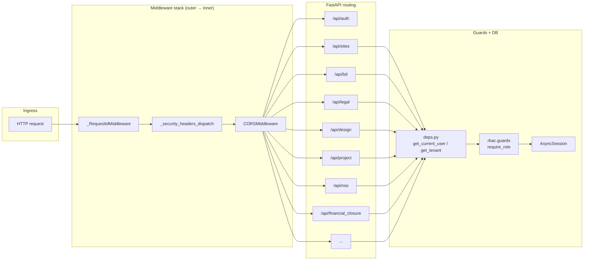
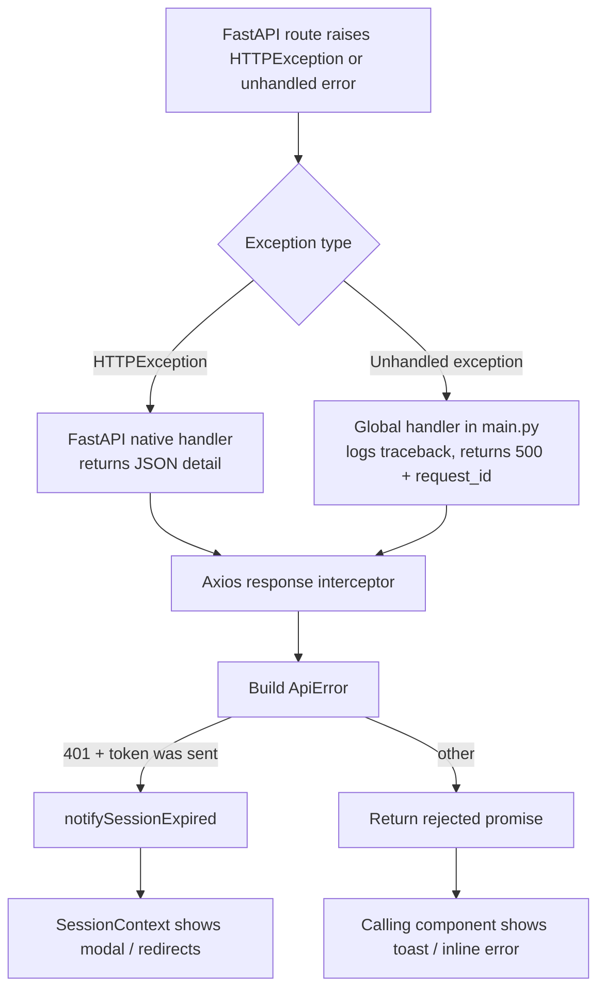

# Request lifecycle: adapter, client, router, and service internals

This page is the missing glue between the frontend service layer and the FastAPI backend. It explains how a user action becomes an HTTP request, how the backend unwraps identity and tenant, and how errors propagate back to the UI. It also documents the environment switches that make local development possible without a real backend.

## The adapter facade

All frontend service modules import from `adapters/index.js`, never from `mockAdapter.js` or `httpAdapter.js` directly. The index picks the active adapter at module load time from `import.meta.env.VITE_USE_MOCK`.

```text
siteService.js ──► adapters/index.js ──► mockAdapter.js  (VITE_USE_MOCK=true)
                                │
                                └──────► httpAdapter.js  (production / local backend)
```

> **Source of Truth**
> - `frontend/src/services/api/adapters/index.js:1-14` — adapter selector.
> - `frontend/src/services/api/siteService.js:1-7` — service modules consume the adapter facade.

## HTTP adapter responsibilities

`httpAdapter.js` is the production client. It owns five concerns:

1. **Auth token injection** on every request via `authToken.js`.
2. **Camel / snake case translation** at the wire boundary so components stay camelCase.
3. **Typed errors** — converts axios/network/timeout failures into `ApiError`.
4. **Timeouts** — default 20 s, with a separate 120 s budget for multipart uploads.
5. **Token refresh** — proactively refreshes near-expiry tokens and retries 401s once.

> **Source of Truth**
> - `frontend/src/services/api/adapters/httpAdapter.js:1-31` — responsibilities and timeouts.
> - `frontend/src/services/api/adapters/httpAdapter.js:94-158` — interceptors, refresh, and `ApiError`.
> - `frontend/src/services/api/authToken.js:1-60` — token storage and expiry helpers.

### Token lifecycle

The access token is stored in a module-level closure and mirrored into `sessionStorage` (not `localStorage`) so it survives a refresh but dies with the tab. The auth provider calls `setAuthToken(token)` after login and `clearAuthToken()` on logout. The HTTP adapter reads the token synchronously in the request interceptor.

```text
Login / refresh ──► setAuthToken(token)
                         │
                         ▼
              module-level _token + sessionStorage
                         │
                         ▼
         request interceptor reads token ──► Authorization: Bearer <token>
                         │
                         ▼
   401 with token sent ──► refresh /auth/refresh ──► setAuthToken(next) ──► retry
```

> **Source of Truth**
> - `frontend/src/services/api/authToken.js:15-60` — token storage, hydration, and listeners.
> - `frontend/src/services/api/adapters/httpAdapter.js:54-92` — proactive refresh helper.

### Error propagation

When a request fails, the response interceptor builds a single `ApiError` that the UI can render:

| Failure mode | `ApiError` fields | Typical UI handling |
| --- | --- | --- |
| Request timeout | `status: 0, code: 'TIMEOUT'` | Toast: request timed out |
| Network / CORS | `status: 0, detail: "Network Error contacting API at ..."` | Toast + retry button |
| 401 with sent token | `status: 401` | Session expired modal via `notifySessionExpired` |
| 403 / 422 | `status, detail` | Inline error or toast |
| 500 | `status: 500` | Generic error; support uses `request_id` |

Bootstrap auth requests (`/auth/whoami`, `/auth/refresh`) intentionally skip the session-expired modal so a stale token on first load does not blink a blocking popup over the landing page.

> **Source of Truth**
> - `frontend/src/services/api/adapters/httpAdapter.js:102-158` — `ApiError` and response interceptor.

## Complete request walkthrough: transition a site

This sequence follows a supervisor clicking **Shortlist** or **Approve** on a site card. The same path applies to most status transitions.

```mermaid
sequenceDiagram
    autonumber
    participant UI as Site card / form
    participant SS as siteService.js
    participant HA as httpAdapter.js
    participant API as FastAPI /sites router
    participant DEPS as deps.py
    participant SVC as bd_service.py
    participant DB as Supabase (Postgres)

    UI->>SS: transitionSite(siteId, nextStatus, payload)
    SS->>HA: adapter.patchSiteStatus(siteId, status, payload)
    HA->>HA: ensureFreshAuthToken()<br/>detailsToServer(payload.details)
    HA->>API: PATCH /api/sites/{id}/status<br/>Authorization: Bearer <token>
    API->>DEPS: get_current_user + get_tenant
    DEPS->>DEPS: decode token, SELECT role/is_active<br/>await db.rollback() to release read txn
    DEPS-->>API: current_user, tenant_id
    API->>API: Enforce supervisor-only targets (#102)
    API->>SVC: svc_shortlist_draft / svc_approve_shortlist / ...
    SVC->>DB: "BEGIN; SELECT ... FOR UPDATE<br/>validate transition; UPDATE sites<br/>INSERT audit, stage event, outbox<br/>COMMIT"
    DB-->>SVC: updated row
    SVC-->>API: domain response (snake_case)
    API-->>HA: 200 OK + site JSON
    HA->>HA: siteFromServer(response) → camelCase
    HA-->>SS: canonical site object
    SS-->>UI: promise resolves
    UI->>UI: SitesContext refetches list, broadcasts event
```

> **Source of Truth**
> - `frontend/src/services/api/siteService.js:17-22` — `transitionSite` wrapper.
> - `frontend/src/services/api/adapters/httpAdapter.js:165-189` — `detailsToServer` snake_case conversion.
> - `frontend/src/services/api/adapters/httpAdapter.js:204-322` — `siteFromServer` camelCase conversion.
> - `backend/app/routers/sites.py:167-250` — status patch dispatcher and role gate.
> - `backend/app/core/deps.py:32-89` — `get_current_user` with active check and rollback fix.

## FastAPI application composition

`main.py` builds the app, wires middleware, registers routers, and defines the lifespan hooks.



> **Source of Truth**
> - `backend/app/main.py:225-250` — FastAPI app and middleware order.
> - `backend/app/main.py:297-298` — router inclusion loop.

### Middleware order

Middleware is added last-registered-first-executed. The actual ingress order is:

1. `_RequestIdMiddleware` — generates `request_id`, stores it in `request.state` and a `contextvars.ContextVar`.
2. `_security_headers_dispatch` — adds `X-Content-Type-Options`, `X-Frame-Options`, `Referrer-Policy`, and HSTS on HTTPS.
3. `CORSMiddleware` — handles preflight and origin headers.

Unhandled 500s are produced by Starlette's outer `ServerErrorMiddleware`, so the global exception handler re-applies both CORS and security headers to prevent the browser from reporting a generic network error.

> **Source of Truth**
> - `backend/app/main.py:99-151` — request ID and security middleware.
> - `backend/app/main.py:277-294` — global exception handler with CORS/security re-application.

### Lifespan hooks

The lifespan context manager runs at startup and shutdown:

1. Smoke-test the database with `SELECT 1`; exit code 1 on failure so Railway restarts.
2. Warn if `WEB_CONCURRENCY` or `UVICORN_WORKERS` is >1 because the in-memory rate limiter is not shared across processes.
3. Start the background email drain when `RESEND_API_KEY` is configured.
4. On shutdown, cancel the drain task, close the storage client, and dispose the SQLAlchemy engine.

> **Source of Truth**
> - `backend/app/main.py:180-220` — lifespan context manager.

## Dependency injection chain

Most routes declare three injected values:

| Dependency | Type | Purpose |
| --- | --- | --- |
| `db: DbDep` | `AsyncSession` | One database session per request. |
| `current_user` | `dict` | Decoded JWT + current DB role + `is_active` re-check. |
| `tenant_id: TenantId` | `str` | `current_user["tenant_id"]` injected by `get_tenant`. |

`get_current_user` re-checks `users.is_active` on every request, then **rolls back the read-only transaction** it just opened. This is critical: without the rollback, SQLAlchemy's autobegin would leave the session "in transaction", and the service-layer `transaction()` helper would open a `SAVEPOINT` instead of a real transaction, causing all writes to be silently rolled back at session close.

> **Source of Truth**
> - `backend/app/core/deps.py:18-89` — `DbDep`, `get_current_user`, and rollback fix.
> - `backend/app/db/session.py:1-77` — `get_db` session lifecycle.

## Router → service → database dispatch

Routers are intentionally thin. They validate input, enforce role gates, and call domain services. The `sites.py` dispatcher maps target statuses to service functions; the actual state machine, locking, audit, and notification logic lives in `bd_service.py` and shared helpers.

```text
PATCH /api/sites/{id}/status
    │
    ├─ target == REJECTED    → svc_reject_site
    ├─ target == ARCHIVED    → svc_archive_site
    ├─ target == SHORTLISTED → svc_shortlist_draft
    ├─ target == DETAILS_SUBMITTED → svc_submit_details
    ├─ target == APPROVED    → svc_approve_shortlist
    ├─ target == LEGAL_REVIEW → svc_push_to_payments
    ├─ target == LOI_UPLOADED → 400 (use multipart POST /loi)
    └─ anything else          → 422
```

> **Source of Truth**
> - `backend/app/routers/sites.py:167-250` — status dispatcher.
> - `backend/app/services/bd_service.py:178-447` — transition implementations.

## Mock mode for local development

Setting `VITE_USE_MOCK=true` swaps `mockAdapter.js` into the facade. The mock adapter returns in-memory objects and simulates latency via `delay.js`. It is useful for UI work without a running backend, but it does **not** exercise the real state machine, auth, or transaction paths.

> **Source of Truth**
> - `frontend/src/services/api/adapters/index.js:7-12` — environment switch.
> - `frontend/src/services/api/adapters/mockAdapter.js` — in-memory implementations.

## Error mapping from backend to UI



> **Source of Truth**
> - `backend/app/main.py:277-294` — global exception handler.
> - `frontend/src/services/api/adapters/httpAdapter.js:113-158` — response interceptor.

## Common mistakes

- **Calling adapters directly from JSX** — always go through the service module (e.g. `siteService.js`) so mock mode works and payload coercion stays in one place.
- **Sending numeric form fields as strings** — `siteService.submitDetails` and `saveDraftDetails` coerce rupee/percent fields to numbers before passing them to the adapter. Without this, the backend writes strings into `NUMERIC` columns and values disappear on reload.
- **Adding a new status transition only in the UI** — the canonical state machine lives in `backend/app/domain/state_machine.py`. The frontend should not invent transitions.
- **Forgetting the read-then-write pattern for uploads** — LOI/photo uploads must validate in a read transaction, release it, upload to storage, then open a locked write transaction. Holding the DB lock during a storage call exhausts the connection pool.

> **Source of Truth**
> - `frontend/src/services/api/siteService.js:29-73` — numeric field coercion.
> - `backend/app/domain/state_machine.py` — canonical transition rules.
