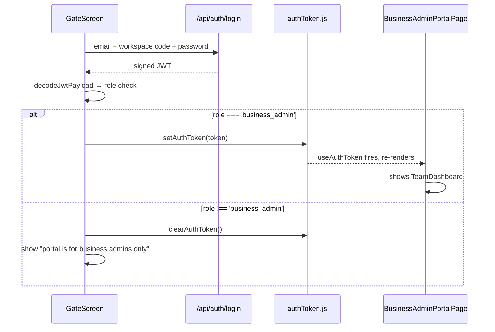

# Business admin portal

The business admin portal is a second, fully independent frontend application that shares the same HTML entry point and JavaScript bundle as the main workspace but runs with its own session model, chrome, and theme. It is not a module within the main workspace shell.

## Why it is separate

Business admins do not belong to a module and have no BD/legal/design pipeline to navigate. Putting them into the main workspace shell (`App.jsx`) would require threading admin-specific tabs and data into an otherwise module-scoped chrome. Instead the portal has its own sidebar, theme toggle, and data layer that operate without `SessionContext` or `SitesContext`.

## Routing entry point

`AppRouter.jsx` decides where to send a session before any screen renders:

```text
useAuthToken() returns token
    │
    ▼
decodeJwtPayload(token).role
    │
    ├── 'business_admin'  →  <Navigate to="/business-admin" replace/>
    └── anything else     →  normal workspace screens
```

The redirect fires on every render until the role changes, so a business admin who somehow reaches `/` is immediately bounced back to the portal.

> **Source of Truth**
> - `frontend/src/router/AppRouter.jsx:67-91` — role-based redirect and workspace guards.
> - `frontend/src/router/routes.js` — `ROUTES.BUSINESS_ADMIN = '/business-admin'`.

## Component tree

```text
Route /business-admin
└── BusinessAdminPortalPage          (entry, owns auth gate + error boundary)
    ├── GateScreen                   (sign-in form, shown when no valid admin token)
    └── BusinessAdminErrorBoundary
        └── TeamDashboard            (full portal UI: sidebar + main panel)
            ├── Sidebar              (portal-specific nav, theme toggle, logout)
            └── main panel
                ├── ApprovalCenter   (tab: approvals)
                ├── LaunchApprovalTab (tab: launch approvals)
                ├── DepartmentsTab   (tab: departments)
                └── SitesTab         (tab: sites)
```

> **Source of Truth**
> - `frontend/src/modules/business-admin/BusinessAdminPortalPage.jsx` — entry and error boundary.
> - `frontend/src/modules/business-admin/GateScreen.jsx` — login gate.
> - `frontend/src/modules/business-admin/TeamDashboard.jsx:75-280` — tabs and portal shell.

## Authentication pattern: `useAuthToken`, not `useSession`

The portal does not use `SessionContext`. Instead it reads the raw JWT via `useAuthToken()`, which subscribes to the shared `authToken.js` token store.

```text
authToken.js (module-level closure + sessionStorage)
    │
    ├── useAuthToken()          — React hook; re-renders on token change
    │       └── BusinessAdminPortalPage: if (!token || role !== 'business_admin') → GateScreen
    │
    └── axiosClient.js          — injects Bearer header on every request
```

`decodeJwtPayload(token)` reads claims (role, tenant, workspace name) directly from the token payload without making a network call. There is no `/auth/whoami` hydration in the portal.

When the axios interceptor clears the token on a `401`, `useAuthToken()` fires and the portal drops back to `GateScreen` immediately, with no stale render window.

> **Source of Truth**
> - `frontend/src/state/useAuthToken.js:1-8` — token subscription hook.
> - `frontend/src/modules/business-admin/BusinessAdminPortalPage.jsx:43-57` — gate check.
> - `frontend/src/modules/business-admin/jwt.js` — `decodeJwtPayload`.
> - `frontend/src/services/api/authToken.js:15-60` — shared token store.

## GateScreen login flow

`GateScreen` reuses the same `/api/auth/login` endpoint as the main workspace. After a successful login it reads the JWT role claim and rejects tokens that are not `business_admin`, clearing the token and showing an error.



> **Source of Truth**
> - `frontend/src/modules/business-admin/GateScreen.jsx:8-47` — login form and role gate.
> - `frontend/src/services/api/supabaseAuth.js:46-76` — shared login function.

## TeamDashboard: portal shell

`TeamDashboard` owns the full portal layout. It has its own theme system (`getInitialTheme` / `persistTheme` from `kit.jsx`, stored under `ac-theme` in `localStorage`) that is independent of the main workspace dark-mode preference.

Data is fetched via injectable `fetchers` (real API functions by default; replaceable with mocks in tests or the dev preview). Each queue is managed by a local `useQueue` hook that handles loading, error, and silent-refresh states.

| Tab | Data fetched | Backend router |
| --- | --- | --- |
| Approval Center | Design deliverables, GFC queue, finance queue, budget queue, quality audit, closure | `/business-admin`, `/design`, `/project-excellence` |
| Launch Approvals | Launch approval queue | `/launch-approvals` |
| Departments | Org tree, pending supervisor requests | `/users`, `/supervisor-codes` |
| Sites | All tenant sites | `/business-admin` |

The approval center aggregates four queues into a single site-centric list keyed by `siteId` using a client-side `Map`. All four queues must fail before the center shows an error; a single failing queue shows a partial view.

> **Source of Truth**
> - `frontend/src/modules/business-admin/TeamDashboard.jsx:57-73` — `useQueue` hook.
> - `frontend/src/modules/business-admin/TeamDashboard.jsx:115-159` — queue aggregation.
> - `frontend/src/modules/business-admin/TeamDashboard.jsx:161-167` — resilient status logic.

## Data and API wiring

`TeamDashboard` imports real API functions as `REAL_FETCHERS` and uses them by default. The `fetchers` prop makes every queue replaceable for testing.

```text
TeamDashboard
    └── fetchers = REAL_FETCHERS (default)
            ├── getDesignAdminQueue      → GET /design/admin/queue
            ├── adminReviewDeliverable   → POST /design/admin/review
            ├── getFinanceQueue          → GET /business-admin/finance/queue
            ├── approveFinance           → POST /business-admin/finance/{id}/approve
            ├── getBudgetQueue           → GET /project-excellence/admin/queue
            ├── getQualityAuditQueue     → GET /business-admin/quality-audit/queue
            ├── getClosureAdminQueue     → GET /financial-closure/admin/queue
            ├── listPendingSupervisors   → GET /users/pending-supervisors
            ├── getOrg                   → GET /business-admin/org
            └── getAllSites              → GET /business-admin/sites
```

> **Source of Truth**
> - `frontend/src/modules/business-admin/TeamDashboard.jsx:29-53` — `REAL_FETCHERS`.
> - `frontend/src/services/api/businessAdminApi.js` — queue and decision endpoints.

## Error boundary

`BusinessAdminErrorBoundary` wraps `TeamDashboard` and catches render errors. It is keyed to the current token: when the token changes (sign out then sign in), the error boundary resets automatically and a fresh `TeamDashboard` is mounted with the new identity.

> **Source of Truth**
> - `frontend/src/modules/business-admin/BusinessAdminPortalPage.jsx:8-43` — error boundary implementation and `key={token}` reset.

## Dev preview

A separate route `/business-admin-preview` mounts `ApprovalCenterPreview`, which drives `TeamDashboard` with static mock data. It is only bundled and accessible when `import.meta.env.VITE_ENABLE_PREVIEW === 'true'`.

> **Source of Truth**
> - `frontend/src/router/AppRouter.jsx:49,149-151` — conditional preview route.
> - `frontend/src/modules/business-admin/_preview/ApprovalCenterPreview.jsx` — mock fetchers and test scenarios.

## Key differences from the main workspace

| Concern | Main workspace | Business admin portal |
| --- | --- | --- |
| Session context | `SessionContext` / `useSession()` | None — raw token via `useAuthToken()` |
| Auth hydration | `GET /auth/whoami` on login | Token payload decoded inline via `decodeJwtPayload` |
| Data context | `SitesContext` / `useSites()` | Local `useQueue` hooks inside `TeamDashboard` |
| Chrome | `App.jsx` top bar + `Sidebar.jsx` | `TeamDashboard` owns its sidebar from `modules/business-admin/ui/` |
| Theme | `SessionContext` dark-mode preference | Local `ac-theme` preference in `localStorage` |
| Route guard | `RequireAuth` + module guards | `BusinessAdminPortalPage` gate check inline |
| Entry point | `AppRouter` normal routes | `Route path="/business-admin"` directly |
