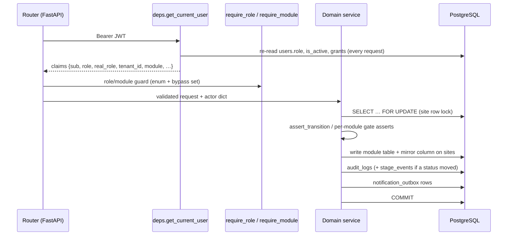
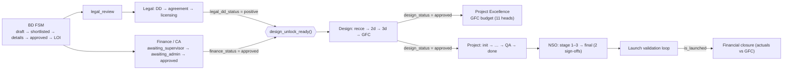

# Part 1: Current state

[← Index](README.md) · §2 Current architecture · §3 Hardcoded assumptions · §4 Weaknesses and risks · Current → Target mapping

This part treats the repository as evidence of what the product does today, not as the authority on what the platform should be. Claims about current behaviour cite code. The full inventory of domain-specific assumptions is in [Appendix A](appendix-a-hardcoded-inventory.md).

---

## §2 Current architecture analysis

### 2.1 The system at a glance

| Dimension | Measured value | How measured |
| --- | --- | --- |
| Backend | ~27,000 lines of Python: 19 routers, 31 services, 1 ORM module | `wc -l backend/app/**/*.py` |
| HTTP surface | **225 routes**; `business_admin.py` (28), `project.py` (22), `sites.py` (22) and `project_excellence.py` (21) are the largest | `grep -c "@router."` |
| Frontend | ~41,000 lines of JS/JSX; ~60 route constants; 20 module folders | `frontend/src/router/routes.js`, `frontend/src/modules/` |
| Tables | ~35 live, plus 2 dropped (`project_executions`, `project_budget_items`) | `CREATE TABLE` / `DROP TABLE` across `backend/database/migrations/` |
| Migrations | 64 ordered files, applied by a ledger runner at boot | `backend/database/migrations/`, `backend/app/main.py` |
| Value vocabularies | **63** `CHECK (… IN (…))` constraints in the reference schema | `backend/database/schema.sql` |
| Tests | ~60 backend test modules, mostly scenario regressions per module | `backend/tests/` |

**Stack:**

- **Frontend:** React 18 + Vite, hash-routed SPA hosted on Vercel.
- **Backend:** FastAPI + Pydantic v2 + SQLAlchemy 2 (async) + asyncpg, hosted on Railway.
- **Data and files:** Supabase PostgreSQL and Supabase Storage.
- **Email:** Resend, drained in-process from a transactional outbox.

> **Source of Truth**
> - `docs/00-overview/project-overview.md` — stack table.
> - `backend/pyproject.toml`, `frontend/package.json` — dependencies.
> - `DEPLOYMENT.md` — topology.

### 2.2 Layering and the write path

The layering is disciplined: thin routers, services that own the rules, and one transaction per command. Every status-changing write follows the same choreography:

This choreography is the most valuable thing in the codebase. Lock, check, write, record and notify, all in one transaction, is exactly the command pipeline a platform needs. It is currently re-implemented by hand in each service.

> **Source of Truth**
> - `backend/app/core/deps.py:193-325` — `get_current_user`, with the per-request role and `is_active` re-check.
> - `backend/app/rbac/guards.py:8-91` — `require_role`, `require_real_role`, `require_module`.
> - `backend/app/services/_common.py:89-104` — `fetch_site_for_update_or_404`.
> - `backend/app/services/audit_service.py:17-84` — the `audit_logs` + `stage_events` co-write.
> - `backend/app/services/notification_service.py:1-22` — the outbox contract.

### 2.3 Tenant model

- **Shared database, shared schema.** Every domain row carries `tenant_id`, and every service query filters on it. Postgres RLS was added as defense in depth (`20260802_complete_rls_defense_in_depth.sql`).
- **Onboarding.** A workspace is created from a landing-page `workspace_requests` row that a *platform admin* approves. Approval provisions a `tenants` row with a `workspace_code` (the login code) and a `seat_limit`.
- **Per-tenant configuration.** The only per-tenant configuration is `logo_url` (branding), `plan` and `seat_limit`. Departments, roles, stages, forms and approval chains are the same for every tenant because they are code.

> **Source of Truth**
> - `backend/database/schema.sql:49-60` — `tenants`.
> - `backend/app/services/tenancy_service.py:273` — `approve_workspace_request`.
> - `backend/database/migrations/20260802_complete_rls_defense_in_depth.sql`.

### 2.4 Identity and authentication

- The backend issues a 24-hour HS256 JWT itself (Supabase Auth is not in the login path). Login takes email, workspace code and password.
- The token carries `role`, `tenant_id` and **one** `module`. When a user has several memberships, login picks the first by `ORDER BY module … LIMIT 1`. **A session therefore lives in exactly one department.**
- Every request re-reads the user's role and `is_active` flag, so deactivation takes effect immediately. That is a strength worth keeping.

> **Source of Truth**
> - `backend/app/core/security.py` — token issue and refresh.
> - `backend/app/services/auth_repo.py:89-107` — `get_primary_membership`, `ORDER BY module, supervisor_id NULLS LAST`.
> - `backend/database/migrations/20260930_supervisor_module_access_grants.sql:1-14` — documents why a second membership row would "silently relocate" a supervisor at next login.

### 2.5 Authorization

Authorization is spread across **seven mechanisms**, and they must be read together:

| # | Mechanism | What it decides |
| --- | --- | --- |
| 1 | `Role` enum: `business_admin`, `observer`, `supervisor`, `executive` | Global authority level |
| 2 | `READ_ALL_ROLES` bypass in `require_role` / `require_module` | Admin and observer pass every route guard |
| 3 | `_assert_may_write` in `deps.py` | Observers are refused every non-GET request |
| 4 | `user_module_memberships.module` + `role_in_module` | Which department the authority applies to |
| 5 | `X-Override-Role` / `X-Override-Module` headers, rewritten in `_apply_workspace_override` | Admin simulation, observer module switching, supervisor "borrowed" modules, supervisor-as-executive |
| 6 | `supervisor_module_access_grants`, `supervisor_executive_requests` / `has_executive_access` | Cross-module and dual-role exceptions |
| 7 | Object scope helpers (`assert_executive_owns_site`, delegation checks) and the `PERMISSIONS` action map | Ownership, delegation, per-action role lists |

The `PERMISSIONS` map exists twice. The backend copy is `backend/app/rbac/permissions.py`; the frontend copy is `frontend/src/rbac/permissions.js`. **They have already drifted.** The frontend lists `BUSINESS_ADMIN` for `create_draft`, `shortlist`, `approve_details`, `reject` and `archive`. The backend relies on the bypass set instead.

The model can't express *conditions*, such as "approve only in my region" or "never approve my own submission". So those live as imperative checks inside services.

> **Source of Truth**
> - `backend/app/rbac/roles.py:1-46` — the four-role model and `READ_ALL_ROLES`.
> - `backend/app/rbac/guards.py:8-91` — guards and bypasses.
> - `backend/app/core/deps.py:74-190` — `_assert_may_write`, `_assert_workspace_access`, `_apply_workspace_override`.
> - `backend/app/rbac/permissions.py`, `frontend/src/rbac/permissions.js` — the duplicated action map.
> - `backend/app/services/_common.py:107-141` — `actor_is_business_admin`, `actor_can_supervise`, `assert_executive_owns_site`.

### 2.6 Modules and the site lifecycle

A **site** is the only case type. It moves through one hardcoded FSM (`sites.status`, BD) and eight module tracks. Each track has its own tables, its own status vocabulary and a **mirror column** on `sites`, which downstream modules read to decide whether they are unlocked.

| Module | Own tables | Mirror on `sites` | Opens when (hardcoded in) |
| --- | --- | --- | --- |
| BD | `sites`, `site_details`, `approvals`, `site_files`, `shortlist_delegations` | `status` (11 values) | — |
| Finance / CA | (columns on `sites`) | `finance_status`, `ca_code`, `kyc_verified` | `status ∈ _LOI_AND_BEYOND` (`finance_service.py:36`) |
| Legal | `legal_dd_checklist`, `site_agreement`, `site_licensing`, `legal_change_requests` | `legal_dd_status`, `agreement_status`, `licensing_status` | `status = legal_review` |
| Design | `design_reviews`, `design_deliverables` | `design_status` | `legal_dd_status='positive' AND finance_status='approved'` (`workflow_unlocks.py:25`, `design_service.py:230`) |
| Project Excellence | `site_budgets(phase=gfc)`, `site_budget_items` | `project_excellence_status` | `design_status='approved'` (`project_excellence_service.py:57`) |
| Project | `project_reviews`, `quality_audit_reports` | `project_status`, `project_completed_at` | `design_status='approved'` (`project_service.py:67`) |
| NSO | `nso_reviews` | (via `project_reviews.nso_status`) | Project pushed to the NSO handover |
| Launch | `launch_approvals`, `launch_review_events` | `is_launched`, `launched_at` | NSO final approval |
| Financial closure | `site_budgets(phase=closure)` | `financial_closure_status` | `is_launched` (`financial_closure_service.py:57`) |

> **Source of Truth**
> - `backend/app/domain/state_machine.py:11-45` — `SiteStatus` and `ALLOWED_TRANSITIONS`.
> - `backend/app/services/workflow_unlocks.py:25-29` — the only explicit parallel join.
> - `backend/app/db/models.py:145-176` — the mirror columns.
> - `docs/03-state-machine/site-lifecycle.md` — the per-module tracks.

### 2.7 Approvals

The product's central act, *someone reviews and decides*, is implemented at least eight times, each with its own vocabulary:

| Where | Vocabulary | Approver chain |
| --- | --- | --- |
| Site details (`approvals`, `sites.status`) | `pending / approved / rejected` | supervisor |
| Finance / CA (`sites.finance_status`) | `pending → awaiting_supervisor → awaiting_admin → approved` | exec → supervisor → admin |
| Legal DD (`legal_dd_checklist.stage`, `final_verdict`) | `draft → pending_review → published` + `positive/negative` | exec → supervisor |
| Legal change requests | `pending / approved / rejected` | legal supervisor |
| Design deliverables | `status` + `admin_status`, each `pending/submitted/approved/rejected`; plus `gfc_status` | exec → supervisor → admin |
| Budgets (`site_budgets`) | `draft → pending_supervisor → pending_admin → approved / rejected` | exec → supervisor → admin |
| Project milestones and QA (`project_reviews`) | `initialization_status`, `expected_completion_status`, `quality_audit_status (… supervisor_approved …)` | exec → supervisor → admin |
| NSO final | `final_approval_signoff_1`, `final_approval_signoff_2` (booleans) | two sign-offs |
| Launch loop | `pending_admin_review → under_exec_review → under_supervisor_review → pending_admin_final → ready_to_launch → launched` | admin → exec → supervisor → admin |

The *pattern* is the same in all of them (maker, then checker, then approver, with send-back), and `docs/14` identified it correctly as the product's approval doctrine. The *implementation* is not shared. Each has its own columns, endpoints, queue queries, notifications and UI.

> **Source of Truth**
> - `backend/database/schema.sql:336-356, 612-905` — approval columns.
> - `backend/app/db/models.py:175, 783-826, 901, 1026-1120`.
> - `backend/app/services/launch_service.py:1-23`, `finance_service.py:1-6`.

### 2.8 Delegation and acting on behalf of others

There are five delegation-like mechanisms:

- **`shortlist_delegations`:** BD shortlist ownership, per site.
- **`site_delegations`:** per site and per module, with module list `bd, legal, design, project, nso, project_excellence, financial_closure, quality_audit`.
- **`supervisor_module_access_grants`:** a supervisor borrows another module, approved by an admin.
- **`supervisor_executive_requests` / `has_executive_access`:** a supervisor may also act as an executive.
- **Business-admin and observer simulation** through override headers.

The migration that added module grants records the gap itself: *"a site write made under a borrowed grant is not marked as such … a Legal approval made under a grant is byte-identical to one by Legal's own supervisor."*

> **Source of Truth**
> - `backend/app/services/delegation_service.py:1-20`, `module_access_service.py:1-15`.
> - `backend/database/migrations/20260930_supervisor_module_access_grants.sql` — the "Out of scope" note.
> - `docs/13-admin-role-simulation/admin-role-simulation.md`.

### 2.9 History, audit and events

History is split across five stores with overlapping purposes:

| Store | Shape | Gaps |
| --- | --- | --- |
| `audit_logs` | Free-text `action` (97 distinct values in services and routers), status from/to, field from/to, JSON old/new | `actor_role` is not stored. No workflow version, policy, task or reason fields |
| `stage_events` | Co-written when a status moves; `site_id NOT NULL`; `actor_role` CHECK limited to 4 values | Site-only. Records the *simulated* role |
| `launch_review_events` | Launch loop timeline with `changes` JSON | A third, module-specific ledger |
| `legal_change_requests` | Request/decision rows for flipping a legal field | History doubling as workflow |
| `reversible_actions` | Before-value snapshots for undo | Exists because the audit log does not record before-state for every action |

There is no way to answer *"which workflow version and which policy permitted this action?"*. Neither concept exists.

> **Source of Truth**
> - `backend/app/services/audit_service.py:1-15, 61-74` — the co-write rule; `actor_role` is dropped from `audit_logs`.
> - `backend/database/schema.sql:230-308, 583-610, 877-897`.
> - `backend/database/schema.sql:259-263` — the stated reason for `reversible_actions`.

### 2.10 Notifications, documents and forms

- **Notifications.** A solid transactional outbox (`notification_outbox`: channel, status, attempts) is drained to Resend. *Who* gets notified is decided by code-level resolvers (`recipients_for_legal_supervisors`, `recipients_for_design_supervisors`, …) called from each transition by hand.
- **Documents.** There are two models. One is `site_files`, with `file_type` constrained to `loi, photo, quality_audit, excellence, closure`. The other is URL columns on module rows (`design_deliverables.file_url`, `site_agreement.document_url`). Uploading bytes outside the DB transaction and serving short-lived signed URLs is a good pattern worth keeping.
- **Forms.** Every form is a Pydantic request model plus a hand-built React form. Checklists are **columns**: nine legal DD items (plus two free-label "other" slots), five licences and eleven budget heads (`BUDGET_LABELS`, enforced by `CHECK (idx BETWEEN 1 AND 11)`). Adding a checklist item means a migration, model, schema, service and UI change.

> **Source of Truth**
> - `backend/app/services/notification_service.py:43-120` — recipient resolvers.
> - `backend/database/schema.sql:204-228, 526-581, 744-765`.
> - `backend/app/services/budget_service.py:28-40`.

### 2.11 Frontend

- About 60 hardcoded route constants, one family per department. `RequireRole` and `RequireModule` guards are nested per route in `AppRouter.jsx` (602 lines).
- Global state lives in `SessionContext` (identity) and `SitesContext` (one canonical site list plus queue selectors).
- The **business-admin portal is a second application** in the same bundle, with its own session model, chrome, theme and per-module queue fetchers.
- The pipeline's node list is re-declared in `SiteTrackerDetailPage.jsx` and in `SitesTab.jsx`. The backend projection `site_stage_status_service.py` "mirrors the pipeline node-state logic the BD tracker renders on the client".
- The design system (`z-matrix-design-system/`, CSS tokens, `modules/shared` primitives) is a reusable asset.

> **Source of Truth**
> - `frontend/src/router/routes.js:2-61`, `frontend/src/router/AppRouter.jsx`.
> - `frontend/src/modules/bd/site-tracker/SiteTrackerDetailPage.jsx:10-19`.
> - `frontend/src/modules/business-admin/sites/SitesTab.jsx:112-121`.
> - `backend/app/services/site_stage_status_service.py:1-7`.
> - `docs/12-business-admin-portal/business-admin-portal.md`.

### 2.12 What is genuinely good and must survive

These are platform-grade disciplines that the target architecture keeps and generalizes:

1. **One transaction per command**, with a row lock on the case (`SELECT … FOR UPDATE`). This is the basis for correct concurrent approvals.
2. **A transactional outbox** for side effects. Nothing is ever notified about a state that rolled back.
3. **Re-checking identity on every request.** Deactivation is immediate, and roles are never trusted from a stale token.
4. **Defense in depth.** Application tenant filters, RLS, and an explicit "observer cannot write" choke point.
5. **Bytes outside transactions** and signed URLs for documents.
6. **A migration ledger runner** with statement-level retry and a parser test.
7. **A culture of written rationale** in code comments and migrations. Appendix A relies on it.
8. **The approval doctrine** (maker → checker → approver, with send-back). It becomes a reusable workflow fragment (§11).

---

## §3 Hardcoded and domain-specific assumptions discovered

Each item is grouped by the *kind* of assumption, because the kind decides what replaces it. The full list with every file reference is in [Appendix A](appendix-a-hardcoded-inventory.md).

| Code | Assumption | Representative evidence | Target replacement |
| --- | --- | --- | --- |
| **H1** | The lifecycle is a fixed FSM | `SiteStatus` + `ALLOWED_TRANSITIONS`, copied by hand into `frontend/src/lib/stateMachine.js` | Workflow definition (§10) |
| **H2** | The order between modules is fixed | `workflow_unlocks.design_unlock_ready`, `_assert_design_unlocked`, `_assert_project_unlocked`, `_assert_launched`, `_LOI_AND_BEYOND` | Gateways and conditions in the flow graph |
| **H3** | Status lives in columns named per stage | 9 mirror columns plus 14 per-stage timestamp columns on `sites` (`shortlisted_at`, `legal_review_at`, …) | Lifecycle projection: stages and milestones (§6.6) |
| **H4** | Departments are an enumeration | `_VALID_MODULES` (×2), `_ORG_MODULES`, `_MODULES`, the `Module` Literal (×2), `WORKSPACE_MODULES`, 13 migration CHECKs | Org units plus installed packages (§7, §15) |
| **H5** | Roles are a global four-value enum with a fixed ladder | `Role` enum; `role_in_module IN ('supervisor','executive')`; `actor_role` CHECK | Tenant-defined roles from templates (§8) |
| **H6** | Every approval is exec → supervisor → admin | 8 implementations (§2.7) | Approval task kind plus approval policy (§11) |
| **H7** | The site is the only case type | `site_id` on `audit_logs`, `stage_events (NOT NULL)`, `notification_outbox`, `site_delegations`, `reversible_actions` | Generic `entity` reference (§6) |
| **H8** | Forms and checklists are schema | `legal_dd_checklist` (9 columns + 2 label slots), `site_licensing` (5), `BUDGET_LABELS` (11), `nso_reviews` readiness flags | JSON Schema forms (§17) |
| **H9** | Tenant-specific facts sit in the shared schema and code | `make_site_code → "BT-…"`, `nearest_starbucks_m`, `nearest_twc_m`, store `model` e.g. *BTC Cafe+*, demo user `demo@bluetokai.local` | Tenant entity schema and identifier templates |
| **H10** | One jurisdiction (India) | Licences `fssai`, `shops_estab_reg`, `health_trade`; `total_op_cost = … * 1.18` (GST); a rupee icon in the tracker | Package-level fields and decision tables (§15, §11) |
| **H11** | One department per session | JWT `module` claim; `get_primary_membership … LIMIT 1` | Identity-only tokens with per-request effective permissions (§8) |
| **H12** | Screens are per department | ~60 routes, `RequireModule` nesting, a separate admin portal app | Metadata-driven shell plus views (§13, §25) |
| **H13** | Notifications are wired per transition | `recipients_for_<module>_supervisors` called inside services | Event-driven notification rules (§14) |
| **H14** | History semantics are per module | `launch_review_events`, `legal_change_requests`, `reversible_actions` | One ledger with a provenance envelope (§14) |
| **H15** | Retired concepts still shape the core | `pushed_to_payments` (status and timestamp), the `payment` module literal, `PAYMENT` route, legacy launch ladder columns | Removed in migration (§28) |

---

## §4 Architectural weaknesses and risks

Each weakness is stated with its consequence for the platform vision. None of this is a criticism of code quality, which is high. These are consequences of a design that was correct for one customer and one process.

1. **The same fact is stated in many places.** The pipeline order lives in ≥5 places, the module list in ≥20, and the permission map in 2. *Consequence:* every process change is a coordinated multi-file deploy, and drift is already visible (§2.5). A platform needs each fact stated **once, as data**.
2. **The process is encoded in the schema.** Adding or reordering a stage requires a migration, new columns, CHECK changes and service edits. *Consequence:* the brief's failure condition (new tables, status enums, approval logic and screens per customer) is built in.
3. **There is no version for "how work is done".** A deploy changes the rules for every in-flight site at once. *Consequence:* the platform's hardest requirement, that existing records keep their version while new ones use the new one, has no foundation to stand on.
4. **Authorization is imperative and enum-shaped.** It is spread over 7 mechanisms, with 250+ role references in code, header-based simulation and no conditions. *Consequence:* the brief's distinctions between "can act", "can see", "can approve" and "can configure" can't be configured. Every new rule is a code change and a security review. The PR history (#103, #505 and the observer audits) shows how expensive that already is.
5. **Approval is re-implemented per module.** *Consequence:* features such as SLA, delegation, quorum, segregation of duties and reminders have to be built N times. Behaviour differs subtly between modules, for example whether a rejection bounces to the executive or to the supervisor.
6. **History is fragmented and cannot record provenance.** *Consequence:* the system can't answer "why was this allowed?" Auditability, which retail-expansion customers with landlords and regulators need, is weaker than it looks.
7. **The site is the only case type.** *Consequence:* Customer B's "project", Customer C's "client" and even an internal "vendor" or "lease" can't exist without new tables.
8. **A session lives in one module.** *Consequence:* matrix organizations, where one person is in Design *and* is a Regional Supervisor, need workarounds. Today those are grants and override headers.
9. **The UI is hand-built per department.** About 60 routes and a second admin app. *Consequence:* each new module means weeks of frontend work. Views can't be derived per role.
10. **Tenant and jurisdiction leakage.** Blue Tokai competitors and Indian tax and licences are in shared code. *Consequence:* a second F&B customer inherits the first one's facts.

**Delivery risk:** the domain-specific test suite (~60 modules) is a behaviour oracle for v1 but not a platform test harness. It tests *Blue Tokai's process*, not *any process*.

---

## Current → Target mapping

| Current | Target | Treatment (§28) |
| --- | --- | --- |
| `tenants` (+ `workspace_requests`) | `core.tenants` + self-serve onboarding wizard (§26) | Migrate |
| `users` + `business_admins` + `role` column | `core.actors` (human) + `auth.identities` + memberships with roles | Migrate / Replace |
| `user_module_memberships` (module, role_in_module, supervisor_id) | `core.memberships` (actor ∈ org unit, roles, reports_to) | Replace |
| `module_codes`, `supervisor_invite_codes`, `observer_codes` | `core.invitations` scoped to org unit + role | Replace |
| `Role` enum, `PERMISSIONS`, `require_role`, `require_module`, `READ_ALL_ROLES`, override headers | Roles → capabilities → Cerbos policies; acting-as and impersonation with audit | Replace |
| `supervisor_module_access_grants`, `has_executive_access`, `site_delegations`, `shortlist_delegations` | `core.delegations` (scoped, time-bound) + multiple role memberships | Replace / Migrate data |
| `sites` | `data.entities` (type `site`) from the Site Expansion package | Migrate |
| `site_details`, `launch_approvals` commercial snapshot | Attributes of the `site` entity; launch "staging" becomes a draft form submission | Migrate |
| `sites.status` + `SiteStatus` FSM + `stateMachine.js` | Workflow definition *Site Lifecycle v1*; status becomes a projection | Replace |
| Mirror columns (`legal_dd_status`, `design_status`, …) | Milestones emitted by sub-flows; `entities.lifecycle` projection | Replace |
| `workflow_unlocks.py`, `_assert_*_unlocked` | BPMN gateways and conditions compiled from the flow graph | Replace |
| `approvals`, finance/budget/design/QA/NSO/launch approval columns | `work.tasks` (kind = approval) + approval policies + outcome events | Replace / Migrate history |
| `legal_dd_checklist`, `site_licensing`, `site_agreement` | `legal_review` child entity + checklist forms (items as data) | Replace / Migrate |
| `legal_change_requests` | A generic "change request" task template (any field, any entity) | Replace |
| `design_reviews`, `design_deliverables` | `deliverable` child entities, each with its own review sub-flow | Replace / Migrate |
| `site_budgets`, `site_budget_items` (11 heads, 2 phases) | `budget` entity type with configurable line schema; phases become separate budgets | Replace / Migrate |
| `project_reviews`, `quality_audit_reports` | `project` sub-flow tasks + `audit_report` documents | Replace / Migrate |
| `nso_reviews` | NSO sub-flow with checklist forms | Replace / Migrate |
| `launch_review_events`, `stage_events`, `audit_logs` | `ledger.events` (one envelope) | Migrate (imported as `source=v1`) |
| `reversible_actions` | Compensating commands derived from ledger diffs | Deprecate |
| `site_files` + URL columns | `data.documents` + `data.attachments` (slot keys) | Migrate |
| `notification_outbox` + resolver functions | `ledger.outbox` + notification rules (event → audience → template) | Refactor |
| Per-module routers (225 routes) | Generic resource API + command endpoints + metadata API (§24) | Replace |
| ~60 React routes + module pages + admin portal | Runtime shell (metadata-driven) + Studio + registered custom panels | Replace (reuse components) |
| `z-matrix-design-system` | Component library + RJSF theme + view renderers | Keep / Refactor |
| Outbox drain, migration ledger, RLS, row locks, signed URLs | Same patterns inside the platform core | Keep |
