# Part 2: The platform model

[← Index](README.md) · §5 Primitives · §6 Ontology · §7 Organization · §8 Actors · §9 Tasks · §10 Workflow · §11 Approvals · §12 Policy · §13 Views · §14 Events · §15 Packages · §16 Versioning · §17 Forms · §18 AI

Everything in this part is **proposed design**. The key rule throughout is that every concept below is the *same code for every customer*. Customers differ only in the **definitions** (data) they install and edit.

---

## §5 Core platform primitives

### 5.1 How the primitives were derived

The brief warns against "the current app + config tables". So the primitives were derived by **variability analysis**: list what differs between the current product and the three customers in the brief, and treat whatever stays invariant as a candidate primitive.

| Question | Blue Tokai (today) | Café launch (Starbucks/BK) | Construction | Consulting | Invariant concept |
| --- | --- | --- | --- | --- | --- |
| What is the case? | Site | Store site | Project | Client engagement | **Entity** of a configured **type** |
| What hangs off it? | Details, deliverables, budget, licences | Design packs, audits, HOC | BOQ, vendor bids, permits | SOW, contract, staffing plan | **Child entities**, **relationships**, **documents** |
| Who works on it? | BD, Legal, Finance, Design, Project, NSO | BD, Legal, Design, Asia-Pac design, Finance, Project, BA, HSO, Ops | Procurement, Engineering, Finance | Sales, Delivery, Finance | **Actors** in **org units** with **roles** |
| What do they do? | Capture, upload, review, approve | Same, plus committee and joint audits | Bids, technical evaluation, approval | Proposals, legal review, onboarding | **Tasks** from **templates** |
| In what order? | LOI → Legal ∥ Finance → Design → … | LOI → Legal ∥ Design → Budget → … | RFQ → Eval → Approve → PO | Lead → Proposal → SOW → Kickoff | **Workflow definition** (graph) |
| Who may? | Role-ladder code | Committee (CEO/CPO), regional team | Approval by amount (DoA) | Partner sign-off | **Policies** over capabilities |
| What does each see? | Module screens | Region dashboards | Project portfolio | Pipeline/utilisation | **Views** and **KPIs** |
| What happened? | 5 history stores | — | — | — | **Event ledger** |
| How is it shipped? | Code deploy | — | — | — | **Package** + **config release** |

### 5.2 The kernel: 6 planes, 28 primitives

```mermaid
flowchart LR
  subgraph IO["Identity & Organization"]
    T[Tenant] --- A[Actor] --- OU[Org Unit] --- M[Membership] --- R[Role] --- C[Capability] --- DL[Delegation]
  end
  subgraph DP["Data"]
    ET[Entity Type] --- E[Entity] --- RT[Relationship Type] --- RL[Relationship] --- DOC[Document]
  end
  subgraph WP["Work"]
    TT[Task Template] --- TK[Task] --- WF[Workflow Definition] --- PI[Process Instance] --- DC[Decision]
  end
  subgraph EP["Experience"]
    FM[Form] --- VW[View] --- KPI[Metric / KPI] --- NT[Notification Rule]
  end
  subgraph GP["Governance"]
    PL[Policy] --- EV[Event] --- DF[Definition] --- CR[Config Release] --- PK[Package]
  end
  subgraph AP["Automation"]
    AU[Automation] --- IN[Integration] 
  end
```

| Plane | Primitive | One-line definition |
| --- | --- | --- |
| Identity & Org | **Tenant** | An isolated organization; the boundary for data, configuration and billing |
| | **Actor** | Anything that can act: human, AI agent, system or integration |
| | **Org Unit** | A node in the organization graph, typed (company, department, region, team, location, external party) |
| | **Membership** | Actor ∈ org unit with roles, a reporting line and a validity period |
| | **Role** | A tenant-defined bundle of capabilities, created from a role template |
| | **Capability** | Permission to perform a verb on a resource type within a scope (`site:approve@unit`) |
| | **Delegation** | A time-bound, scoped transfer of capabilities or responsibilities from one actor to another |
| Data | **Entity Type** | Versioned schema of a kind of thing: fields, identifiers, relationships, document slots, default workflow |
| | **Entity** | One record of a type: typed attributes, owner, org unit, lifecycle projection |
| | **Relationship Type** / **Relationship** | Typed, directed edge between entities or actors, with its own attributes |
| | **Document** | An immutable stored file with metadata, attached to entities and tasks through *slots* |
| Work | **Task Template** | Versioned definition of a unit of work: kind, form, outcomes, assignment rule, SLA |
| | **Task** | An instance of work assigned to actors, about a subject entity |
| | **Workflow Definition** | A versioned graph of tasks, decisions, parallelism, timers and sub-flows |
| | **Process Instance** | One execution of a workflow for one subject entity, pinned to a definition version |
| | **Decision** | A versioned rule (decision table or expression) used by gateways, assignment, validation and SLAs |
| Experience | **Form** | Versioned JSON Schema + UI schema, bound to entity fields or task outputs |
| | **View** | A saved query plus layout plus actions plus audience |
| | **Metric / KPI** | A versioned measure over entities, tasks or events, with dimensions and time grain |
| | **Notification Rule** | Event pattern → audience → channel → template |
| Governance | **Policy** | A rule deciding allow/deny for (actor, action, resource, context), including field visibility |
| | **Event** | An immutable ledger record of something that happened, with full provenance |
| | **Definition** / **Config Release** | Any configuration artifact (versioned, content-addressed) / an immutable published set of definition versions |
| | **Package** | An installable, versioned bundle of definitions with dependencies |
| Automation | **Automation** | Trigger (event, schedule, condition) → actions, run durably by system actors |
| | **Integration** | A connector instance with credentials, acting as an integration actor |

### 5.3 What is deliberately *not* a primitive

Keeping the kernel small is the main defense against the inner-platform effect. Each concept below is a **composition** of primitives:

| Concept | Why it is not a primitive | Composed from |
| --- | --- | --- |
| Approval | Its lifecycle is a task lifecycle; only the outcome set and quorum rule differ | Task (kind `approval`) + approval policy (§11) |
| Stage / status | It is a fact *derived* from where the process is | Process instance → lifecycle projection |
| Department / module | "Department" is org structure; "module" is installed functionality. Today `module` conflates org unit, permission scope, UI area and pipeline stage | Org unit + package |
| Checklist | A form with an item list | Form (array of items, each with a status) |
| Budget, LOI, licence | Customer vocabulary | Entity types from packages |
| Delegating a single task | A reassignment of one task, not a new grant | Task event `reassigned` + policy check |
| Comment / note | An event with text about a subject | Event (`comment.added`) |
| Dashboard | A layout of views and metrics | View (layout `dashboard`) |
| Site | One customer's case type | Entity type `site` in the Site Expansion package |

### 5.4 Coverage check: every current table maps to primitives

| Current table(s) | Primitive(s) |
| --- | --- |
| `tenants`, `workspace_requests` | Tenant |
| `users`, `business_admins`, `user_module_memberships` | Actor, Membership, Role |
| `module_codes`, `supervisor_invite_codes`, `observer_codes` | Invitation (sub-record of Membership) |
| `shortlist_delegations`, `site_delegations`, `supervisor_module_access_grants`, `supervisor_executive_requests` | Delegation, Membership |
| `sites`, `site_details`, `launch_approvals` (snapshot) | Entity (`site`) |
| `legal_dd_checklist`, `site_licensing`, `site_agreement`, `design_reviews`, `design_deliverables`, `project_reviews`, `nso_reviews`, `site_budgets`, `site_budget_items`, `quality_audit_reports` | Child entities + forms + tasks |
| `approvals`, `legal_change_requests`, every `*_status` approval column | Task (approval) + Event |
| `audit_logs`, `stage_events`, `launch_review_events`, `reversible_actions` | Event |
| `site_files` | Document + attachment |
| `notification_outbox` | Notification rule → outbox |
| `password_reset_requests` | Identity sub-system (not domain) |

No current table needs a primitive outside the kernel. That is the evidence that the kernel is complete enough for Customer A.

---

## §6 Domain / ontology model

### 6.1 Modeling options

| Option | How it works | Strengths | Weaknesses | Used by |
| --- | --- | --- | --- | --- |
| **Hand-written relational (today)** | One table per concept, written by developers | Types, FKs, fast queries | Every customer change is a migration; fails §18 | Matrix v1 |
| **Metadata-driven relational, runtime DDL** | Type definitions generate real tables/columns at runtime | Real columns, indexes, FKs; good analytics | Runtime DDL in a shared multi-tenant DB means locks, per-tenant schema drift and hard rollbacks. Usually forces schema- or DB-per-tenant | Frappe (DocType), NocoBase (collections), Twenty (schema per workspace) |
| **EAV** | Rows of (entity, attribute, value) | Infinitely flexible | Painful queries, weak typing, poor performance | Legacy CRMs |
| **Typed JSONB documents + schema registry** | A shared `entities` table; `data jsonb` validated against a versioned JSON Schema per type | No DDL per change; versionable schemas; GIN and expression indexes; one table to secure (RLS) | Weaker FK integrity inside JSON; analytics need projections; large-scale aggregates need care | Many modern SaaS platforms |
| **Graph database** | Nodes/edges in Neo4j or similar | Natural relationships | A second database, weak transactions alongside Postgres, team unfamiliarity | Ontology products |
| **Event-sourced** | State = fold of events | Perfect history | Every read is a projection; event schema evolution is hard; overkill for CRUD-heavy work | Banking cores |

### 6.2 Recommendation: a hybrid "typed documents + edges + ledger + projections" model in Postgres

- **The kernel is relational and fixed.** Tenants, actors, org units, memberships, tasks, process instances, definitions, events, documents. These tables never change per customer.
- **Customer data is typed documents.** `data.entities(type_key, type_version, data jsonb, …)`. JSON Schema (Draft 2020-12) is the source of truth for fields. It is validated in the API on every write and also drives forms (§17).
- **Relationships are first-class edges.** `data.relationships(rel_type, from_ref, to_ref, attributes, valid_from, valid_to)`. Recursive CTEs handle traversal ("all stores in North region"). The Postgres extension Apache AGE stays an option if graph queries grow.
- **History is a ledger** (§14), and **read models are projections**:
  - the `lifecycle` column on entities;
  - per-type SQL views and materialized views for list views and KPIs;
  - a warehouse feed later.
- **Hot fields get indexes, not columns.** A platform job creates partial expression indexes such as `ON entities ((data->>'city')) WHERE tenant_id = … AND type_key = 'site'` when a view or uniqueness rule needs one. That is index-only DDL, run concurrently, so it is safe in a shared schema.
- **Escape hatch.** A package may declare a **native extension table** for a high-volume child collection (for example POS sales lines in a future "Store Performance" package). It is shipped as a normal migration with the platform release, never at runtime.

Why not runtime DDL: it is the best answer for single-tenant ERP deployments, which is why Frappe and Odoo use it. It is the wrong answer for a shared multi-tenant SaaS in which a tenant admin can edit their own schema at noon on a weekday.

### 6.3 Is this an "ontology"?

Yes, in the useful sense. Entity types and relationship types form a **typed semantic model** of the organization, and every other subsystem refers to it by key:

- Tasks reference a **subject entity**.
- Policies reference entity types, fields and relationships.
- Views query entity types.
- AI tools are generated from it.

This is the lightweight version of what Palantir calls an Ontology: objects, links and actions. It is not an RDF/OWL reasoner. Inference is not needed; shared vocabulary and type safety are.

### 6.4 Anatomy of an entity type (definition)

```yaml
kind: EntityType
key: site                      # stable key used everywhere
version: 3                     # immutable once published
package: site-expansion@2.1.0
label: { singular: Site, plural: Sites }
identifier:
  display_code: "{{tenant.code_prefix}}-{{data.city|upper|first:3}}-{{rand:4}}"   # replaces hardcoded "BT-"
  unique: [ { fields: [data.ca_code], scope: tenant, case_insensitive: true } ]
schema:                        # JSON Schema 2020-12 (abridged)
  type: object
  required: [name, city]
  properties:
    name:          { type: string, maxLength: 200 }
    city:          { type: string }
    expected_rent: { type: number, minimum: 0, x-sensitivity: commercial }
    rent_type:     { enum: [fixed, revshare, mg_revshare, staggered] }
    competitors:   { type: array, items: { $ref: "#/$defs/competitor_distance" } }   # replaces nearest_starbucks_m / nearest_twc_m
computed:
  total_op_cost: "(data.expected_rent + data.cam_charges) * tenant.settings.tax_multiplier"   # replaces hardcoded 1.18
relationships:
  - { key: deliverables, type: has_part, target: design_deliverable, cardinality: many }
  - { key: budget_gfc,   type: has_part, target: budget, filter: { phase: gfc } }
  - { key: region,       type: located_in, target: org_unit, org_unit_type: region }
document_slots:
  - { key: loi,    label: Letter of intent, accept: [pdf], max: 1 }
  - { key: photos, label: Site photos,      accept: [image/*], max: 30 }
lifecycle:
  default_workflow: site-lifecycle
field_groups:                  # sensitivity classes used by policies (§12)
  commercial: [expected_rent, rent_type, capex, security_deposit]
  financial:  [ca_code, finance_amount]
```

### 6.5 Child entity or nested data?

A rule decides this consistently, so modelers don't argue case by case:

- **Make it a child entity** (its own `entities` row, linked by a `has_part` relationship) when it has *its own lifecycle, approval, assignee or documents*. Examples: design deliverables, a legal review, a budget, an audit report, a vendor bid.
- **Keep it as nested JSON** in the parent's `data` when it is *plain repeating data without its own lifecycle*. Examples: budget line items, competitor distances, a staggered escalation schedule, checklist items.

The 11 budget heads therefore become an array whose item schema (labels, count) the package defines. That removes `BUDGET_LABELS` and `CHECK (idx BETWEEN 1 AND 11)`.

### 6.6 Lifecycle projection: the replacement for mirror columns and `status`

Every entity carries a `lifecycle` projection that the platform maintains from process events. **Nothing writes it by hand.**

```json
{
  "state": "active",                          // active | completed | rejected | archived | on_hold
  "process": { "definition": "site-lifecycle", "version": 4, "instance": "…" },
  "stages": ["design"],                       // currently active stage(s); parallel → several
  "milestones": {
    "loi.signed":          { "at": "2026-08-02T10:11:00Z", "event": "…" },
    "legal.dd_positive":   { "at": "2026-08-20T09:00:00Z", "event": "…" },
    "finance.ca_approved": { "at": "2026-08-22T13:40:00Z", "event": "…" }
  },
  "open_tasks": 3,
  "sla": { "breached": 0, "at_risk": 1 }
}
```

- What used to be `legal_dd_status = 'positive'` is now the milestone `legal.dd_positive`. Gateways, views and KPIs read **milestones**, not columns.
- Milestones are emitted by flow nodes (§10.5). That is the single place where "the order of modules" is stated.
- List views filter on `lifecycle->'stages'` and `lifecycle->'milestones'` through GIN indexes.

### 6.7 Kernel entity-relationship view

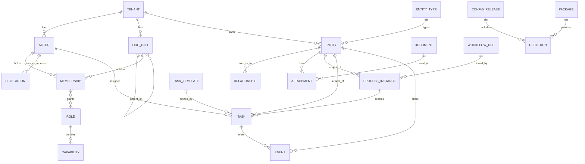

---

## §7 Organization model

### 7.1 Org units: a typed graph, not a list of departments

- **Org units form a tree** with typed nodes: `company → division → department → team`, plus `region → city → location (store)`.
- **One actor can hold several memberships** across trees. For example, Design department *and* the North region. This is the matrix organization the current single-module session can't express.
- **Reporting lines** (`reports_to`) are stored on memberships. Approval chains like "my manager, then their manager, up to a limit" use them.
- **External parties are org units** of type `external`. Examples: a landlord, a franchise partner, the **Asia Pacific design team** and the **Getin team** in the café-launch flow, an auditing firm. Their people are **guest actors** with tightly scoped roles.
- **Locations and stores are org units *and* entities.** A store can be a place people belong to (store staff) and a thing with a lifecycle (opening, performance). A `represents` relationship links the two.

### 7.2 Departments versus modules

Today `module` means four things at once: org unit (Legal team), permission scope (`require_module('legal')`), UI area (`/legal/*`) and pipeline stage (legal review). The platform separates them:

| Today's `module` meaning | Platform concept |
| --- | --- |
| "The Legal team" | Org unit `Legal` (type department) |
| "May act on legal things" | Capabilities scoped by entity type and org unit |
| "The `/legal` screens" | A workspace (a set of views) assigned to roles |
| "The legal stage of a site" | A stage in the workflow, with milestones |
| "The Legal product feature" | The installed package `legal@x.y` |

A customer can therefore have a Legal *department* without the Legal *package*, for example if they handle compliance in a generic task flow. They can also install the Legal package and assign its tasks to an outside law firm.

### 7.3 Organization import

The wizard's employee upload (§26) is a pipeline, not a form:

1. Upload CSV/XLSX.
2. Map columns (name, email, department, role, manager email, location, plus extra columns).
3. Validate: duplicate emails, unknown managers, reporting cycles, unknown roles.
4. Preview the inferred org tree.
5. Commit: create actors, org units, memberships and reporting lines in one transaction, with one `org.imported` event.
6. Send invitations.

Re-imports are diffs: add, update or deactivate. Extra columns become **actor attributes** (validated by an `actor_profile` schema the tenant can extend), which policies can use, for example `actor.attributes.grade`.

---

## §8 Actor, role and capability model

### 8.1 Evaluating "every user is an agent"

The instinct is right; the implementation trap is real. The useful abstraction is the **actor model**: anything that can be assigned work, hold capabilities and cause events. It is **not** "user = LLM agent".

| Actor type | Authenticates via | Typical capabilities | Special rules |
| --- | --- | --- | --- |
| `human` | Password, SSO, magic link | From roles | Can hold CONFIGURE and ADMINISTER |
| `ai_agent` | Service credential bound to a deploying human or team | From an **agent role** (narrow) | Autonomy level (§18.3); never CONFIGURE/ADMINISTER; rate and spend limits; every action carries `on_behalf_of` |
| `system` | Internal | Platform automations, timers, escalations | Can't be impersonated; actions attributed to the automation definition |
| `integration` | API key or OAuth client | Scoped to its connector's entity types | Inbound webhooks and outbound sync |

Humans and agents share **one interface**: an inbox of tasks, a set of capabilities, policies over what they see, and events they emit. That symmetry lets work move between people and AI by changing an assignment rule rather than code.

### 8.2 Capability grammar

```
<resource-type>:<action>[:<qualifier>]@<scope>
```

- **resource-type:** an entity type key (`site`, `budget`), or a platform resource (`task`, `workflow`, `view`, `org`, `package`, `release`).
- **action:**
  - **ACT** (perform): `create`, `update`, `submit`, `upload`, `assign`, `delegate`, `comment`, `start`.
  - **SEE** (data): `read`, `list`, `read:<field-group>`, `download`, `export`.
  - **APPROVE** (decide): `approve`, `reject`, `send_back`, `override`.
  - **CONFIGURE** (definitions): `define`, `edit_definition`, `publish`, `migrate`.
  - **ADMINISTER** (tenant): `invite`, `manage_roles`, `manage_billing`, `impersonate`.
- **scope:** `own` (created by me) · `assigned` (I hold an open task on it) · `team` (my org unit) · `unit_subtree` (my unit and below) · `region` (entities located in my region) · `tenant` · `none`.

Examples:

- `site:approve@unit_subtree` — a Regional Supervisor.
- `site:read:financial@tenant` — Finance.
- `task:delegate@team`
- `workflow:publish@tenant` — Business Admin only.

These four classes are the brief's *can act / can see / can approve / can configure* distinction, written as grammar. Policies (§12) add conditions the grammar can't express.

### 8.3 Roles: templates, not globals

- The platform ships **role templates**: Business Admin, Executive (doer), Supervisor (reviewer), Approver, Observer/Guest, External Partner, Agent.
- A tenant **instantiates and renames** them. Examples: *Regional Supervisor*, *BD Supervisor*, *Finance Approver*, *Executive Reviewer*, *Guest Analyst*. Each starts with the template's capabilities and is then edited in the permission matrix.
- **Roles are attached to memberships, not to actors.** The same person can be a "Design Executive" in Design and a "Regional Reviewer" in North.
- **Packages contribute role templates.** For example, Site Expansion adds "Site Scout" and "Legal Reviewer".
- The current four roles map to templates as follows:
  - `business_admin` → Business Admin
  - `supervisor` → Supervisor (scoped to org unit)
  - `executive` → Executive
  - `observer` → Observer, which grants SEE at `tenant` scope and nothing else; the current "reads everything, writes nothing" rule becomes data

### 8.4 Responsibilities: who *should* do it, not who *may*

Capabilities say who **may** act. **Responsibilities** say who **should**: they are standing assignment rules that the task service uses (§9.4). For example:

```yaml
kind: Responsibility
key: legal-review-north
when:  { task_template: legal.dd_review, subject: { region: North } }
assign_to: { role: Legal Supervisor, org_unit: Legal/North }
fallback:  { role: Legal Supervisor, org_unit: Legal }
```

RACI-style views (who is accountable for what) are queries over responsibilities.

### 8.5 Delegation, acting-as and impersonation

The five current mechanisms (§2.8) collapse into three:

| Mechanism | Meaning | Example | Recorded as |
| --- | --- | --- | --- |
| **Delegation** | Actor A grants B some of A's capabilities or responsibilities, with a scope and expiry | Supervisor on leave delegates approvals for Mumbai sites to a peer for 2 weeks | `delegations` row + `delegation.granted` event; every action under it carries `via_delegation_id` |
| **Acting-as** | A person with several memberships chooses which one they are acting in | A Design Executive who is also the Regional Reviewer switches context | Session context; every event carries `membership_id` |
| **Impersonation** | An administrator views or acts *as* another actor for support | Admin reproduces a supervisor's screen | Requires `tenant:impersonate`; events carry `actor = admin`, `on_behalf_of = target`; mutation can be disabled by policy |

This closes the gap the codebase documents itself: a write made under a borrowed grant is distinguishable from the grantor's own write, because the provenance is in the event envelope.

---

## §9 Task model

### 9.1 Anatomy

| Field | Purpose |
| --- | --- |
| `id`, `tenant_id` | Identity |
| `template_key`, `template_version` | Pinned definition (form, outcomes, SLA, assignment) |
| `kind` | `work` · `data_entry` · `upload` · `checklist` · `review` · `approval` · `decision` · `ai` · `system` · `external` |
| `title`, `description` | Rendered from template with the subject's data |
| `subject_ref` | The entity the task is about (site, budget, deliverable) |
| `process_instance_id`, `activity_id`, `engine_job_id` | Workflow linkage (null for ad hoc and recurring tasks) |
| `status` | See 9.2 |
| `assignee_actor_id`, `candidate_rule`, `candidates` | Who has it, and who could claim it |
| `responsible_unit_id` | Department/org unit accountable |
| `priority`, `due_at`, `sla_policy`, `sla_state` | Time management |
| `form_key`, `form_version`, `draft` | Input contract and autosaved draft |
| `required_documents` | Slot keys that must be filled |
| `outcomes` | Allowed results, e.g. `[approve, reject, send_back]` |
| `outcome`, `output` | Result plus validated output data |
| `approval` | Quorum state for approval tasks (§11) |
| `depends_on` | Other tasks that must finish first, for ad hoc dependencies outside the flow |
| `escalation_level` | 0..n |
| `created_by` | `{actor, via: workflow|manual|recurring|automation|ai}` |

### 9.2 Lifecycle

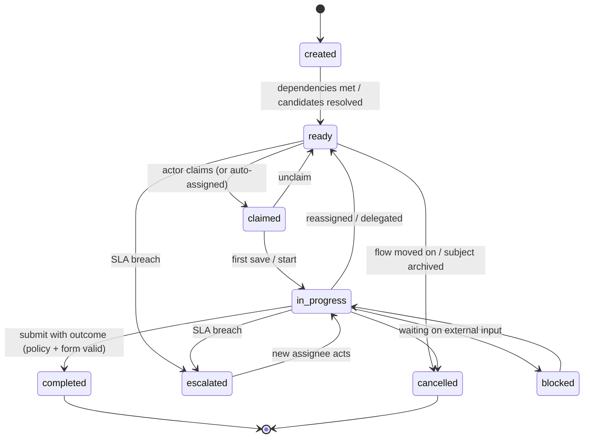

The vocabulary is **the same for every task in every package**. Department-specific meaning lives in the **outcome** and in the **milestones** the flow emits. It does not live in task statuses.

### 9.3 Where tasks come from

| Source | Example | Mechanism |
| --- | --- | --- |
| Workflow | "Legal DD review" when a site reaches the legal stage | Engine job → task service (§10.6) |
| Ad hoc | Supervisor asks an executive to "re-measure the frontage" | `POST /tasks` with a template or a free-form `work` kind |
| Recurring | Monthly lease-compliance check for every launched store | Recurrence rule (RRULE) over a view of entities |
| Automation | Licence expires in 30 days, so create a renewal task | Automation (event or condition → `create_task`) |
| AI | Agent notices a missing document and proposes a task | Agent proposes, then a human accepts (autonomy-dependent) |

### 9.4 Assignment resolution

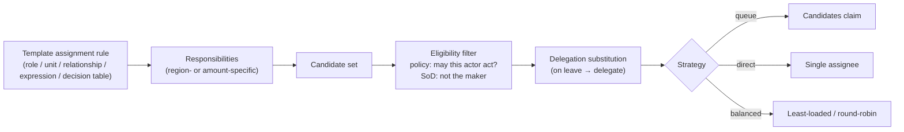

Rule forms, in order of preference:

1. Role in a unit: `{role: Legal Supervisor, unit: subject.region}`.
2. Relationship: `{relationship: subject.assigned_scout}`.
3. Process variable: `{from: task.legal_review.completed_by}`.
4. Decision table: by amount, city or store format.

Every resolution is recorded in the `task.assigned` event, including *why* (the rule and the delegation applied).

### 9.5 SLA and escalation

- An **SLA policy** is a definition: target duration, business calendar (tenant holidays, working hours), at-risk threshold and an escalation ladder.
- An escalation ladder is a list of `{after, action}` steps. Actions are notify assignee, notify manager, reassign to a pool, or raise priority.
- **Who enforces it:**
  - For workflow tasks, the engine enforces it with a BPMN boundary timer, which keeps escalation versioned with the flow.
  - For ad hoc tasks, the automation scheduler enforces it.
- SLA state (`on_track`, `at_risk`, `breached`) is projected onto the task and rolled up to the entity's `lifecycle.sla`.

---

## §10 Workflow model

### 10.1 Two levels: Flow Graph for people, BPMN for machines

Business administrators should not draw BPMN. BPMN is a precise execution language with ~100 element types. The platform therefore has two representations:

| Level | Who edits it | Shape | Purpose |
| --- | --- | --- | --- |
| **Flow Graph** (authoring) | Business admins in the Studio | Small JSON graph: ~12 node kinds, lanes, stages | What the business means |
| **BPMN 2.0 + DMN 1.3** (execution) | Generated by the compiler; power users may inspect it | Standard XML | What the engine runs; portable across Operaton, Flowable, SpiffWorkflow and Camunda |

The compiler is deterministic and versioned. A published Flow Graph version always produces the same BPMN, and the BPMN deployment records its source graph hash.

### 10.2 Node catalogue

| Flow Graph node | Business meaning | Compiles to (BPMN) |
| --- | --- | --- |
| `start` | How a case begins (manual create, import, event) | Start event (none / message) |
| `stage` | Groups nodes into a named phase; emits `stage.entered` / `stage.exited` | Sub-process boundary or listener markers |
| `task` | Someone does work (template ref) | Service task, topic `platform.task` (§10.6) |
| `approval` | Someone decides (template ref + approval policy) | Service task, topic `platform.task`, kind approval, followed by an exclusive gateway on outcome |
| `parallel` | Branches that run together, with join `all` / `any` / `n_of_m` | Parallel or inclusive gateway (+ complex join for n-of-m) |
| `decision` | Branch by condition or decision table | Exclusive gateway + conditions / business rule task (DMN) |
| `wait` | Wait for a date, a duration or an external event | Timer / message intermediate catch |
| `milestone` | Mark a business fact reached (`legal.dd_positive`) | Intermediate throw (listener emits `milestone.reached`) |
| `subflow` | Reuse another flow (a module) | Call activity (versioned binding) |
| `automation` | System step (send to ERP, generate a document, call AI) | Service task, topic `platform.automation` / `platform.ai` |
| `loop_back` | Send back for rework to a named earlier node | Sequence flow back to the node, with a counter |
| `end` | Completed / rejected / cancelled | End event (with terminate for reject) |

Each node also carries an optional **SLA policy**, **notifications** and **entry/exit conditions**.

### 10.3 Shapes the brief requires

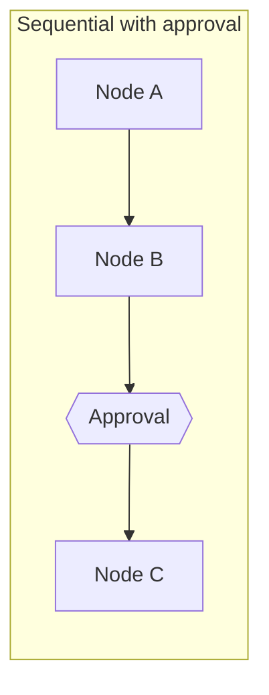

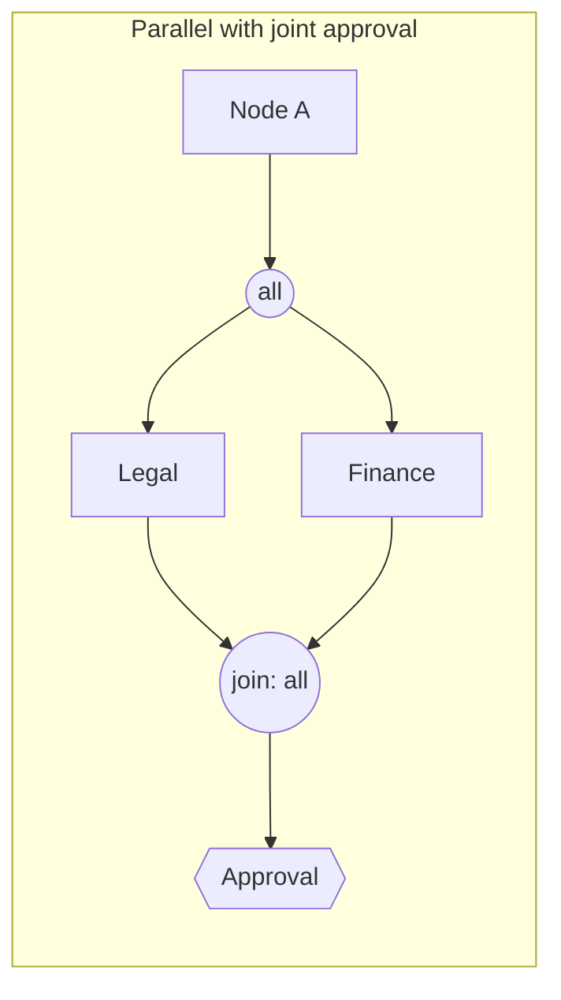

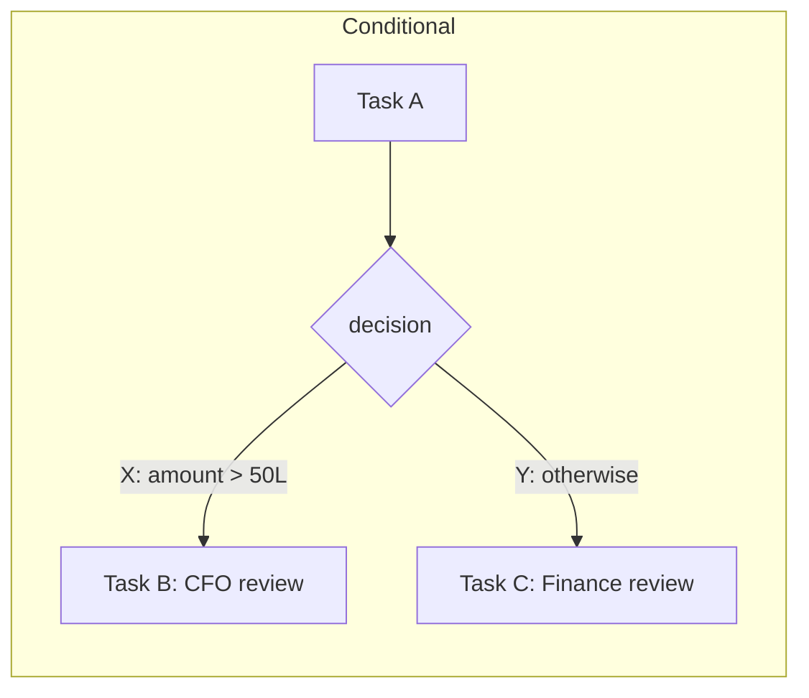

### 10.4 Modules as sub-flows: the case is orchestrated, the module is reusable

The `docs/14` insight that modules are reusable units is kept, but modules stop being black boxes in code:

- Each package provides **sub-flows**: `legal.due_diligence`, `design.design_cycle`, `finance.budget_approval`, and so on. Each is built from the same node catalogue and emits **milestones** on completion.
- A **case flow** (e.g. `site-lifecycle`) composes sub-flows with parallel joins and conditions. This is the canvas in the screenshot of the module builder: module nodes linked by "Available when Legal is approved" edges.
- Customers can edit either level. They can reorder modules in the case flow, or add a step inside a module's sub-flow, as permitted by the package's **lock level** (§15.5).

### 10.5 Conditions: one AST, several compilers

Conditions appear in gateways, entry gates, assignment, notifications, views and policies. They are stored once as a **condition AST**, serialized as JsonLogic-compatible JSON:

```json
{ "and": [
  { "milestone": "legal.dd_positive" },
  { "milestone": "finance.ca_approved" },
  { ">=": [ { "var": "subject.data.area_sqft" }, 800 ] }
] }
```

| Consumer | Compiled to |
| --- | --- |
| Engine gateways | JUEL expression over process variables (Operaton) / Python expression (SpiffWorkflow) |
| Platform checks (entry gates, automations) | Evaluated natively in Python |
| Views and queries | SQL `WHERE` over JSONB and lifecycle |
| Policies | CEL condition in Cerbos |

The Studio's condition builder edits the AST. Nobody writes JUEL, CEL or SQL by hand.

### 10.6 What the engine does versus what the platform does

**The engine moves tokens; the platform owns the work.**

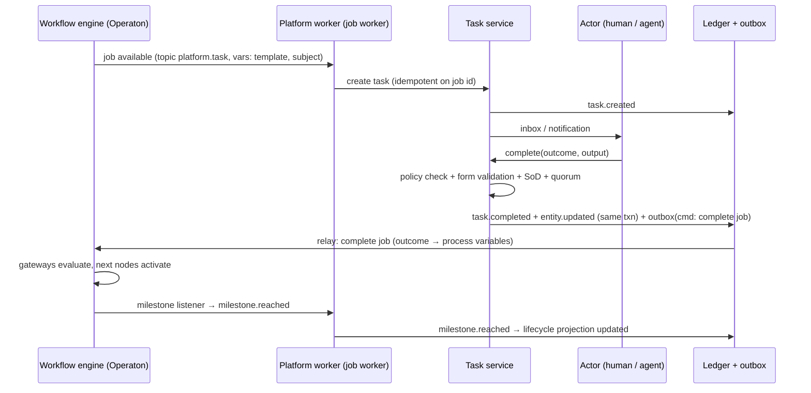

This **job-worker pattern** (external tasks in Operaton, service tasks in SpiffWorkflow, jobs in Zeebe) is the one integration contract for human, system and AI work. It has three consequences:

1. Tasks, assignment, delegation, SLA display, forms and audit are **platform features**. They work identically whichever engine runs underneath, and AI actors take tasks through the same path.
2. The engine is **never exposed** to browsers or tenants. It is internal infrastructure.
3. Moving to another engine (§19) means rewriting one adapter, not the product.

Trade-off: we deliberately do *not* use the engine's built-in tasklist, candidate groups or `delegateTask`. Their identity model would have to be kept in sync with ours, and they can't express our policies. Long-running jobs use long lock durations and idempotent re-fetch (§30).

### 10.7 Publish-time validation

A flow can't be published unless all of these hold:

- Every node is reachable and can reach an end.
- Joins match their splits.
- No unbounded loops: send-back loops carry counters.
- Every `task` and `approval` has a template whose assignment rule resolves to ≥1 eligible actor in the current org (checked against real memberships).
- Every referenced form, decision, sub-flow and milestone exists at a published version.
- Every gate condition only references milestones that some upstream node emits.
- No role used in an assignment lacks the capability the task requires.

The Studio also offers **simulation**: run the flow against a synthetic entity, step through it as each role, and see the tasks, views and notifications each person would get.

---

## §11 Approval model

### 11.1 An approval is a task with an approval policy

```yaml
kind: TaskTemplate
key: site-expansion.loi_approval
version: 2
task_kind: approval
form: site-expansion.loi_review_form@1
outcomes:
  approve:   { label: Approve }
  reject:    { label: Reject,    require: [comment], terminal: true }
  send_back: { label: Send back, require: [comment], to: upload_loi }
approval:
  mode: sequential                         # single | any | all | quorum | sequential | hierarchy
  steps:
    - { assign: { role: BD Supervisor, unit: subject.region } }
    - { assign: { role: Business Admin },  when: { ">": [ { "var": "subject.data.expected_rent" }, 500000 ] } }
  separation_of_duties:
    - not_actor: subject.created_by          # maker ≠ checker
    - distinct_across_steps: true
  delegation: allowed                       # approvals may be delegated (policy-checked)
  evidence: { on_reject: [comment] }
sla: site-expansion.sla_3_business_days
```

### 11.2 Modes

| Mode | Meaning | Current example | Café-launch example |
| --- | --- | --- | --- |
| `single` | One eligible actor decides | Site details approval | — |
| `any` | First of N decides | Any BD supervisor | — |
| `all` | Every listed approver must approve | NSO two sign-offs | **Joint audit by BA & HSO** |
| `quorum(n)` | n of m approve | — | **Property Committee (CEO/CPO + members)** |
| `sequential` | Ordered chain, each conditional | Finance: supervisor → admin; budgets | Final design: Asia-Pac → Business Admin → Central Design |
| `hierarchy` | Up the reporting line until a limit (DoA) | — | Budget approval by amount |

**Delegation of authority (DoA)** — "who can approve how much" — is a **decision table** (DMN) owned by Finance, versioned like any definition. It is referenced from approval steps:

| Amount (₹) | Category | Approver role |
| --- | --- | --- |
| ≤ 10 L | any | Finance Approver |
| 10–50 L | capex | Head of Projects |
| > 50 L | any | CFO |

### 11.3 The maker–checker–approver fragment

The product's approval doctrine (exec captures → supervisor reviews with send-back → admin confirms) becomes a **reusable sub-flow template**: `platform.maker_checker_approver`. Packages instantiate it with their own form, roles and conditions. The template appears 8 times in v1 code and becomes 8 *configured instances* of one fragment.

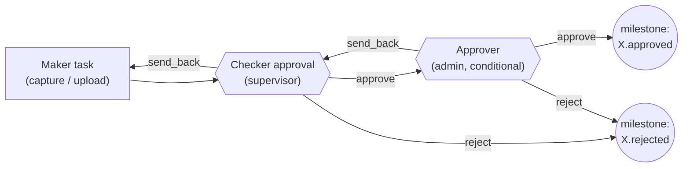

### 11.4 Mapping today's eight implementations

| Today | Becomes |
| --- | --- |
| Site details → `approved` | `maker_checker_approver` (approver step disabled) in `bd.qualification` |
| Finance `awaiting_supervisor → awaiting_admin` | `maker_checker_approver` in `finance.ca_code` |
| Legal DD `draft → pending_review → published` + verdict | Checklist task + review approval with outcomes `positive` / `negative` |
| Legal change request | Generic `change_request` template (any field, any entity) |
| Design deliverables `status` + `admin_status` | Per-deliverable `maker_checker_approver`; admin step only for `2d`, `3d` (a template condition) |
| Budgets `pending_supervisor → pending_admin` | `maker_checker_approver` + DoA decision |
| Project QA `supervisor_approved → approved` | `maker_checker_approver` in `project.execution` |
| NSO two sign-offs | Approval `all` with 2 named roles |
| Launch validation loop | A sequential review flow with editable staging form; *Confirm* commits the staged data |

---

## §12 Policy / permission model

### 12.1 Options

| Approach | Expresses | Good at | Weak at |
| --- | --- | --- | --- |
| RBAC | Role → permissions | Simple matrices admins understand | "Own region", "not own submission", field visibility |
| ABAC | Rules over attributes of actor, resource and context | Conditions, amounts, sensitivity, time | Explaining access; list filtering without query planning |
| ReBAC (Zanzibar) | Permissions from relationship graphs | Hierarchies, sharing, "member of team that owns" | Requires syncing every relationship into the authz store (dual write) |
| Policy engine | Externalized decisions (Cerbos, OPA, Cedar, OpenFGA, SpiceDB) | Testable, versionable, auditable, consistent | Another moving part |

### 12.2 Recommendation: layered, compiled, externalized

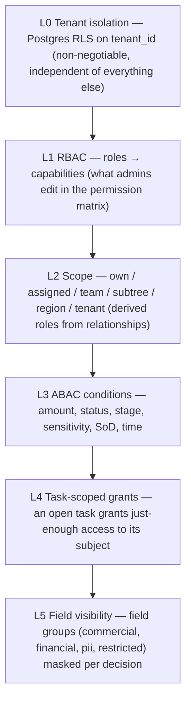

- **Engine: Cerbos PDP** (Apache-2.0), running as a sidecar.
  - **Derived roles** express relationships computed by the platform (`owner`, `assignee`, `same_unit`, `in_subtree`, `same_region`, `manager_of_submitter`).
  - **Scoped policies** (`scope: tenant_<id>`) give each tenant overrides on top of package defaults, so tenants differ by data, not code.
  - The **Postgres storage driver + Admin API** let policies be written by the Studio at publish time.
  - **PlanResources → `cerbos-sqlalchemy`** turns "what may this actor list?" into a SQL filter. This makes **"can see data"** enforceable on lists, not only on single records.
  - **Decision logs** record which policy produced the effect. The platform copies the matched policy and version into the event envelope (§14).
- **The permission matrix is the authoring surface.** Admins edit a role × entity-type × action grid with scope and condition cells. A **policy compiler** turns the matrix into Cerbos YAML. Nobody writes YAML except package authors for advanced rules.
- **Relationships stay in our database.** We pass precomputed attributes such as `actor.unit_paths`, `actor.region_ids` and `resource.unit_path`, so Cerbos never needs its own copy of the graph. If deep sharing graphs appear later (cross-tenant partners, per-record sharing), **OpenFGA** can be added behind the same `PolicyPort` for those resource types only.

### 12.3 The four questions

| Question | Mechanism | Example |
| --- | --- | --- |
| **Can perform action?** | `check(actor, action, resource)` on every command | `site:update` on a site in my region while it's in `bd.qualification` |
| **Can see data?** | `plan(actor, read, type)` → SQL filter on every list and view; field masks on every read | Regional Supervisor lists only North sites; `financial` fields masked unless Finance |
| **Can approve?** | `check(actor, approve, task.subject)` **plus** the task's approval policy (assignment, SoD, quorum) | Not the maker; DoA threshold respected |
| **Can configure?** | `check(actor, workflow:publish, tenant)` | Business Admin publishes flows; supervisors can't |

### 12.4 Example: generated policy (abridged)

```yaml
apiVersion: api.cerbos.dev/v1
resourcePolicy:
  resource: site
  version: default
  scope: tenant_7c1e          # this tenant's override layer; falls back to package defaults
  importDerivedRoles: [platform_relationships]
  rules:
    - actions: [read, list]
      effect: EFFECT_ALLOW
      roles: [regional_supervisor]
      derivedRoles: [in_region]
    - actions: [approve]
      effect: EFFECT_ALLOW
      roles: [regional_supervisor]
      derivedRoles: [in_region]
      condition:
        match:
          all:
            of:
              - expr: request.resource.attr.created_by != request.principal.id    # SoD
              - expr: "'bd.qualification' in request.resource.attr.stages"
    - actions: ["read:financial"]
      effect: EFFECT_ALLOW
      roles: [finance_approver, business_admin]
```

### 12.5 Performance

Single checks are sub-millisecond on a local sidecar. Per-request decisions are batched (`checkResources` over a page of rows), and query plans are cached per (actor, type, action) for the request. Field-mask decisions are computed once per (actor, type) per request.

---

## §13 View / query model

### 13.1 The equation

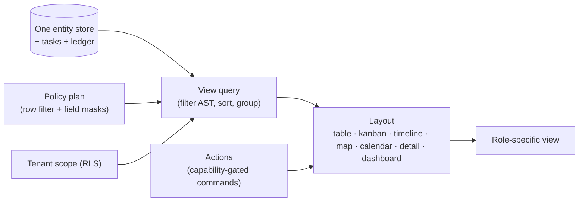

No view ever has its own copy of data. Executive, Supervisor, BD, Legal, Finance and Guest views are **different definitions over the same rows**.

### 13.2 Anatomy of a view definition

```yaml
kind: View
key: site-expansion.legal_queue
version: 3
title: Legal — pending reviews
source: { entity_type: site }
filter: { and: [ { stage: legal }, { open_task_template: legal.dd_review } ] }
columns: [display_code, name, city, { field: lifecycle.sla }, { task: legal.dd_review, show: [assignee, due_at] }]
sort: [ { field: "task.due_at", dir: asc } ]
layout: table
row_actions: [ open, { command: task.claim }, { command: task.delegate } ]
audience: { roles: [Legal Executive, Legal Supervisor] }
```

At runtime the view engine does the following:

1. Compile the filter AST to SQL.
2. AND it with the policy plan from Cerbos.
3. Apply RLS.
4. Fetch.
5. Mask fields.
6. Attach available actions per row, computed with a batched policy check.

### 13.3 Workspaces: the role's home

A **workspace** is an ordered set of views, dashboards and quick actions assigned to roles. It replaces today's per-module route families and the separate admin portal:

| Workspace | Shows |
| --- | --- |
| Executive | Portfolio KPIs (sites by stage, avg days LOI→launch, budget variance), bottleneck heatmap (stage × SLA), approvals waiting on me |
| Supervisor | Team task board (workload per person), approvals queue, at-risk SLAs, delegation panel |
| BD | My sites pipeline (kanban by stage), my tasks, map view |
| Legal | Legal cases, document checklist completeness, pending reviews |
| Finance | Budgets awaiting approval, variance (closure vs GFC), CA codes |
| Guest / Observer | Only the views explicitly granted, read-only actions |

### 13.4 Metrics and KPIs

- A **metric definition** contains a measure, an optional filter, dimensions, a time grain and a source. The source is entities, tasks, or **ledger events** (for durations such as "LOI signed → launched").
- Duration KPIs are computed from milestone events, never from per-stage timestamp columns. That removes the need for `shortlisted_at`, `legal_review_at` and the rest.
- KPI definitions are **versioned** so a report can state which definition produced it (§16).
- Implementation path:
  - **v1:** SQL over projections and materialized views refreshed by the worker.
  - **Later:** a semantic layer (Cube, Apache-2.0) if self-serve analytics is needed.

---

## §14 Event / history model

### 14.1 Options and decision

| Model | Answers "who/what/when" | Answers "why/which version/which policy" | Reconstruct entity | Cost |
| --- | --- | --- | --- | --- |
| Audit log (today) | Partly | No | Partly | Low |
| Full event sourcing | Yes | If modeled | Yes (by replay) | High: every read is a projection; event-schema evolution |
| Snapshots only | No | No | No | Low |
| **Hybrid: state tables + immutable ledger with provenance + outbox** | **Yes** | **Yes** | **Yes** (diffs) | **Moderate** |

**Decision: hybrid.** Current state lives in normal tables (`entities`, `tasks`, …) for fast reads. *Every* command appends exactly one ledger event (or a small batch) in the **same transaction**, with a full provenance envelope and a JSON Patch diff. The ledger is the history of record. The engine's own history is secondary and is not used for audit.

### 14.2 The envelope

```json
{
  "id": "evt_01J…", "tenant_id": "…",
  "occurred_at": "2026-10-01T09:12:44Z", "recorded_at": "2026-10-01T09:12:44Z",
  "type": "task.completed",
  "subject": { "type": "site", "id": "…", "version": 17 },
  "actor": { "id": "…", "type": "human", "membership_id": "…", "on_behalf_of": null, "via_delegation_id": "…" },
  "source": { "channel": "web", "ip": "…", "user_agent": "…", "request_id": "…" },
  "work": { "task_id": "…", "task_template": "legal.dd_review@4", "process_instance": "…", "workflow": "site-lifecycle@4", "activity": "legal_dd" },
  "config": { "release_id": "rel_23", "package": "site-expansion@2.1.0" },
  "authz": { "decision": "allow", "policy": "site/default/tenant_7c1e", "policy_version": "rel_23", "rule": "approve:in_region" },
  "reason": { "outcome": "approve", "comment": "All DD items verified." },
  "changes": [ { "op": "replace", "path": "/data/legal_verdict", "from": null, "value": "positive" } ],
  "correlation_id": "…", "causation_id": "…"
}
```

This answers every question in the brief: **who** (actor and on_behalf_of), **what** (type and changes), **when**, **why** (reason), **which workflow version** (work.workflow), **which policy permitted it** (authz) and **which task triggered it** (work.task_id).

### 14.3 Taxonomy

Event types are namespaced verbs from a **closed platform vocabulary** plus package-declared milestones. This replaces the 97 free-text audit actions.

`entity.created|updated|archived|restored` · `relationship.added|removed` · `document.attached|replaced` · `task.created|assigned|claimed|reassigned|completed|cancelled|escalated` · `process.started|migrated|completed|terminated` · `stage.entered|exited` · `milestone.reached` · `comment.added` · `delegation.granted|revoked` · `membership.changed` · `config.published` · `policy.denied` · `ai.proposed|acted` · `integration.synced`

### 14.4 Integrity, delivery and use

- **Append-only.** The application role has `INSERT` only on `ledger.events`, with no `UPDATE` or `DELETE`. An optional per-tenant hash chain (`prev_hash`) makes tampering evident for regulated customers.
- **Outbox/inbox.** Side effects are written to `ledger.outbox` in the same transaction and relayed at least once: notifications, engine commands, webhooks, search indexing. Consumers dedupe on the event id (`inbox`). This is the current outbox pattern, generalized.
- **Reconstruction.** An entity's history is its events ordered by `occurred_at`. "State as of date X" applies the inverse patches from the current state backwards, or replays from creation. Snapshots every N versions keep this fast.
- **Undo.** Becomes a *compensating command* that writes a new event with the inverse patch, guarded by policy. This retires `reversible_actions`.
- **Analytics.** Ledger events feed duration KPIs and, later, a warehouse via logical replication or CDC.
- **Retention.** Events are kept for the tenant's retention policy. PII in `changes` can be crypto-shredded per actor for right-to-erasure requests.

---

## §15 Module / package model

### 15.1 What a package is

A package is an **installable, versioned bundle of definitions**. It plugs into the platform; it never owns the application.

```yaml
# package.yaml
name: site-expansion
version: 2.1.0
title: Site Expansion
publisher: matrix
requires:
  platform: ">=1.4 <2"
depends:
  legal: "^1.2"            # provides legal.due_diligence subflow, legal_review entity
  finance: "^1.0"          # provides budget entity, DoA decision, ca_code subflow
  design: "^1.1"
provides:
  entity_types:   [site, site_visit]
  relationships:  [site_has_part, site_located_in]
  task_templates: [bd.capture, bd.shortlist_review, bd.details_review, bd.upload_loi, bd.loi_approval]
  workflows:      [site-lifecycle, bd.qualification]
  decisions:      [site_score]
  forms:          [site_capture, site_details, loi_review]
  role_templates: [site_scout, bd_supervisor]
  policies:       [site_default]          # defaults; tenants override in their scope
  views:          [pipeline_kanban, site_map, stuck_sites]
  metrics:        [days_loi_to_launch, sites_by_stage, conversion_funnel]
  notifications:  [loi_due_soon, site_approved]
  automations:    [loi_deadline_reminder]
  custom_panels:  [site_rent_editor]       # trusted UI component keys (§15.4)
settings_schema:   # per-tenant settings the package exposes in the wizard
  properties:
    code_prefix:   { type: string, default: "ST" }
    tax_multiplier:{ type: number, default: 1.18 }
    competitor_brands: { type: array, items: { type: string } }
lock_levels:
  workflows.site-lifecycle: editable        # tenants may reorder/insert
  task_templates.bd.loi_approval: extend_only
migrations:
  "2.0.0->2.1.0": migrations/2_1_0.yaml     # declarative data transforms between package versions
```

### 15.2 Package kinds

| Kind | Examples | Contains |
| --- | --- | --- |
| **Core** (always installed) | `platform.people`, `platform.tasks`, `platform.documents`, `platform.notifications`, `platform.audit` | Base entity types (person profile, generic case), base task templates (`work`, `change_request`, `maker_checker_approver`) |
| **Functional** | `legal`, `finance`, `design`, `project`, `procurement`, `hr-onboarding` | Reusable sub-flows, entity types, forms, metrics |
| **Solution** | `site-expansion`, `cafe-launch`, `construction-project-approval`, `client-onboarding` | Case types, case flows composing functional packages, workspaces |
| **Template** | "Retail expansion: 3 stages, gated on BD" (from the screenshot) | A starting configuration that a solution package plus wizard defaults produce |
| **Tenant-private** | A customer's own package exported from their Studio | Anything the tenant built, portable between their sandbox and production |

### 15.3 Customization layers and upgrades

Each definition a tenant uses is **base (package version) + tenant overlay (JSON merge patch)**. On package upgrade:

1. Compute a three-way merge of old base, new base and tenant overlay.
2. Apply non-conflicting changes automatically into a **draft**.
3. Surface conflicts in the Studio for an admin to resolve.
4. Publish as a new release. In-flight cases stay pinned (§16).

This is how a tenant can edit "Site Expansion" and still receive upstream fixes, which is the problem Odoo's module inheritance and Salesforce's managed packages solve.

### 15.4 Code extensions: trusted, not tenant-supplied

Packages are **declarative by default**, which makes installing one safe in a shared SaaS. When behaviour can't be declared, there are three sanctioned extension points. All are shipped with platform releases, reviewed and versioned:

- **Automation actions:** Python handlers registered by key, such as `generate_lease_abstract` or `push_to_erp`, and run by the worker.
- **Decision functions:** named predicates usable inside conditions, such as `within_radius_km(site, competitors, 2)`.
- **Custom UI panels:** React components registered by key and mounted in slots of entity pages, such as a rent-schedule editor or a drawing viewer.

This is the explicit escape hatch that keeps the configuration language small.

### 15.5 Lock levels

Package authors can mark each definition as:

- `locked`: can't be changed, for example a regulatory checklist.
- `extend_only`: fields and steps can be added but not removed.
- `editable`.

This lets "built-in" packages behave like the screenshot's locked Design module, without the lock being code.

### 15.6 Lifecycle

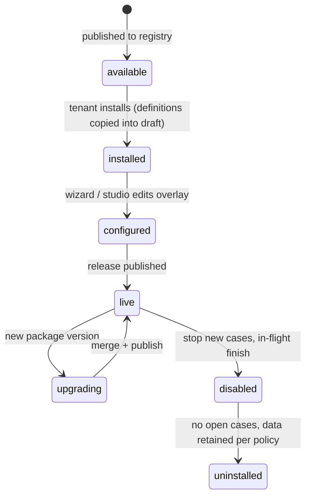

---

## §16 Configuration and versioning model

### 16.1 Definitions and releases

- Every definition (entity type, form, task template, workflow, decision, policy source, view, metric, notification rule, role template) is stored as **immutable versions** in `model.definitions(kind, key, version, content, checksum, status)`.
- Tenants edit in a **draft workspace**. Validation runs continuously (§10.7).
- **Publish** creates an immutable **config release** (`rel_N`) that lists exactly one version of each definition. It is diffable, can be rolled back as a new release, and shows in the UI as "Live v7 · Draft v8".
- Releases are created per tenant. A package install or upgrade is just a source of draft changes.

### 16.2 Pinning rules

The pinning decision differs per artifact type, on purpose:

| Artifact | In-flight behaviour | Why |
| --- | --- | --- |
| Workflow | **Pinned** per process instance | Changing the path under a running case breaks its guarantees |
| Task template (form, outcomes, assignment) | **Pinned** per task at creation | A half-filled form must not change shape |
| Form | **Pinned** per task / submission | Same reason |
| Decision used by a gateway | **Pinned** with the workflow (deployed alongside) | Reproducible routing |
| Entity type schema | **Forward-compatible evolution**: additive changes apply to all; breaking changes need a data migration | One entity can't sit at two schemas forever |
| Policies | **Always latest** | Revoking access must take effect immediately; pinning security is a vulnerability |
| Roles and memberships | **Always latest** | Same |
| Approval requirements inside a flow | **Pinned** (part of the workflow / template) | "This site was approved under v3 rules" must stay true |
| Views and workspaces | **Always latest** | No in-flight state |
| Metrics / KPIs | Latest for display; **version recorded** on saved reports | Reports can be reproduced and explained |
| Notification rules | Latest | Low risk; prevents stale recipients |

### 16.3 What happens when a workflow changes: the brief's example

- **v1:** BD → Supervisor approval → Legal → Finance → Launch.
- **v2:** BD → Regional Supervisor → Finance → Legal → Executive approval → Launch.

When the admin publishes v2:

1. New sites start on **v2**.
2. Existing sites stay on **v1** by default and finish on v1.
3. The Studio lists v1 instances grouped by current activity and offers a **migration plan** per group:
   - **Map** activities from v1 to v2, for example "at Legal (v1) → at Legal (v2)". The engine validates the plan (Operaton `MigrationPlan`; SpiffWorkflow allows it only for not-yet-executed changes) and migrates in a batch.
   - **Restart at** a chosen v2 node, with completed milestones carried over. Used when the mapping is not structural.
   - **Leave on v1.**
4. Every migrated instance gets a `process.migrated` event recording from, to, plan and actor.

### 16.4 Entity schema evolution rules

| Change | Allowed without a data migration? |
| --- | --- |
| Add optional field, add enum value, relax a constraint | Yes |
| Add required field | Only with a default or a backfill expression |
| Rename field | Yes, via an `x-renamed-from` alias (read both, write new); a later release drops the old one |
| Remove field | Soft-remove: hide in forms and views; data kept until a cleanup release |
| Change type, tighten constraint | Requires a declarative migration (`transform` expression or script) run as a batch with a dry-run report |

---

## §17 Form / schema model

- **Format:** JSON Schema 2020-12 for data rules plus a **UI schema** for layout (sections, columns, widgets, help text, conditional visibility).
- **Rendering:** react-jsonschema-form (RJSF). Its theme is built from the Z-Matrix design-system primitives so dynamic forms look native.
- **One schema, two validators.** The browser validates for UX; the API **always** re-validates with the same schema (Python `jsonschema`) before any write.
- **Binding:** each form field maps by JSON Pointer to either the subject entity's attributes (`/data/expected_rent`) or the task's output (`/output/verdict`). Forms are *views onto entity data*, not separate stores. That removes copies like the launch "staging snapshot". A staging form becomes a **draft submission**, committed atomically on *Confirm*.
- **Field library:** text, number, money (currency from tenant settings), percent, date, enum, multi-enum, entity reference (lookup through a policy-filtered query), actor picker, document slot, geo point, repeating section, checklist item (`yes / no / na / pending` + note + evidence document), signature, and computed (read-only expression).
- **Checklists** are a repeating section whose items are *data* in the form definition. Legal DD's nine items, licensing's five and NSO readiness become editable lists, with optional `required_for_outcome: positive`.
- **Conditional logic** uses the condition AST (§10.5) for visibility and requiredness.
- **Versioning** is pinned per task (§16.2). The Studio form builder edits the UI schema and field definitions, previews the result with RJSF, and validates against the entity type.

---

## §18 AI / agent architecture

### 18.1 Position: AI is a consumer and an actor, never the substrate

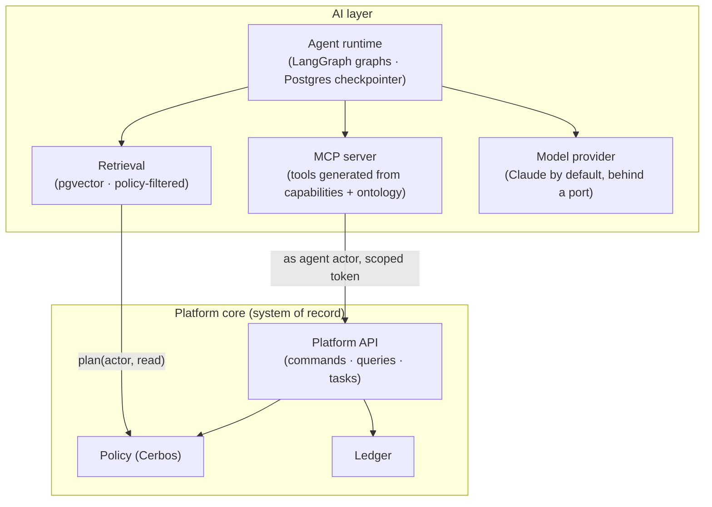

- **Agents are actors** (§8.1). They have a role, capabilities, an org unit and an **autonomy level**. They receive tasks through the same job-worker path as people (§10.6), for example `assign: { agent: lease-abstractor }`.
- **Tools are the platform API.** An MCP server exposes `search_entities`, `get_entity`, `list_my_tasks`, `complete_task`, `propose_update`, `attach_document`, `run_view` and similar. Tools are generated from the ontology and filtered by the agent's capabilities, so an agent can't call what its role can't do. The MCP 2026-07-28 spec's OAuth 2.1 resource-server model fits the platform's token issuer.
- **Orchestration.** Use LangGraph (MIT) where an agent needs a multi-step graph with retries, branching and checkpoints. Its Postgres checkpointer keeps state in our database. Its `interrupt`/resume maps directly onto **creating a platform approval task for a human** and resuming when that task completes. Simpler agents can use a plain tool-use loop. Both sit behind an `AgentPort`.
- **LangChain/LangGraph is not** the database, the workflow engine or the permission system. They have no tenant isolation, no definition versioning, no approval semantics and no audit ledger. Those stay in the core.

### 18.2 Retrieval without leaks

- Embeddings of documents and entity text are stored in `ai.embeddings` (pgvector) with `tenant_id`, `entity_ref` and `field_group`.
- **Every retrieval is ANDed with the actor's policy plan.** The same SQL filter as views (§13) applies, so an agent working for a Legal user can't retrieve Finance-only text.
- Chunks from restricted field groups are excluded unless the actor holds `read:<group>`.

### 18.3 Autonomy levels

| Level | Agent may | Example |
| --- | --- | --- |
| 0 — Assist | Read and summarize; draft text in the UI for a human | "Summarize this LOI" |
| 1 — Propose | Create `ai.proposed` changes that a human accepts or rejects | Extract rent terms from the lease into fields, pending review |
| 2 — Act within limits | Complete tasks of specific templates when confidence and policy allow; else escalate to a human | Classify uploaded photos; complete "document completeness" checks |
| 3 — Delegate | Create tasks for humans and chase them | SLA chaser that reassigns per escalation policy |

Agents never hold CONFIGURE or ADMINISTER. Configuration proposals (below) are drafts a human publishes.

### 18.4 High-value use cases on this architecture

1. **Process capture → draft flow.** Upload a whiteboard photo or SOP (like images 1–2 of the café launch). The agent produces a **draft Flow Graph** plus suggested task templates and roles in the Studio for a human to edit and publish. This is the fastest route through the setup wizard.
2. **Document extraction.** LOI, lease and licence → structured fields with citations, proposed at level 1.
3. **Natural-language views.** "Sites stuck in legal more than 30 days in the North" → a view filter AST, previewed, then saved.
4. **SLA risk and bottleneck explanation** over ledger durations.
5. **Task copilot.** For the open task: what is missing, the relevant history and a draft comment.

### 18.5 Safety and accountability

- Every agent action is a ledger event with `actor.type = ai_agent`, `on_behalf_of`, model id, prompt or template hash, tool calls and confidence.
- Per-agent rate and spend limits.
- Evaluation sets per agent template are run on each model or prompt change.
- A kill switch per agent actor: deactivating it works exactly like deactivating a user.
