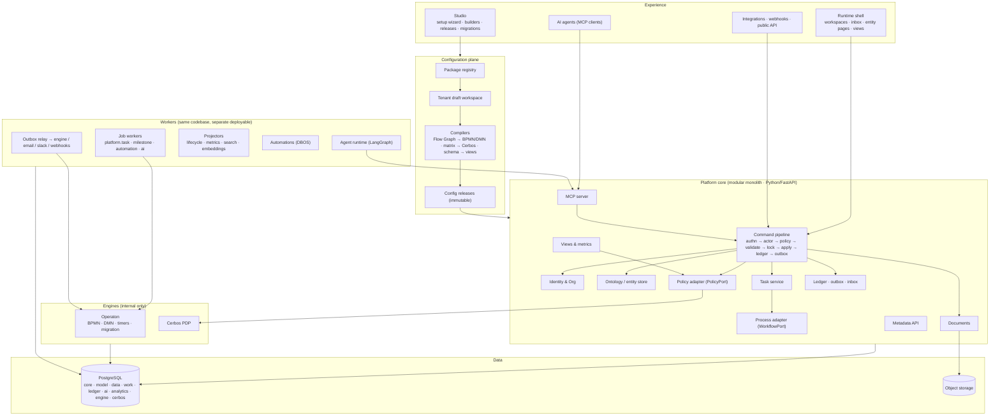
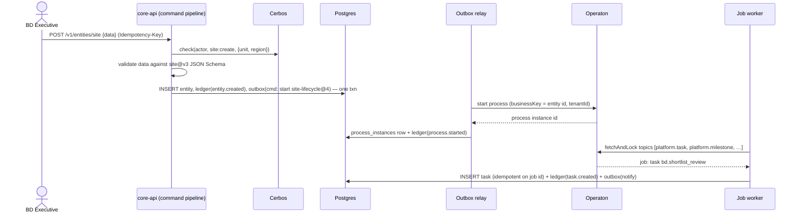
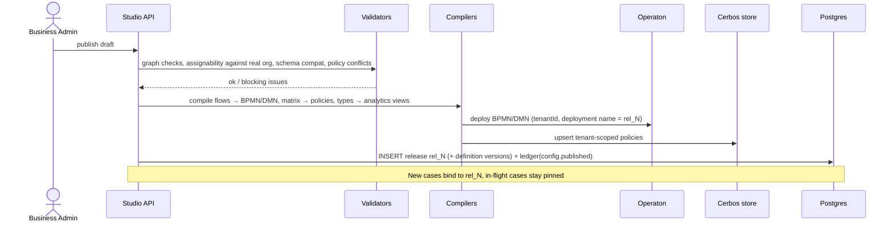
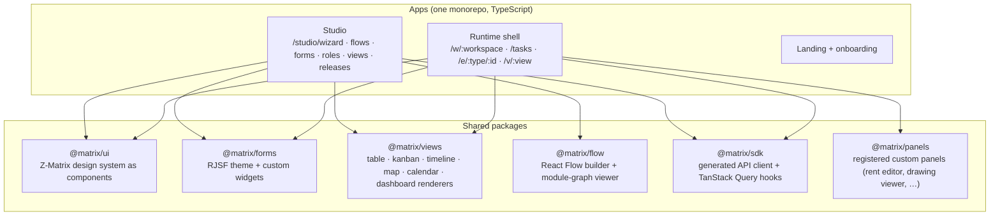
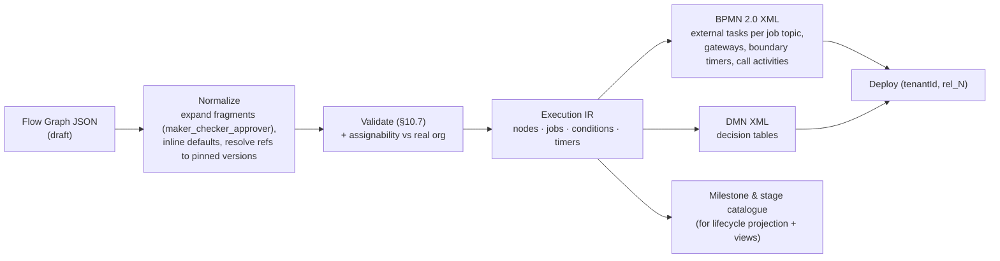

# Part 4: Target architecture

[← Index](README.md) · §22 System · §23 Data · §24 API · §25 Frontend · §26 Setup wizard · §27 Workflow builder

---

## §22 Target system architecture

### 22.1 The refined picture

This refines the diagram in the brief. Configuration is its own plane. The core is a **modular monolith** with hard internal boundaries. External engines sit behind ports. AI is a client of the same API.



### 22.2 Deployables

| Deployable | Contents | Host (today's providers) | Scale unit |
| --- | --- | --- | --- |
| `web` | Runtime shell + Studio (static SPA) | Vercel | CDN |
| `core-api` | Platform core (FastAPI), metadata API, MCP server | Railway | Stateless replicas |
| `worker` | Job workers, outbox relay, projectors, automations, agent runtime | Railway | Replicas per queue/topic |
| `operaton` | Unmodified Operaton distribution (Docker), REST enabled, internal network only | Railway | 1–2 nodes (shared DB) |
| `cerbos` | Cerbos PDP, Postgres policy store | Sidecar to `core-api` / `worker` | Per replica |
| `postgres` | Supabase Postgres (+ pgvector) | Supabase | Vertical, then read replicas |
| `storage` | Supabase Storage | Supabase | — |

This is a **modular monolith, not microservices**. The core's internal modules talk through in-process interfaces with enforced import boundaries, for example with `import-linter` contracts. One team, one database and one deploy keep the operational cost honest. The workflow engine and the PDP are separate *processes* only because they are separate *products*.

### 22.3 Key runtime flows

**Create a case and start its flow**



**Complete an approval task.** See §10.6. The completion and its entity changes commit in one transaction; the engine command is relayed afterwards from the outbox.

**Publish a configuration release**



### 22.4 Consistency model

| Boundary | Mechanism |
| --- | --- |
| Inside the core | One Postgres transaction per command: state + ledger + outbox. Row lock (`FOR UPDATE`) or optimistic `row_version` on the subject entity, generalizing today's `fetch_site_for_update_or_404` |
| Core → engine | Outbox command relay, at least once. Each command carries an idempotency key (job id or business key + node). The relay treats "already completed / already started" engine responses as success |
| Engine → core | **Pull only.** Workers fetch-and-lock external-task jobs. **Everything the engine needs to tell the platform is a job:** human tasks, milestones (`platform.milestone`), stage markers, escalations (boundary timers → `platform.escalate`) and process end. No custom engine plugins, no Java code |
| Engine job locks | Long lock durations for human tasks, with lock extension. Platform task rows are keyed by job id, so a re-fetched job never duplicates a task |
| Drift detection | A reconciler compares the engine's active jobs with the platform's open tasks every few minutes and raises `integration.drift` events. Drift is a bug signal, never silently "fixed" |
| Side effects | Notifications, webhooks, search and embeddings are always driven from the outbox or ledger, never from request handlers |

### 22.5 Multi-tenancy

- **Default model:** shared database and shared schema. Every row carries `tenant_id`. Postgres **RLS** keys on `current_setting('app.tenant_id')`, set per transaction by the command pipeline. Application queries *also* filter, so there are two independent barriers, as today.
- **Engine:** every deployment, process instance and external task carries an Operaton `tenantId`. Workers fetch across tenants but stamp tenant context from the job.
- **Policy:** Cerbos `scope = tenant_<id>`, falling back to package defaults.
- **Storage:** an object path prefix per tenant, with signed URLs only.
- **Noisy neighbours:** per-tenant rate limits on the API and fair-share fetch in workers.
- **Enterprise option:** a dedicated *cell* (its own Postgres + engine) for customers that need physical isolation. The same code is deployed with one tenant.

### 22.6 Identity and security

- **Tokens identify; policies authorize.** Access tokens carry only `sub` (actor), `tenant`, `session` and `auth_time`. **No role or module claims**, so there is nothing stale to trust (today's #103 lesson) and no single-module sessions (H11). Effective roles are resolved per request from memberships (cached for seconds).
- **Issuer.** An OIDC-compliant issuer with short-lived access tokens and refresh. Enterprise SSO (OIDC/SAML) per tenant. Keep today's per-request `is_active` check as a kill switch.
- **Impersonation and acting-as** are explicit token or session attributes, recorded in every event (§8.5). They are not request headers that rewrite roles.
- **Data classification:** field groups (§6.4) drive masking, export rules and AI retrieval eligibility. PII is encrypted at the column or field level where required.

### 22.7 Observability

OpenTelemetry traces carry `correlation_id` across `core-api → outbox → relay → engine → worker`, and the same id is stored on ledger events. A support engineer can follow one approval from click to next task to email. Golden signals per tenant. SLA dashboards come from the ledger, not from logs.

### 22.8 Expected scale and headroom

Retail expansion is low-volume and high-value: tens of tenants, hundreds to low thousands of open cases each, tens of tasks per case and well under 100 requests per second. One Postgres primary handles this with large margin. Partition `ledger.events` by month when it passes ~50M rows. Operaton's history level is set to `activity` (not `full`), because our ledger is the audit record.

---

## §23 Target database / data architecture

### 23.1 Schemas

| Schema | Owns | Written by |
| --- | --- | --- |
| `core` | tenants, actors, identities, org_units, memberships, roles, role_capabilities, delegations, invitations | Identity & Org module |
| `model` | definitions, releases, release_items, packages, installations, overlays | Config plane |
| `data` | entities, relationships, documents, attachments | Ontology + Documents |
| `work` | tasks, process_instances, task_comments (if not purely events), recurrences | Task service, process adapter |
| `ledger` | events, outbox, inbox, snapshots | Command pipeline (append-only) |
| `ai` | agents, runs, embeddings | AI layer |
| `analytics` | **generated** per-type views, materialized metric tables | Projectors / compiler |
| `engine` | Operaton tables | Operaton only |
| `cerbos` | Policy store | Cerbos Admin API only |

### 23.2 Core table sketches (illustrative, not final DDL)

```sql
-- data.entities: every customer "thing" (site, budget, deliverable, project, client…)
CREATE TABLE data.entities (
  id            uuid PRIMARY KEY,
  tenant_id     uuid NOT NULL,
  type_key      text NOT NULL,                 -- 'site'
  type_version  int  NOT NULL,                 -- schema version last validated against
  display_code  text,                          -- from identifier template
  title         text NOT NULL,
  data          jsonb NOT NULL DEFAULT '{}',   -- validated by JSON Schema in the API
  lifecycle     jsonb NOT NULL DEFAULT '{}',   -- projection (§6.6); never written by commands
  owner_actor_id uuid,
  org_unit_id   uuid,                          -- accountable unit (drives scope)
  parent_id     uuid,                          -- shortcut for has_part trees
  row_version   bigint NOT NULL DEFAULT 1,     -- optimistic concurrency / ETag
  created_at    timestamptz NOT NULL DEFAULT now(),
  updated_at    timestamptz NOT NULL DEFAULT now(),
  archived_at   timestamptz
);
CREATE INDEX ON data.entities (tenant_id, type_key, updated_at DESC);
CREATE INDEX ON data.entities USING gin (data jsonb_path_ops);
CREATE INDEX ON data.entities USING gin ((lifecycle -> 'stages'));
CREATE UNIQUE INDEX ON data.entities (tenant_id, type_key, display_code);

CREATE TABLE data.relationships (
  id uuid PRIMARY KEY, tenant_id uuid NOT NULL,
  rel_type text NOT NULL,                      -- 'has_part', 'located_in', 'assigned_scout'
  from_kind text NOT NULL, from_id uuid NOT NULL,   -- entity | actor | org_unit
  to_kind   text NOT NULL, to_id   uuid NOT NULL,
  attributes jsonb NOT NULL DEFAULT '{}',
  valid_from timestamptz NOT NULL DEFAULT now(), valid_to timestamptz
);

-- work.tasks
CREATE TABLE work.tasks (
  id uuid PRIMARY KEY, tenant_id uuid NOT NULL,
  template_key text NOT NULL, template_version int NOT NULL,
  kind text NOT NULL, status text NOT NULL,     -- one platform vocabulary (§9.2)
  subject_id uuid NOT NULL REFERENCES data.entities(id),
  process_instance_id uuid, activity_id text,
  engine_job_id text UNIQUE,                    -- idempotency for engine-created tasks
  assignee_actor_id uuid, candidates jsonb, responsible_unit_id uuid,
  priority smallint NOT NULL DEFAULT 3, due_at timestamptz, sla_state text,
  form_key text, form_version int, draft jsonb,
  outcome text, output jsonb, approval jsonb,
  created_at timestamptz NOT NULL DEFAULT now(), completed_at timestamptz
);
CREATE INDEX ON work.tasks (tenant_id, assignee_actor_id, status);
CREATE INDEX ON work.tasks (tenant_id, subject_id);

-- ledger.events: append-only (app role has INSERT only)
CREATE TABLE ledger.events (
  id uuid PRIMARY KEY, tenant_id uuid NOT NULL,
  occurred_at timestamptz NOT NULL, recorded_at timestamptz NOT NULL DEFAULT now(),
  type text NOT NULL,
  subject_kind text, subject_id uuid, subject_version bigint,
  actor jsonb NOT NULL, source jsonb, work jsonb, config jsonb, authz jsonb,
  reason jsonb, changes jsonb,
  correlation_id uuid, causation_id uuid, prev_hash bytea
) PARTITION BY RANGE (occurred_at);

-- model.definitions: every configurable artifact, immutable once published
CREATE TABLE model.definitions (
  id uuid PRIMARY KEY, tenant_id uuid,          -- NULL = package base (global)
  kind text NOT NULL,                           -- entity_type | form | task_template | workflow | decision | policy | view | metric | …
  key text NOT NULL, version int NOT NULL,
  status text NOT NULL,                         -- draft | published | retired
  content jsonb NOT NULL, checksum text NOT NULL,
  package text, base_definition_id uuid, overlay jsonb,   -- package base + tenant overlay
  UNIQUE (tenant_id, kind, key, version)
);
```

### 23.3 Read paths and analytics

- **Operational lists** query `data.entities` through view queries using GIN and expression indexes, ANDed with the policy plan.
- **Generated analytics views.** On publish, the compiler emits one typed SQL view per entity type, for example `analytics.site` with typed columns extracted from `data` and flattened milestones. BI tools and the metric engine read these. Views are safe to regenerate, because they are not tables.
- **Metric materializations** (`analytics.metric_<key>`) are refreshed by projectors on relevant events or on a schedule.
- **Later:** logical replication or CDC into a warehouse (DuckDB, ClickHouse or BigQuery) for cross-tenant product analytics.

### 23.4 Documents

- Objects are **immutable**. A replacement is a new document with `supersedes`.
- Path: `tenants/{tenant}/{entity_type}/{entity_id}/{slot}/{document_id}`. Bytes are uploaded outside the DB transaction (today's pattern), followed by a metadata transaction plus a `document.attached` event.
- Each document has a hash for dedupe and evidence, plus a `classification` (field-group equivalent) for policy and AI retrieval.

### 23.5 Operations

- PITR backups (Supabase).
- Ledger partitions moved to cheaper storage by age.
- Per-tenant export (entities + ledger + documents) for portability and offboarding.
- **Platform schema migrations stay code-reviewed SQL migrations** under the existing ledger-runner discipline. *Customer* changes never become DDL.

---

## §24 API architecture

### 24.1 Principles

1. **Generic resources, explicit commands.** CRUD on entities is generic. Domain verbs are **commands** (`submit`, `approve`, `send_back`, `delegate`), each gated by a capability. There are no per-department routers.
2. **One command pipeline** for every write (diagram below). This is the only place authorization, validation, provenance and side effects happen.
3. **Metadata-first.** The UI and agents learn what exists, and what *this actor* may do, from the metadata API. The client never re-implements permissions, which removes the `permissions.js` drift by construction.
4. **Contracts.** OpenAPI 3.1 with generated TypeScript and Python SDKs; `/v1` versioning; `Idempotency-Key` on POST; `ETag`/`If-Match` (`row_version`) on updates; cursor pagination; RFC 9457 problem+json errors.

### 24.2 The command pipeline

```mermaid
flowchart LR
  REQ["HTTP / MCP request"] --> AU["Authenticate<br/>(token → actor)"]
  AU --> AC["Resolve context<br/>membership · delegation · impersonation"]
  AC --> PO["Authorize<br/>Cerbos check (+ task SoD/quorum)"]
  PO --> VA["Validate<br/>JSON Schema (pinned version)"]
  VA --> LK["Lock / version check<br/>subject row"]
  LK --> AP["Apply<br/>entity · task · relationships"]
  AP --> LE["Ledger event<br/>(provenance envelope)"]
  LE --> OB["Outbox<br/>engine cmds · notifications · webhooks"]
  OB --> CM["COMMIT"]
```



### 24.3 Endpoint families

| Family | Examples | Notes |
| --- | --- | --- |
| Entities | `GET/POST /v1/entities/{type}` · `GET/PATCH /v1/entities/{type}/{id}` · `POST /v1/entities/{type}/{id}/commands/{command}` · `GET /v1/entities/{type}/{id}/history` | Fields masked per policy; `history` reads the ledger |
| Relationships and documents | `POST /v1/entities/{type}/{id}/relationships` · `POST /v1/documents` (signed upload) · `POST /v1/entities/{type}/{id}/attachments/{slot}` | |
| Tasks | `GET /v1/tasks?inbox=me` · `POST /v1/tasks/{id}/claim` (also `/complete`, `/delegate`, `/comment`) · `POST /v1/tasks` (ad hoc) | Completion runs form validation, SoD and quorum |
| Processes | `GET /v1/processes/{id}` (timeline, active nodes) · `POST /v1/processes/{id}/migrate` (admin) | The engine is never exposed directly |
| Views and metrics | `POST /v1/views/{key}/run` · `GET /v1/metrics/{key}?grain=week` · `POST /v1/views/preview` (ad hoc AST) | Policy plan always applied |
| Organization | `/v1/org/units` · `/v1/org/members` · `/v1/org/import` (CSV pipeline) · `/v1/org/delegations` · `/v1/org/invitations` | |
| Metadata (runtime) | `GET /v1/meta/manifest` → workspaces, nav, entity types, forms, views and allowed actions **for the current actor** | Drives the shell |
| Studio (config) | `/v1/studio/drafts` · `/validate` · `/diff` · `/publish` · `/releases` · `/packages` · `/simulate` · `/migration-plans` | Requires CONFIGURE capabilities |
| Events | `GET /v1/events?subject=…` · `GET /v1/stream` (SSE: inbox, entity changes) | From the ledger/outbox |
| Integrations | API keys as integration actors · outbound webhooks (subscriptions on event types) · inbound webhooks per connector | |
| AI | MCP server at `/mcp` (OAuth 2.1 resource server) | Tools generated from capabilities |

---

## §25 Frontend architecture

### 25.1 Applications and packages



### 25.2 How a screen is produced

1. On sign-in, the shell loads `/v1/meta/manifest` for the actor. It contains workspaces, navigation, and the entity types, views and forms visible to them, with *allowed actions*.
2. Routes are **generic**: `/e/site/123` renders the entity page from the `site` type's page layout (header fields, stage tracker from `lifecycle`, tabs for related entities, documents, history and open tasks). Custom panels are mounted where the layout names them.
3. `/tasks/456` renders the task's pinned form with RJSF, the subject's context panel, and outcome buttons from the task template.
4. Buttons render only for actions the server listed. The server re-checks on submit.

Generic routes replace ~60 hardcoded routes and the second admin app. The business-admin portal becomes a set of workspaces and Studio access.

### 25.3 Reuse from v1

- **Keep:** the Z-Matrix tokens and primitives (`frontend/public/colors_and_type.css`, `modules/shared/primitives`), and the drawer and document components.
- **Port** as registered custom panels: rent and staggered-escalation editors, the site map, and the deliverable file review.
- **Retire:** `SitesContext`'s queue selectors (replaced by views), `stateMachine.js` and `permissions.js` (the server is authoritative), and per-module route families.

### 25.4 State and data

Server state lives in **TanStack Query**, keyed by resource and invalidated by **SSE** events from the ledger. Local UI state stays in components. Form drafts autosave to `tasks.draft`. There is no global hand-rolled cache.

---

## §26 Configuration wizard architecture

### 26.1 The wizard is a guided path over the Studio

Every step writes **draft definitions** through the same Studio API. The wizard can be left and resumed at any time. Nothing reaches users until **Publish**.

| Step | User does | Creates (draft) | Live validation |
| --- | --- | --- | --- |
| 1 · Organization | Name, logo, locale, currency, time zone, business calendar | `tenant.settings`, calendar | Slug and domain uniqueness |
| 2 · People | Upload CSV/XLSX; map columns; review the inferred org tree | Actors, memberships, reporting lines (staged) | Duplicates, unknown managers, cycles |
| 3 · Departments and units | Confirm or edit the inferred units; add regions and locations; add **external parties** | Org units (typed) | Orphans, empty units |
| 4 · Packages | Pick an industry template or individual packages; set package settings (e.g. code prefix, tax multiplier, competitor brands) | Package installs → base definitions + overlay | Dependency resolution |
| 5 · Roles | Start from templates; rename and clone; assign people | Roles, membership role links | Every package task template has ≥1 role able to do it |
| 6 · Capabilities | Permission matrix: role × entity type × action, with scope and condition cells | Permission matrix → policy sources | Conflicts; "nobody can approve X"; SoD warnings |
| 7 · Data visibility | Field groups per role; which entity types and records (scope) per role | Field-group grants, view audiences | Sensitive groups exposed to Guest |
| 8 · Workflow | Review the template flow in the builder; reorder, insert approvals, add parallel or conditional branches | Flow Graph drafts | §10.7 checks against the *real* imported org |
| 9 · Views and KPIs | Pick workspaces per role; tweak columns, filters, KPI tiles | Views, workspaces, metrics | Every role has a home workspace |
| 10 · Review and publish | **Simulate** a case end-to-end as each role; read the diff; publish v1; send invitations | Config release `rel_1` | All blocking issues resolved |

### 26.2 Accelerators

- **Industry templates:** "Retail / café expansion", "Construction project approval", "Client onboarding". They are solution packages plus wizard defaults (Appendix B).
- **AI setup assistant (§18.4):** upload an SOP, a slide deck or a **photo of a whiteboard flow** (like the café-launch sketch). It proposes the org units, roles, Flow Graph and task templates as a draft, with an explanation of each inference.
- **"View as" preview** at every step: see the workspace a role would get, without publishing.

### 26.3 After go-live

The wizard becomes the **Studio**. The same builders are used, now creating `rel_2…` with migration plans for in-flight cases (§16.3).

---

## §27 Workflow builder architecture

### 27.1 Two canvases, one model

- **Module graph** (top level, as in the module-builder screenshot). Shows the case flow composed of sub-flows (modules), with gates such as "available when Legal is approved" and parallel or join semantics.
- **Flow canvas** (drill-down). Shows tasks, approvals, decisions, waits and milestones inside a module, with **swimlanes by org unit or role** and **stage bands**.

Both are views of the same Flow Graph JSON.

### 27.2 Flow Graph JSON (authoring model)

```json
{
  "kind": "Workflow", "key": "cafe-launch", "version": 1,
  "subject": "store_site",
  "stages": [ {"key": "acquire"}, {"key": "design_legal"}, {"key": "build"}, {"key": "open"}, {"key": "close"} ],
  "nodes": [
    {"id": "start", "type": "start"},
    {"id": "identify", "type": "task", "template": "bd.identify_site", "stage": "acquire"},
    {"id": "committee", "type": "approval", "template": "bd.property_committee", "stage": "acquire",
     "approval": {"mode": "quorum", "n": 2, "assign": {"role": "Property Committee Member"}}},
    {"id": "loi", "type": "task", "template": "bd.sign_loi", "stage": "acquire"},
    {"id": "m_loi", "type": "milestone", "key": "loi.signed"},
    {"id": "split", "type": "parallel", "join": "all"},
    {"id": "legal", "type": "subflow", "flow": "legal.statutory@2", "stage": "design_legal"},
    {"id": "design", "type": "subflow", "flow": "design.global_review@1", "stage": "design_legal"},
    {"id": "join", "type": "parallel_join", "of": "split"},
    {"id": "budget", "type": "approval", "template": "finance.project_budget", "stage": "build",
     "approval": {"mode": "hierarchy", "decision": "finance.doa"}}
  ],
  "edges": [
    {"from": "start", "to": "identify"}, {"from": "identify", "to": "committee"},
    {"from": "committee", "to": "loi", "when": {"outcome": "approve"}},
    {"from": "committee", "to": "end_rejected", "when": {"outcome": "reject"}},
    {"from": "loi", "to": "m_loi"}, {"from": "m_loi", "to": "split"},
    {"from": "split", "to": "legal"}, {"from": "split", "to": "design"},
    {"from": "legal", "to": "join"}, {"from": "design", "to": "join"}, {"from": "join", "to": "budget"}
  ]
}
```

### 27.3 Compiler pipeline



- **Deterministic.** The same graph and compiler version always produce the same XML. Both are stored with the release.
- **Round-trip is not a goal.** BPMN is an output. If a power user needs an element the Flow Graph can't express, the answer is a new node kind or a trusted extension, not hand-edited XML. This guard keeps the authoring language small.

### 27.4 Builder UX features

- A palette of the ~12 node kinds. Lanes are inferred from assignment rules.
- An **inspector** per node: template, form, assignment rule (with a live preview of *who* would get the task in the current org), SLA, notifications, conditions (visual condition builder over the AST).
- **Live validation** with click-to-locate issues.
- **Simulation mode:** step a synthetic case through the graph; see each task appear in the right person's inbox preview; toggle outcomes to explore branches.
- **Version diff:** visual overlay of added, removed and changed nodes between the live version and the draft. It feeds the **migration planner**, which shows in-flight cases per node with suggested mappings.
- **Lock levels** from packages (§15.5): locked nodes are visibly pinned, and `extend_only` sub-flows allow insertion but not deletion.
- **Export:** Mermaid and PNG for documentation, so a published flow's documentation is generated and never stale; BPMN download for auditors.
