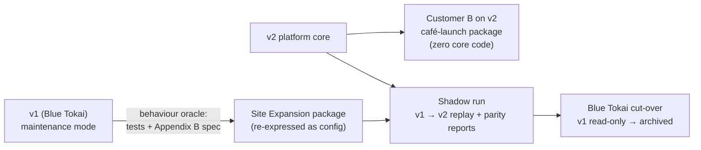
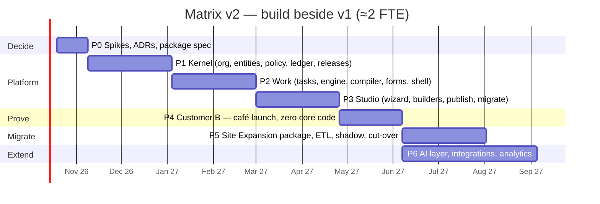

# Part 5: Migration, roadmap, risks and assumptions

[← Index](README.md) · §28 Migration · §29 Phased plan · §30 Risks and tradeoffs · §31 Assumptions to validate

---

## §28 Migration strategy from the current application

### 28.1 Approach: build beside, prove on a new customer, then migrate the original

`docs/14` proposed strangling v1 in place: wrap modules, move gates into tables, and keep production running throughout. That is the right technique when the core abstractions are sound. Here they are not (§4). The abstraction being replaced is the schema itself: `sites` plus per-module tables and mirror columns. Strangling it in place would mean wrapping every module twice.

Given the team's decision to build v2 alongside a maintained v1, the strategy is:

1. **v1 keeps serving Blue Tokai** under a maintenance policy (§28.2).
2. **The v2 core is built domain-free**, enforced by a lint rule: no package vocabulary (`site`, `legal`, `loi`, …) may appear in core code.
3. **Customer B (café launch) goes live on v2 first.** It is the cleanest test of the architecture, with no legacy data and a different process.
4. **Blue Tokai migrates** once the Site Expansion package reaches parity. The steps are ETL, history import, in-flight case mapping, a shadow run, then cut-over.

### 28.2 v1 maintenance policy during the build

- v1 gets bug fixes, security fixes and customer-critical changes only.
- Every v1 feature request is also logged as a **v2 parity item**: "this would be: a field / a task template / a flow change / a policy rule / a new primitive". Anything that would need a new *primitive* is an early warning for the platform design.
- No new modules in v1. If a new module is needed before cut-over, it is built in v2 first.
- Cheap v1 hygiene that reduces migration risk is encouraged: stop adding new free-text audit actions without a mapping, and keep `stage_events` complete.

### 28.3 KEEP / REFACTOR / REPLACE / DEPRECATE / MIGRATE

**KEEP**: carried into v2 as-is or as patterns:

| Item | Where in v1 | How it lives on |
| --- | --- | --- |
| PostgreSQL on Supabase, Supabase Storage | Infrastructure | Same providers; new schemas |
| One transaction per command; row lock on the case | `_common.fetch_site_for_update_or_404`, services | The command pipeline's lock step (§24.2) |
| Transactional outbox with attempts and drain | `notification_service.py` | `ledger.outbox` and relay |
| Per-request identity re-check (kill switch) | `deps.get_current_user` | Same rule in the v2 pipeline |
| RLS as defense in depth | `20260802_complete_rls_defense_in_depth.sql` | RLS on every v2 schema |
| Bytes outside transactions, signed URLs | `storage_service.py`, `loi_service.py` | Documents module |
| Migration ledger runner and parser tests | `main.py` runner, `test_migration_parser.py` | v2 platform migrations |
| Z-Matrix design system | `z-matrix-design-system/`, `modules/shared` | `@matrix/ui` |
| Observer = read-only principle | `rbac/roles.py`, `deps._assert_may_write` | The Observer role template (SEE only) |

**REFACTOR**: the same responsibility in a new, generic shape:

| Item | Becomes |
| --- | --- |
| `audit_service.write_audit_event` | Ledger writer with the provenance envelope |
| `notification_service` recipient resolvers | Notification rules: event → audience (role, relationship, assignee) → template |
| `storage_service`, `site_documents_service` | Documents module with slots and classification |
| `budget_service` (11 heads, 2 phases) | `budget` entity type with a configurable line schema in the Finance package |
| `site_stage_status_service` (read-only projection) | Lifecycle projection + entity page stage tracker |
| v1 regression tests (~60 modules) | Scenario specs run against the Site Expansion package (parity oracle) |

**REPLACE**: removed in favour of platform primitives:

| v1 mechanism | v2 replacement |
| --- | --- |
| `SiteStatus` + `ALLOWED_TRANSITIONS` (+ `stateMachine.js`) | `site-lifecycle` workflow definition |
| `workflow_unlocks.py`, `_assert_design_unlocked`, `_assert_project_unlocked`, `_assert_launched`, `_LOI_AND_BEYOND` | Gateways and milestone conditions in the flow graph |
| Mirror columns + per-stage timestamp columns | `entities.lifecycle` projection + milestone events |
| `Role` enum, `PERMISSIONS` (×2), `require_role`, `require_module`, `READ_ALL_ROLES` | Role templates → tenant roles → capabilities → Cerbos policies |
| `X-Override-Role` / `X-Override-Module` simulation | Acting-as and impersonation with audit (§8.5) |
| JWT `module` claim, `get_primary_membership … LIMIT 1` | Identity-only tokens + per-request effective permissions |
| Module tables: `legal_dd_checklist`, `site_licensing`, `site_agreement`, `design_reviews`, `design_deliverables`, `project_reviews`, `nso_reviews`, `launch_approvals`, `quality_audit_reports` | Child entity types + checklist forms + sub-flows |
| 8 approval implementations | Approval task kind + approval policies + `maker_checker_approver` fragment |
| `legal_change_requests` | Generic `change_request` task template |
| `module_codes`, `supervisor_invite_codes`, `observer_codes` | Invitations to (org unit, role) |
| 19 domain routers / 225 routes | Generic resource + command + metadata API |
| ~60 React routes, per-module pages, separate admin portal | Metadata-driven shell + Studio + custom panels |

**DEPRECATE**: not carried forward:

| Item | Reason |
| --- | --- |
| `pushed_to_payments` status, `pushed_to_payments_at`, `payment` module literal, `PAYMENT` route | Retired module; compatibility names only |
| Legacy launch ladder columns (`admin_approved_*`, `bd_confirmed_*`, `super_admin_approved_*`) | Superseded in v1 already (202606121) |
| `reversible_actions` | Compensating commands from ledger diffs |
| `shortlist_delegations` as a separate table | Folded into delegations |
| `backend/database/schema.sql` | Already stale (superseded by `verified.sql`) |
| Mock adapter state machine | Studio simulation replaces it |
| Tenant-specific code (`BT-` prefix, `nearest_starbucks_m`, `nearest_twc_m`, `1.18`, demo `bluetokai` user) | Package settings and tenant data |

**MIGRATE (data)**: see the mapping in 28.4.

### 28.4 Data mapping v1 → v2

| v1 source | v2 target | Transformation notes |
| --- | --- | --- |
| `tenants` | `core.tenants` + `tenant.settings` | `workspace_code` kept as a login alias; `logo_url` → branding |
| `users` | `core.actors(type=human)` + `core.identities` | Password hashes carried (bcrypt) if the v2 issuer supports import; otherwise forced reset |
| `business_admins` | Membership with role *Business Admin* at company unit | |
| `user_module_memberships` | Memberships: org unit per module department; role from `role_in_module`; `supervisor_id` → `reports_to` | One actor → several memberships (no more `LIMIT 1`) |
| `supervisor_module_access_grants (approved)`, `has_executive_access` | Additional memberships with scoped roles, or time-bound delegations | Each is flagged for admin review on import |
| `site_delegations`, `shortlist_delegations` (active) | `core.delegations` scoped to a subject entity and capability set | Revoked rows → ledger history only |
| `sites` + `site_details` | `data.entities(type=site)` — merged `data` | `code`/`ca_code` → `display_code` + `data.ca_code`; competitor distances → `data.competitors[]` |
| `site_files` | `data.documents` + attachments (slot from `file_type`) | Storage objects re-pathed or referenced in place |
| `legal_dd_checklist`, `site_agreement`, `site_licensing` | Child entity `legal_review` with checklist data | Column items → checklist array items (`other_1_label` → item label) |
| `design_reviews`, `design_deliverables` | Child entities `design_deliverable` (kind, file, reviews) | `status`/`admin_status` → historical approval task records |
| `site_budgets` + `site_budget_items` | Entities `budget` (`phase` = `gfc` or `closure`) with `lines[]` | Labels preserved per line |
| `project_reviews`, `quality_audit_reports` | Project sub-flow state + `audit_report` documents | Milestone dates → milestone events |
| `nso_reviews` | NSO sub-flow state + checklist data | Sign-offs → completed approval tasks |
| `launch_approvals` + `launch_review_events` | Launch review task history + committed site data | |
| `approvals` | Completed approval tasks (historical) | |
| `audit_logs`, `stage_events`, `launch_review_events`, `legal_change_requests` | `ledger.events` with `source.channel = "v1_import"` | Actions mapped to the platform taxonomy via a mapping table (97 actions → ~25 types). Unmappable actions → `legacy.<action>`. `authz` and `config` are null (pre-platform) |
| `notification_outbox` (pending) | Re-enqueued or dropped by type at cut-over | |

### 28.5 In-flight sites

1. **Classify** every non-terminal site by its v1 position. Combine `status` and the mirror columns into a target node set in `site-lifecycle@1`. For example: `status=pushed_to_payments, legal_dd_status=positive, finance_status=approved, design_status=in_progress, design_reviews.current_stage=3d` → node `design.review_3d`.
2. **Start** a process instance **at those activities**, using Operaton process-instance modification (`startBeforeActivity`). Completed milestones are passed as variables so downstream gates evaluate correctly.
3. **Recreate open tasks** with current assignees. Unsaved v1 drafts (e.g. a partial DD checklist) become task drafts.
4. **Keep SLA clocks** by setting `due_at` from the original v1 timestamps, not from the import time.
5. A **classification report** lists every site with its mapped node. A human signs it off before cut-over.

### 28.6 Shadow run and cut-over

- **Replay.** A change feed reads v1 `audit_logs` / `stage_events` (and row diffs where needed) hourly and replays them into v2 via the import pipeline. v1 remains the system of record.
- **Parity report** per site: stage set, milestones, open tasks, assignees, key field values. The target is ≥ 99% parity for three consecutive weeks. Every mismatch is either a package fix or a documented accepted difference.
- **Cut-over:**
  1. v1 goes read-only.
  2. Final delta import.
  3. Classification sign-off.
  4. v2 goes live for Blue Tokai.
  5. v1 stays read-only for 90 days, then is archived. An export is kept.
- **Rollback:** until v2 accepts its first write, flip back to v1. After that, roll forward. Cut-over over a weekend keeps the window small.

---

## §29 Phased implementation plan

> **Capacity assumption (validate, §31):** about 2 full-time-equivalent engineers on v2 while v1 is maintained separately. Durations scale roughly linearly. Each phase ends in something demonstrable, and none depends on the AI layer.

| Phase | Goal | Key deliverables | Exit criteria |
| --- | --- | --- | --- |
| **P0 · Decide** (3 wks) | Turn this proposal into signed decisions | ADRs D1–D13 signed; **engine spike**: BT + café flows on Operaton *and* SpiffWorkflow behind `WorkflowPort`, including a v1→v2 migration; **Cerbos spike**: list filtering over JSONB entities via `cerbos-sqlalchemy`; Flow Graph schema v0; Site Expansion package spec (Appendix B) reviewed with Blue Tokai ops | Engine chosen with evidence; policy filtering proven at 10k entities; team agrees primitives |
| **P1 · Kernel** (8 wks) | A domain-free core | Tenants, actors, org units, memberships, roles; entity store + JSON Schema validation; relationships; documents; command pipeline; ledger/outbox/inbox; Cerbos check + plan; definitions + releases (API only); metadata API; auth (identity-only tokens) | A package-defined type can be created, listed (policy-filtered) and updated with a full ledger trail; RLS isolation tests pass; zero domain words in core (lint) |
| **P2 · Work** (8 wks) | Cases move | Task service (assignment, responsibilities, delegation, SLA projection, approval modes); `WorkflowPort` + engine adapter; job workers; Flow Graph → BPMN/DMN compiler (core node kinds); forms (RJSF + server validation); runtime shell v0 (inbox, entity page, table/kanban, stage tracker) | BD → Legal ∥ Finance → Design runs end-to-end on v2; publishing v2 of the flow leaves v1 instances untouched; one migration plan executed |
| **P3 · Studio** (8 wks) | Non-developers configure | Wizard steps 1–10; CSV org import; permission matrix → policy compiler; flow builder (React Flow) with validation and simulation; form builder; view/workspace builder; diff/publish/rollback; migration planner UI | A product person configures a fresh tenant from a template in < 1 day without engineering help |
| **P4 · Prove** (6 wks) | The §18 test, for real | Café-launch package configured **in the Studio** for the Starbucks/BK prospect; pilot users; feedback loop | **Zero commits to core** were needed to configure it; any gaps are generic primitive improvements, logged as such |
| **P5 · Migrate** (8 wks) | Blue Tokai on v2 | Full Site Expansion package (8 modules); custom panels (rent editor etc.); ETL + history import; in-flight classification; shadow run; cut-over | ≥ 99% parity for 3 weeks; cut-over done; v1 read-only |
| **P6 · Extend** (ongoing) | Compounding value | MCP server and agent actors; setup assistant (process photo → draft flow); document extraction; NL views; integrations (ERP, e-sign); analytics/semantic layer; enterprise SSO; cells | Driven by customer pull |

Estimated time to Customer B live is about 10–11 months; to Blue Tokai on v2, about 12–13 months, with ≈2 FTE. More capacity mainly shortens P1–P3.

---

## §30 Risks and architectural tradeoffs

### 30.1 Risks

| # | Risk | Likelihood | Impact | Mitigation |
| --- | --- | --- | --- | --- |
| R1 | **Inner-platform effect:** configuration grows into a bad programming language | High | High | Fixed primitive set (§5.3); Flow Graph ≈12 node kinds; no hand-edited BPMN; a sanctioned *trusted extension* path (§15.4) instead of more configuration power; a design review for any new node kind |
| R2 | **Dual state between engine and platform** (lost or duplicate commands, drift) | Medium | High | Pull-only engine integration; outbox/inbox with idempotency keys; tasks keyed by job id; reconciler with drift events; spike proves it in P0. Fallback: embedded SpiffWorkflow (single transaction) |
| R3 | **Capacity:** a side build stalls while v1 consumes the team | High | High | Phases each ship value; v1 maintenance policy (§28.2); Customer B gives a revenue reason to finish P1–P4 |
| R4 | **Over-configurability:** every tenant becomes bespoke and support explodes | Medium | High | Opinionated templates; lock levels; package upgrades with overlays (not forks); publish-time validation; "health score" for configurations |
| R5 | **JSONB entity store performance or integrity** (no FKs inside `data`, slow aggregates) | Medium | Medium | Relationships as real rows with FKs; expression and GIN indexes; generated analytics views; native extension tables for proven hot paths; load test in P1 |
| R6 | **Policy filtering complexity** (query plans over JSONB plus relationships) | Medium | High | P0 spike at realistic volume; derived attributes precomputed (unit paths, region ids); cached plans; fall back to ID-list filtering for edge cases |
| R7 | **Migration fidelity** for in-flight Blue Tokai sites | Medium | High | Classification report signed by ops; shadow run with parity threshold; weekend cut-over; 90-day read-only v1 |
| R8 | **Operaton project longevity** (young fork governance) | Low–Medium | Medium | BPMN/DMN standard plus `WorkflowPort`; CIB seven, Flowable and other Camunda-7-compatible engines run the same XML |
| R9 | **The BPMN compiler is a new correctness-critical component** | Medium | High | Golden-file tests (graph → XML); property-based tests on random valid graphs; simulation tests per package flow |
| R10 | **AI actions cause harm or leak data** | Medium | High | Agents are actors under policy; autonomy levels; policy-filtered retrieval; ledger provenance; kill switch; AI deferred to P6 |
| R11 | **Licence changes in dependencies** | Low | Medium | Only Apache/MIT/PostgreSQL licences in the core path; LGPL only as an unmodified library (SpiffWorkflow path); ports everywhere |
| R12 | **Studio UX too complex** for business admins | Medium | Medium | Wizard-first; templates; AI setup assistant; usability tests with Blue Tokai and Starbucks/BK ops in P3–P4 |

### 30.2 Tradeoffs made deliberately

| We chose | Over | We give up | We gain |
| --- | --- | --- | --- |
| JSONB + schema registry | Runtime DDL tables | Native column types and FKs inside data; some query speed | Safe tenant self-service schema changes in a shared DB; versionable schemas |
| External engine (job workers) | Own interpreter | A second runtime and dual state | Correct BPMN semantics, timers and instance migration on day one |
| Platform-owned tasks | Engine tasklist and `delegateTask` | Built-in engine task features | One task model for humans and agents, policy-checked delegation, engine swappability |
| Flow Graph → BPMN (one-way) | Editing BPMN directly | Full BPMN expressiveness for power users | A small, safe language for business admins |
| Policies always latest | Pinning everything | "Old cases keep old access rules" | Revocation works immediately (security) |
| Cerbos sidecar | In-process library (Cedar) | ~1 ms per check, one more process | Query plans → SQL, decision logs, scoped tenant policies |
| Build beside v1 | Strangle in place | Two systems for about a year | A clean, domain-free core not shaped by v1's schema |
| Modular monolith | Microservices | Independent scaling of modules | Simplicity for a small team; one transaction per command |

---

## §31 Explicit assumptions that need validation

| # | Assumption | Why it matters | How and when to validate |
| --- | --- | --- | --- |
| A1 | About 2 FTE can be dedicated to v2 while v1 is maintained | All durations in §29 | Confirm staffing before P0 |
| A2 | Starbucks/BK ops data (images 1–2) reflects how they would actually run on the platform, and the prospect will pilot | P4 is the architecture's acceptance test | Walk the draft café-launch package (Appendix B) with their ops lead in P0 |
| A3 | The roles in the café flow (Asia Pacific design team, Getin team, BA team, HSO team, Ops HOC, CEO/CPO committee) are internal departments or external parties as modeled | Guest/external actor design (§7.1) | Same session as A2 |
| A4 | Operaton migration plus the job-worker pattern hold up for months-long instances with long-locked jobs | D5 | P0 engine spike, including lock-extension and restart tests |
| A5 | SpiffWorkflow migration limits are acceptable *or not* for realistic flow edits | Engine choice | P0 spike: apply the §16.3 v1→v2 change to both engines |
| A6 | Cerbos query plans over JSONB attributes perform at ≥10k entities per tenant with ≤ 50 ms list latency | D8, view engine | P0 spike with synthetic data |
| A7 | Business admins can use a Flow Graph builder without BPMN knowledge | D4, Studio UX | Paper and clickable prototype tests with Blue Tokai admins in P0–P3 |
| A8 | Tenants accept "shared schema + RLS" isolation; no early customer needs a dedicated database | §22.5 | Ask during the Starbucks/BK sales process |
| A9 | Retail-expansion volumes stay in the range in §22.8 for 2–3 years | Single-Postgres design | Re-check against the pipeline forecast annually |
| A10 | Blue Tokai will accept a weekend cut-over and 90 days of read-only v1 | §28.6 | Agree with the customer in P4 |
| A11 | v1 password hashes can be imported into the v2 identity issuer, or users accept a reset | §28.4 | Decide the issuer in P1 |
| A12 | Jurisdiction-specific content (India licences, GST, RERA) belongs in packages, not core, and a single tenant may operate in several jurisdictions | §15 | Package design review in P0 |
| A13 | A JsonLogic-style condition AST is expressive enough for gates, assignment and visibility without arbitrary code | R1 | Express every v1 gate and the café flow's conditions in the AST during P0 |
| A14 | AI features are not required for Customer B go-live | Sequencing (P6 after P4) | Confirm with the prospect |
| A15 | Supabase remains the database provider (pgvector, RLS, PITR) | Infrastructure | Confirm plan limits and pricing for the engine's extra schema and load in P0 |
| A16 | Operaton's per-tenant deployment model is enough (one engine, tenant IDs) and does not need engine-per-tenant | §22.5 | P0 spike with 3 tenants deploying different versions of the same process key |
| A17 | The team is willing to move the frontend to TypeScript for v2 | §25 | Team decision in P0 |
