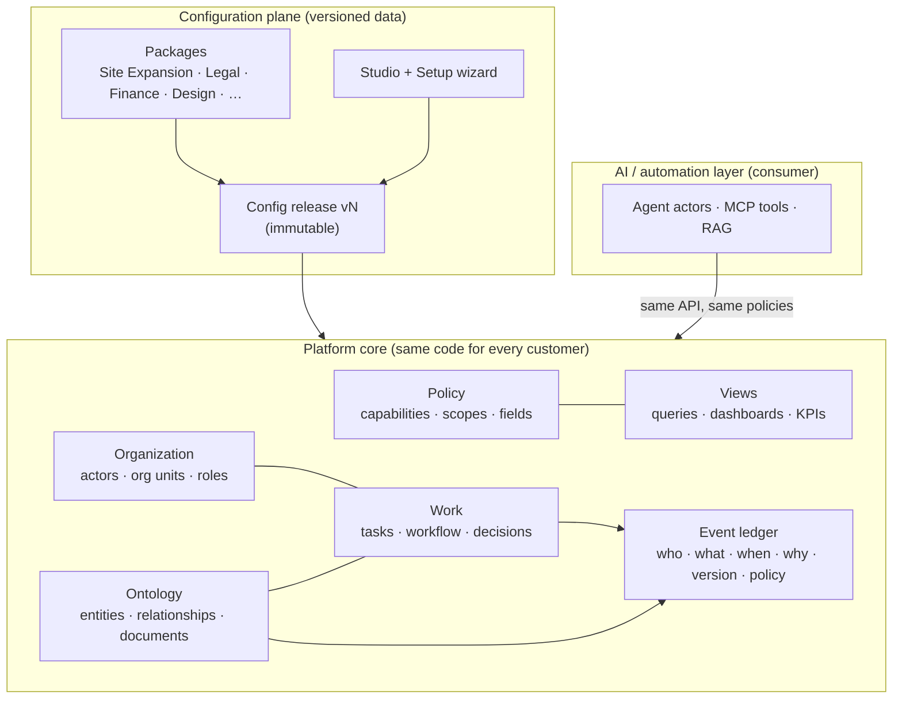

# Matrix Platform: architecture research and refoundation

> **Status:** proposal for discussion · October 2026
> **Scope:** turn the site-expansion application into an organization operating platform, with today's product running on it as one installed package.
> **Relationship to earlier work:** this supersedes the central decision of [`docs/14-dynamic-platform`](../14-dynamic-platform/dynamic-flow-transformation-plan.html). That decision kept module internals in code and made only the graph between modules configurable. Several of its ideas carry forward: version stamping, conditions as JSON, React Flow, JSON Schema forms, and the outbox-driven worker.

This document is split into seven files and keeps the section numbering from the brief (§1–§31). Sections that describe the **current** system follow the repo's documentation rule: every claim is traced to code, schema, or migrations. Sections that describe the **target** system are proposals. Anything they depend on that has not been proven is listed in §31.

| File | Sections |
| --- | --- |
| **README.md** (this file) | §1 Executive summary · decision register |
| [01-current-state-analysis.md](01-current-state-analysis.md) | §2 Current architecture · §3 Hardcoded assumptions · §4 Weaknesses and risks · Current → Target mapping |
| [02-platform-model.md](02-platform-model.md) | §5 Primitives · §6 Ontology · §7 Organization · §8 Actors/roles/capabilities · §9 Tasks · §10 Workflow · §11 Approvals · §12 Policy · §13 Views · §14 Events · §15 Packages · §16 Versioning · §17 Forms · §18 AI |
| [03-open-source-evaluation.md](03-open-source-evaluation.md) | §19 Open-source evaluation · §20 Recommended components · §21 What to build internally |
| [04-target-architecture.md](04-target-architecture.md) | §22 System · §23 Data · §24 API · §25 Frontend · §26 Setup wizard · §27 Workflow builder |
| [05-migration-and-roadmap.md](05-migration-and-roadmap.md) | §28 Migration · §29 Phased plan · §30 Risks and tradeoffs · §31 Assumptions to validate |
| [appendix-a-hardcoded-inventory.md](appendix-a-hardcoded-inventory.md) | Every domain-specific assumption found in the code, with file references |
| [appendix-b-reference-packages.md](appendix-b-reference-packages.md) | The §18 design test done on paper: Blue Tokai, the Starbucks/Burger King café-launch flow, a construction customer and a consulting customer, each expressed only as configuration |

---

## §1 Executive summary

### The problem

Matrix is a well-built **application**, and its business process lives in its schema. That is the root of the problem.

- The site pipeline order is stated independently in at least **five** places. Two are in the backend: the `SiteStatus` FSM and the cross-module unlock gates. One is the backend stage projection. Two are separate node lists in the frontend. Each downstream service also re-checks its upstream gate in its own words. ([Appendix A §A1–A2](appendix-a-hardcoded-inventory.md))
- The eight departments are hardcoded as enumerations in **7+ code lists and 13 migration CHECK constraints**. The reference schema carries **63 CHECK-constrained value lists** across ~35 live tables, and **225 HTTP routes** are split by department.
- Roles are a global four-value enum. The backend has **159** `Role.X` references and **93** raw role-string comparisons. Cross-role behaviour is achieved with request-header overrides, not a policy model.
- Approval, the core act of the product, is implemented **at least eight times** with eight different status vocabularies.
- Blue Tokai specifics sit in the shared schema and code: the `BT-` site-code prefix, `nearest_starbucks_m` / `nearest_twc_m` columns, an 18% GST multiplier, and India-only licence columns.

Under this architecture, onboarding a second customer whose process differs means new tables, new status enums, new routes and new screens. That is exactly the failure condition in the brief (§18).

### The thesis

Separate the five concerns the brief names into five platform subsystems. Each one is driven by **versioned definitions, not code**:

| Concern | Platform subsystem | Defined by |
| --- | --- | --- |
| What exists | **Ontology / entity store** | Entity types, relationship types, field schemas |
| What people do | **Task service** | Task templates, assignment rules, SLAs |
| How work moves | **Workflow engine** | Flow graphs compiled to BPMN 2.0 / DMN |
| Who can do it | **Policy engine** | Roles → capabilities → policies, with scopes |
| What each person sees | **View engine** | Views, dashboards, KPIs, run through policy |

The organization is also data: people, org units, roles and responsibilities. All definitions ship in **installable packages**. They are published as **immutable configuration releases**, and every running case keeps the versions it started with. AI agents are a kind of **actor** that works through the same API, tasks and policies as people. AI does not define the platform.

### Recommended composition

The recommendation is to compose the platform from proven parts, each behind a port so it can be replaced, rather than adopting one framework.

| Subsystem | Recommendation | Verdict |
| --- | --- | --- |
| Data core | **PostgreSQL** (stay on Supabase). Relational kernel, JSON-Schema-validated entity store, relationship edges and an append-only ledger | Build on |
| Workflow execution | **Operaton** (Apache-2.0, BPMN 2.0 + DMN, API-compatible with Camunda 7.24, process-instance migration API). Runs as an internal engine that the platform drives through a job-worker pattern. **SpiffWorkflow** (LGPL, embedded Python) is the evaluated fallback. A 2-week spike decides | Adopt (after spike) |
| Definition standard | **BPMN 2.0 + DMN 1.3** XML, generated from our business-level *Flow Graph*. The standard is the portability layer, so we are not tied to one engine | Adopt |
| Policy | **Cerbos PDP** (Apache-2.0) for RBAC + ABAC with derived roles. Tenant-scoped policies live in Postgres. Query plans become SQLAlchemy filters for row-level visibility. Postgres RLS stays as defense in depth. **OpenFGA** is held in reserve for deep relationship graphs | Adopt |
| Forms | **JSON Schema + react-jsonschema-form (RJSF)**, themed with the Z-Matrix design system; the same schema validates on the server | Adopt |
| Builders | **React Flow** canvas over our Flow Graph, with a compiler to BPMN/DMN | Build on OSS |
| Durable automations | Python workers plus **DBOS Transact** (durable steps checkpointed in Postgres, no extra server) | Trial |
| AI | Agent actors act through an **MCP** surface of the platform API. **LangGraph** handles multi-step agents, and human-in-the-loop checkpoints become platform tasks. RAG uses **pgvector** with policy-filtered retrieval | Trial (after the core) |
| API and UI | A new **Python/FastAPI platform core**: same language, new design. A new metadata-driven **React shell** and **Studio** | Build |

**Evaluated but not recommended as the foundation:**

- **Frappe.** Its workflow is a single-document state machine: no parallel joins, no versioned definitions, weak migration of running instances. It is MariaDB-first. We would replace the whole stack and end up with a weaker workflow core.
- **NocoBase.** Closest to the vision, and Apache-2.0 since Feb 2026. Adopting it means building our product inside someone else's product (Node, Ant Design, app-per-tenant). It is the best *reference architecture* in this survey. Re-evaluate only if a Node rewrite becomes acceptable.
- **Camunda 8.** Self-managed production use needs a commercial licence since 8.6.
- **Temporal.** Workflows are code, which is the wrong abstraction for flows that admins edit.
- **Twenty.** AGPL. Use as a reference only.
- **LangChain/LangGraph as the core.** AI consumes the platform; it is not its database or workflow engine.

Full reasoning is in [§19](03-open-source-evaluation.md).

### Migration in one paragraph

Build v2 **alongside** v1. v1 stays in maintenance and keeps serving Blue Tokai. Today's product is re-expressed as the **Site Expansion reference package** ([Appendix B](appendix-b-reference-packages.md)).

The **Starbucks/Burger King café-launch flow** you gathered (images 1–2) is the architecture's **acceptance test**: it must go live on v2 as configuration only, with zero platform code changes.

Blue Tokai then moves with three steps:

- An ETL from v1 tables into entities, tasks and the ledger.
- A shadow-run period that compares v1 and v2 stage projections site by site.
- A cut-over in which each in-flight site's process instance is started *at its current activity*.

Details: [§28–§29](05-migration-and-roadmap.md).

### The four risks that matter most

1. **The inner-platform effect.** Configuration grows into a bad programming language. *Mitigation:* a deliberately small primitive set, strong package templates, and a sanctioned code-extension path instead of ever-richer configuration.
2. **Dual state between the engine and the platform.** *Mitigation:* the engine only moves tokens. All work and data stay in platform tables. Integration uses outbox/inbox with idempotency keys.
3. **Capacity for a side build while v1 is maintained.** *Mitigation:* phases that each ship something usable, plus a hard rule that new v1 features are logged as "configuration in v2" rather than built twice.
4. **Over-configurability.** Every customer becomes bespoke. *Mitigation:* opinionated templates, guard-railed builders, and validation at publish time.

---

## Decision register

These decisions are proposed and still need sign-off. Each one names the strongest alternative, so the decision can be revisited deliberately.

| ID | Decision | Strongest alternative | Where argued |
| --- | --- | --- | --- |
| D1 | Compose a platform from subsystems behind ports, rather than adopt one low-code framework | Build on NocoBase | §19, §22 |
| D2 | Keep Python/FastAPI and PostgreSQL. Replace the *design*, not the language | Node/TypeScript on NocoBase | §19.6, §22 |
| D3 | Store entities as typed JSONB documents validated by versioned JSON Schema, with a relationship edge table. No runtime DDL per tenant | Table-per-type with runtime DDL (Frappe/Twenty style) | §6 |
| D4 | BPMN 2.0/DMN as the canonical execution format, generated from a simpler Flow Graph that business users edit | Own graph interpreter (docs/14) | §10, §27 |
| D5 | Operaton as the default engine, integrated via the job-worker pattern so the platform owns tasks. SpiffWorkflow is the fallback | SpiffWorkflow embedded in-process | §19.2 |
| D6 | Approval is a task kind with an approval policy, not a separate subsystem | Dedicated approval tables per module (today) | §11 |
| D7 | Entity status is a projection of the process (stages and milestones), never a hand-maintained enum | Mirror columns (today) | §6.6, §10.5 |
| D8 | Cerbos for policy decisions and list filtering, plus Postgres RLS for tenant isolation | OpenFGA (ReBAC-first) or Cedar in-process | §12 |
| D9 | A hybrid history model: current-state tables plus an immutable ledger with a full provenance envelope. Not pure event sourcing | Full event sourcing | §14 |
| D10 | Workflows, task templates and forms are pinned per instance. Policies and roles always apply the latest version. Views read the latest version; KPIs are versioned so historical reports can be reproduced | Pin everything | §16 |
| D11 | Packages are declarative by default. Code extensions are trusted, reviewed and registered by the platform | Arbitrary tenant code | §15 |
| D12 | AI agents are actors with capabilities and autonomy levels. They act through MCP and their human-in-the-loop checkpoints are platform tasks | LangGraph as the workflow engine | §18 |
| D13 | Build v2 alongside v1, prove it with the Starbucks/BK flow, migrate Blue Tokai by ETL plus shadow run | Incremental strangling of v1 in place (docs/14) | §28 |
