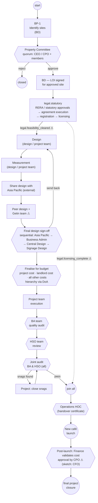
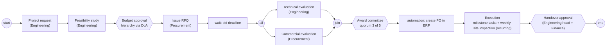
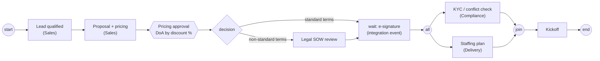

# Appendix B: Reference packages, the design test on paper

[← Index](README.md) · supports §15, §18 (critical design test) and §29 P4

The brief's success criterion: Customers A, B and C run on **the same core** with only configuration, modules, workflows, policies and views changing. This appendix expresses four customers *only* in the definition language of Part 2. If anything below needed new tables, status enums, hardcoded roles, approval logic or screens, the architecture would have failed. It does not.

| | Customer | Solution package | Reuses functional packages |
| --- | --- | --- | --- |
| B.1 | **Blue Tokai**: café site expansion (today's product) | `site-expansion` | legal, finance, design, project, nso, launch |
| B.2 | **Starbucks / Burger King**: café launch (gathered ops data, images 1–2) | `cafe-launch` | legal, finance, design, project |
| B.3 | Construction company: project approval | `construction-project-approval` | finance, procurement, engineering |
| B.4 | Consulting company: client onboarding | `client-onboarding` | finance, legal, delivery |

---

## B.1 Blue Tokai: today's product as a package

### Module graph (case flow `site-lifecycle@1`)

This reproduces v1 behaviour exactly, including the only parallel join in today's code. That join is Legal DD ∥ Finance/CA → Design (`workflow_unlocks.design_unlock_ready`).

```mermaid
flowchart LR
  S((start)) --> BDQ["bd.qualification<br/>capture → shortlist ✓ → details → approve ✓"]
  BDQ --> LOI["bd.loi<br/>upload LOI → approve ✓ / send back"]
  LOI --> M1(("loi.uploaded"))
  M1 --> P1((all))
  P1 --> LEG["legal.due_diligence<br/>DD checklist → review ✓ → agreement → licensing"]
  P1 --> FIN["finance.ca_code<br/>CA + KYC → sup ✓ → admin ✓"]
  LEG -->|"legal.dd_positive"| J1((join all))
  FIN -->|"finance.ca_approved"| J1
  J1 --> DES["design.design_cycle<br/>recce → 2D ✓✓ → 3D ✓✓ → GFC ✓"]
  DES -->|"design.gfc_approved"| P2((all))
  P2 --> PE["finance.gfc_budget<br/>11 lines → sup ✓ → admin ✓"]
  P2 --> PRJ["project.execution<br/>init → … → QA ✓✓ → done"]
  PRJ --> NSO["nso.readiness<br/>stages 1–3 → final (all of 2)"]
  NSO --> LAU["launch.validation<br/>admin → exec → sup → admin → launch"]
  LAU -->|"store.launched"| FC["finance.closure_budget<br/>actuals vs GFC → sup ✓ → admin ✓"]
  FC --> E((end))
```



✓ = an approval step (an instance of `maker_checker_approver`, §11.3); ✓✓ = supervisor and admin.

### Settings that remove today's hardcodes

```yaml
tenant: blue-tokai
packages:
  site-expansion:
    settings:
      code_prefix: BT                                   # was hardcoded in make_site_code()
      tax_multiplier: 1.18                              # was hardcoded in _common.py
      competitor_brands: [Starbucks, Third Wave Coffee] # was nearest_starbucks_m / nearest_twc_m columns
      store_models: ["BTC Cafe", "BTC Cafe+", "Kiosk"]  # was free text in sites.model
  legal:
    settings:
      dd_checklist: [title_doc, sanctioned_plan, oc_cc, commercial_use, property_tax, electricity, fire_noc]
      licences: [fssai, health_trade, shops_estab_reg, fire_noc, storage_license]   # India set
  finance:
    settings:
      budget_heads: ["Professional Fees", "HVAC", "Furniture, Light & Planters", "Civil & Interiors",
                     "Kitchen Equipment", "Branding", "Crockery & Small Equipments", "Utilities",
                     "Licencing", "BD Cost", "Misc"]           # was BUDGET_LABELS + CHECK idx 1..11
```

### Milestones that replace mirror columns

| v1 mirror | Milestone(s) |
| --- | --- |
| `legal_dd_status = positive / negative` | `legal.dd_positive` / `legal.dd_negative` |
| `agreement_status = signed / registered` | `legal.agreement_signed` / `legal.agreement_registered` |
| `licensing_status = complete` | `legal.licensing_complete` |
| `finance_status = approved` | `finance.ca_approved` |
| `design_status = approved` | `design.gfc_approved` |
| `project_excellence_status = approved` | `finance.gfc_budget_approved` |
| `project_status = done` | `project.completed` |
| `is_launched` | `store.launched` |
| `financial_closure_status = approved` | `finance.closure_approved` |

---

## B.2 Starbucks / Burger King: the café-launch flow (Customer A′)

### Source and interpretation

Transcribed from the hand-drawn process (image 2, labelled for Starbucks) and its cleaned-up rendering (image 1, Burger King branding). The two differ in places. Where they disagree, both readings are shown, because choosing between them is an **edge change in the builder, not code**. Items marked ⚠ need confirmation with their ops team (§31 A2–A3).



⚠ Interpretation notes:

1. Image 1 draws Legal/Statutory → Design as sequential. Licensing usually runs until opening, so the model above splits Legal into an early *feasibility* milestone (gates Design) and a late *licensing* milestone (gates the HOC). If ops confirm a strictly sequential flow, it is one edge change.
2. Image 2 feeds "Finance – for budget" from the LOI line and joins it into "Project team – for execution". Image 1 places "Finalise – for budget" after Final Design. The model follows image 1. Image 2's variant is a `parallel` node after LOI plus a join before execution.
3. "Getin team" is spelled as in the source images. Its role (internal or vendor) is to be confirmed.
4. Post-launch approver is "CPO" in image 1 and reads as "CFO" in the sketch.

### What differs from Blue Tokai, and how each difference is expressed

| Difference | Blue Tokai | Café launch | Expressed as |
| --- | --- | --- | --- |
| Pre-LOI qualification | Exec capture → supervisor shortlist → details → supervisor approval | BP identification → **Property Committee** (CEO/CPO) | Approval template with `mode: quorum` |
| Finance position | CA code + KYC in parallel with Legal, *before* Design | Budget finalisation *after* final design | Edge order in the case flow |
| Design review chain | Recce → 2D → 3D → GFC (internal supervisor + admin) | Design → measurement → **external regional review** → peer review → **4-party final sign-off** | `design` package sub-flow with different steps; `mode: sequential` approval; external org unit |
| External participants | None | **Asia Pacific design team**, Getin team | Org units of type `external` + guest actors with scoped roles |
| Quality gates | QA (supervisor + admin) | BA audit → HSO → **joint BA & HSO audit** → **snag loop** | `mode: all` approval + `loop_back` |
| Opening | NSO stages → two sign-offs → launch validation loop | **Operations HOC** → launch | Approval template `ops.hoc` |
| Closure | Actuals vs GFC (exec → sup → admin) | Finance validates; CPO/CFO approves | `finance.closure` sub-flow configured with a different approver chain |
| Jurisdiction items | FSSAI, Shops & Est., Health/Trade, Fire NOC, Storage | Adds **RERA / statutory** | Legal package checklist settings |

### The configuration (abridged)

```yaml
tenant: cafe-co
org_units:
  - { key: bd, type: department, name: Business Development }
  - { key: legal, type: department, name: Legal / Statutory }
  - { key: design, type: department, name: Design }
  - { key: projects, type: department, name: Projects }
  - { key: finance, type: department, name: Finance }
  - { key: ba, type: department, name: Business Administration }
  - { key: hso, type: department, name: Health & Safety (HSO) }
  - { key: ops, type: department, name: Operations }
  - { key: apac_design, type: external, name: Asia Pacific Design Team }
  - { key: getin, type: external, name: Getin Team }
roles:
  - { name: Property Committee Member, template: Approver }
  - { name: Regional Design Reviewer, template: External Partner, unit: apac_design }
  - { name: Central Design Approver, template: Approver, unit: design }
  - { name: BA Auditor, template: Supervisor, unit: ba }
  - { name: HSO Officer, template: Supervisor, unit: hso }
  - { name: Ops Head, template: Approver, unit: ops }
packages:
  cafe-launch: { version: "1.0.0" }
  legal:
    settings:
      statutory_checklist: [rera_approval, statutory_feasibility, agreement_execution, registration]
      licences: [fssai, health_trade, shops_estab_reg, fire_noc]
  finance:
    settings:
      budget_heads: ["Project cost", "Landlord cost", "Other costs"]
decisions:
  finance.doa:            # delegation of authority for budget approval
    hit_policy: FIRST
    rules:
      - { when: "amount <= 5000000",  approver_role: "Head of Projects" }
      - { when: "amount <= 20000000", approver_role: "CPO" }
      - { when: "true",               approver_role: "CEO" }
```

### Result of the test

| Check | Result |
| --- | --- |
| New tables | **0**. Entity types `store_site`, `design_package` and `audit_report` are data |
| New status enums | **0**. Task statuses are platform-wide; stages and milestones are declared in the flow |
| Hardcoded roles | **0**. Roles are tenant data from templates |
| New approval logic | **0**. Uses `quorum`, `sequential`, `all`, `hierarchy`, which are already platform modes |
| New screens | **0**. Workspaces and views are definitions; entity and task pages are generic |
| Core code commits | **0 expected.** P4's exit criterion (§29) checks this for real |

---

## B.3 Customer B: construction company, project approval



- **Entity types:** `project`, `bid` (child, one per vendor), `vendor` (related), `permit` (child).
- **Roles:** Engineer, Procurement Officer, Finance Approver, Award Committee Member, Site Inspector.
- **Policies:**
  - Vendors are guest actors who see **only their own bid** (`bid:read@own`).
  - Commercial fields of other bids are masked (field group `commercial`).
- **Platform features exercised:** wait timer, parallel evaluation, quorum, integration automation, and recurring tasks over a view.
- **New primitives needed:** none. The ERP integration is a connector (an integration actor plus a trusted automation action, §15.4).

## B.4 Customer C: consulting company, client onboarding



- **Entity types:** `client`, `engagement`, `contract` (document-centric).
- **Roles:** Account Executive, Pricing Approver, Legal Counsel, Compliance Analyst, Delivery Lead.
- **Recurring work:** a monthly account review for every active engagement, as a recurrence rule over a view.
- **Platform features exercised:** a conditional branch from a decision on form data, a message wait on an integration event, and parallel onboarding.
- **New primitives needed:** none.

---

## B.5 Verdict

| | Definitions authored | Core code changes | New primitives |
| --- | --- | --- | --- |
| Blue Tokai (`site-expansion`) | ~9 entity types, ~45 task templates, 1 case flow + 8 sub-flows, ~25 views, ~12 metrics | 0 (custom panels such as the rent-schedule editor are *registered* extensions) | 0 |
| Café launch (`cafe-launch`) | ~5 entity types, ~20 task templates, 1 case flow + 3 sub-flows, ~12 views | 0 | 0 |
| Construction | ~4 entity types, ~15 task templates, 1 flow, ~10 views | 0 (+1 ERP connector) | 0 |
| Consulting | ~3 entity types, ~12 task templates, 1 flow, ~8 views | 0 (+1 e-sign connector) | 0 |

Everything that differs between customers is a definition. Everything shared is platform code. That is the property the brief asks for: **the organization is configuration.**
